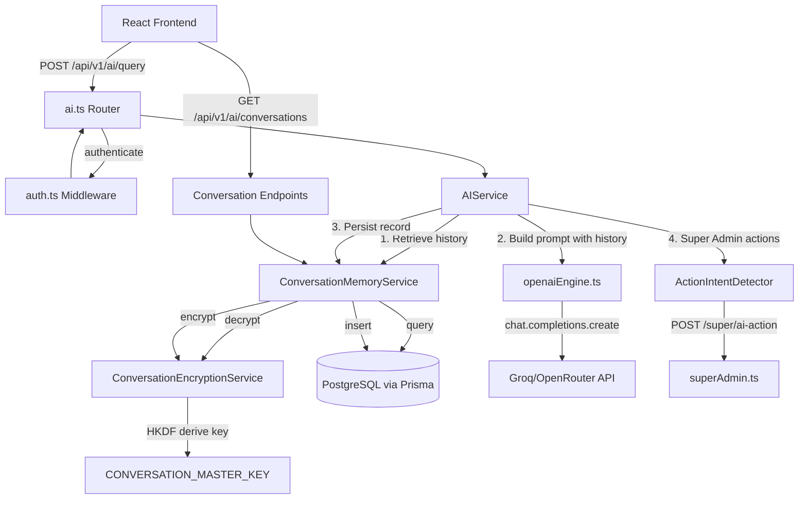
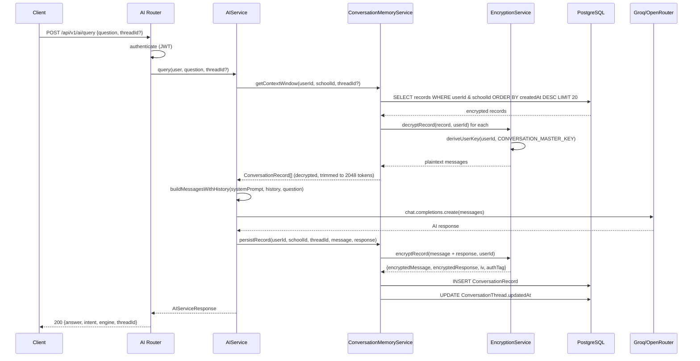
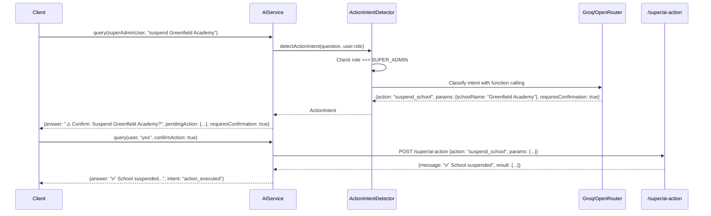

# Design Document: AI Encrypted Conversation Memory

## Overview

This feature adds per-user encrypted conversation memory to the SAMS AI assistant. Currently, the AI is stateless — each query is independent with no history. This enhancement enables the AI to remember past conversations for each user across sessions, with all conversation data encrypted at rest using per-user derived keys (AES-256-GCM via HKDF).

The system follows the existing encryption pattern established by `biometricEncryption.ts` but adapts it for per-user key derivation (instead of per-school). Conversation history is injected into the OpenAI/Groq chat completion API as prior message pairs, enabling contextual follow-up discussions. For Super Admin users, the AI additionally detects action intents and executes them via the existing `/super/ai-action` endpoint.

The architecture prioritizes: (1) zero-knowledge storage — plaintext never persists, (2) graceful degradation — encryption/decryption failures never block AI responses, (3) token budget management — conversation history is trimmed to fit within a 2,048-token budget.

## Architecture



## Sequence Diagrams

### Main Query Flow with Conversation Memory



### Super Admin Action Detection Flow




## Components and Interfaces

### Component 1: ConversationEncryptionService

**File**: `packages/backend/src/services/conversationEncryption.ts`

**Purpose**: Encrypts and decrypts conversation content using AES-256-GCM with per-user derived keys. Mirrors the pattern in `biometricEncryption.ts` but derives keys per-user instead of per-school.

```typescript
interface EncryptedConversationData {
  encryptedData: Buffer;
  iv: Buffer;        // 12 bytes
  authTag: Buffer;   // 16 bytes
}

interface ConversationEncryptionService {
  // Derive a 32-byte AES key unique to this user
  deriveUserKey(userId: string, masterKey?: string): Buffer;
  
  // Encrypt plaintext message/response content
  encrypt(plaintext: string, userId: string): EncryptedConversationData;
  
  // Decrypt ciphertext back to plaintext string
  decrypt(encrypted: EncryptedConversationData, userId: string): string;
  
  // Attempt decryption with previous key (for key rotation)
  decryptWithFallback(encrypted: EncryptedConversationData, userId: string): {
    plaintext: string;
    usedPreviousKey: boolean;
  };
  
  // Re-encrypt a record with the current key
  reEncrypt(encrypted: EncryptedConversationData, userId: string): EncryptedConversationData;
  
  // Validate master key configuration at startup
  validateConfig(): void;
}
```

**Responsibilities**:
- Derive per-user encryption keys using HKDF(SHA-256, CONVERSATION_MASTER_KEY, salt="sams-conversation-encryption-v1", info=userId)
- Generate cryptographically random 12-byte IVs for each encryption operation
- Support key rotation via CONVERSATION_MASTER_KEY_PREVIOUS fallback
- Re-encrypt records transparently when read with the previous key
- Throw configuration error at startup if CONVERSATION_MASTER_KEY is missing or < 32 chars

### Component 2: ConversationMemoryService

**File**: `packages/backend/src/services/conversationMemoryService.ts`

**Purpose**: Manages the lifecycle of conversation threads and records — CRUD operations, context window retrieval, retention policies, and per-user limits.

```typescript
interface ConversationThread {
  id: string;
  userId: string;
  schoolId: string;
  title: string;
  createdAt: Date;
  updatedAt: Date;
}

interface ConversationRecord {
  id: string;
  userId: string;
  schoolId: string;
  threadId: string;
  encryptedMessage: Buffer;
  encryptedResponse: Buffer;
  iv: Buffer;
  authTag: Buffer;
  createdAt: Date;
}

interface DecryptedConversationRecord {
  id: string;
  message: string;
  response: string;
  createdAt: Date;
}

interface ConversationMemoryService {
  // Thread management
  createThread(userId: string, schoolId: string, title?: string): Promise<ConversationThread>;
  getThreads(userId: string, schoolId: string, page?: number, pageSize?: number): Promise<{threads: ConversationThread[], total: number}>;
  deleteThread(userId: string, schoolId: string, threadId: string): Promise<void>;
  deleteAllUserData(userId: string, schoolId: string): Promise<void>;
  
  // Record management
  persistRecord(userId: string, schoolId: string, threadId: string, message: string, response: string): Promise<void>;
  getThreadRecords(userId: string, schoolId: string, threadId: string, page?: number, pageSize?: number): Promise<{records: DecryptedConversationRecord[], total: number}>;
  
  // Context window for AI prompt injection
  getContextWindow(userId: string, schoolId: string, threadId?: string, maxRecords?: number): Promise<DecryptedConversationRecord[]>;
  
  // Retention & limits
  enforceRecordLimit(userId: string, schoolId: string): Promise<void>;
  purgeExpiredRecords(): Promise<number>;
  
  // Resolve thread for a query (find active or create new)
  resolveThread(userId: string, schoolId: string, threadId?: string): Promise<string>;
}
```

**Responsibilities**:
- Enforce 500 records per user limit (delete oldest when exceeded)
- Enforce 90-day retention (purge via scheduled job)
- Scope all queries by userId AND schoolId
- Decrypt records for context window within 200ms target
- Auto-create threads when none exist
- Default to most recent thread when threadId not specified

### Component 3: AIService (Enhanced)

**File**: `packages/backend/src/services/aiService.ts` (modified)

**Purpose**: Orchestrates the query pipeline — retrieves conversation history, builds the prompt with history, routes to the appropriate engine, persists the new record, and handles Super Admin action detection.

```typescript
interface AIServiceResponse {
  answer: string;
  intent: string;
  engine: 'local' | 'openai';
  data?: unknown;
  threadId?: string;
  pendingAction?: PendingAction;
  requiresConfirmation?: boolean;
}

interface PendingAction {
  action: string;
  params: Record<string, unknown>;
  description: string;
}

// Enhanced query method signature
class AIService {
  async query(
    user: AccessTokenPayload,
    question: string,
    options?: {
      threadId?: string;
      confirmAction?: boolean;
      pendingAction?: PendingAction;
    }
  ): Promise<AIServiceResponse>;
}
```

**Responsibilities**:
- Retrieve and inject conversation history before calling OpenAI/Groq
- Skip history injection for local regex engine queries
- Persist conversation records after successful AI response
- Detect Super Admin action intents and route to /super/ai-action
- Handle confirmation flow for destructive actions
- Gracefully degrade if memory service fails (still return AI response)

### Component 4: ActionIntentDetector

**File**: `packages/backend/src/services/ai/actionIntentDetector.ts`

**Purpose**: Classifies Super Admin messages as informational queries or action requests, extracts parameters, and determines if confirmation is needed.

```typescript
interface DetectedAction {
  isAction: boolean;
  action?: string;  // matches ai-action endpoint schema
  params?: Record<string, unknown>;
  requiresConfirmation: boolean;
  description?: string;
}

interface ActionIntentDetector {
  detect(question: string, userRole: string): Promise<DetectedAction>;
  isDestructiveAction(action: string): boolean;
}
```

**Responsibilities**:
- Only activate for SUPER_ADMIN role users
- Map natural language to supported actions: generate_license, suspend_school, unsuspend_school, extend_license, get_school_info, get_system_stats
- Flag destructive actions (suspend_school) for confirmation
- Extract parameters (school names, plan tiers, days) from natural language
- Validate extracted parameters against the ai-action schema

### Component 5: TokenBudgetManager

**File**: `packages/backend/src/services/ai/tokenBudgetManager.ts`

**Purpose**: Manages the 2,048-token budget for conversation history injection, trimming oldest records first.

```typescript
interface TokenBudgetManager {
  // Estimate token count for a string (approximation: chars / 4)
  estimateTokens(text: string): number;
  
  // Trim records to fit within budget, removing oldest first
  trimToFitBudget(
    records: DecryptedConversationRecord[],
    maxTokens: number
  ): DecryptedConversationRecord[];
  
  // Format records as chat message pairs for the API
  formatAsMessages(
    records: DecryptedConversationRecord[]
  ): Array<{role: 'user' | 'assistant', content: string}>;
}
```

**Responsibilities**:
- Approximate token counting (chars / 4 heuristic for English text)
- Trim oldest records first to fit within 2,048-token budget
- Format as alternating user/assistant message pairs
- Return empty array if no records fit within budget


## Data Models

### Prisma Schema Additions

```typescript
// Add to schema.prisma

model ConversationThread {
  id        String   @id @default(cuid())
  userId    String
  user      User     @relation(fields: [userId], references: [id], onDelete: Cascade)
  schoolId  String
  school    School   @relation(fields: [schoolId], references: [id])
  title     String   @db.VarChar(200)
  createdAt DateTime @default(now())
  updatedAt DateTime @updatedAt

  records ConversationRecord[]

  @@index([userId, schoolId])
  @@index([userId, updatedAt])
}

model ConversationRecord {
  id               String   @id @default(cuid())
  userId           String
  user             User     @relation(fields: [userId], references: [id], onDelete: Cascade)
  schoolId         String
  school           School   @relation(fields: [schoolId], references: [id])
  threadId         String
  thread           ConversationThread @relation(fields: [threadId], references: [id], onDelete: Cascade)
  encryptedMessage Bytes    // AES-256-GCM encrypted user message
  encryptedResponse Bytes   // AES-256-GCM encrypted AI response
  iv               Bytes    // 12-byte initialization vector
  authTag          Bytes    // 16-byte authentication tag
  createdAt        DateTime @default(now())

  @@index([userId, schoolId, threadId])
  @@index([userId, schoolId, createdAt])
  @@index([threadId, createdAt])
}
```

**Validation Rules**:
- `title`: 1–200 characters, trimmed, non-empty
- `encryptedMessage`: max 16,000 bytes (accommodates 2,000 chars encrypted + overhead)
- `encryptedResponse`: max 16,000 bytes (accommodates 10,000 chars encrypted + overhead)
- `iv`: exactly 12 bytes
- `authTag`: exactly 16 bytes
- `userId` + `schoolId` must reference existing User and School records
- `threadId` must reference an existing ConversationThread owned by the same user

### Relation Additions to Existing Models

```typescript
// Add to User model
model User {
  // ... existing fields ...
  conversationThreads  ConversationThread[]
  conversationRecords  ConversationRecord[]
}

// Add to School model
model School {
  // ... existing fields ...
  conversationThreads  ConversationThread[]
  conversationRecords  ConversationRecord[]
}
```

## Key Functions with Formal Specifications

### Function 1: deriveUserKey()

```typescript
function deriveUserKey(userId: string, masterKey?: string): Buffer
```

**Preconditions:**
- `userId` is a non-empty string (valid CUID)
- `CONVERSATION_MASTER_KEY` env var is set and ≥ 32 characters (or `masterKey` param provided)

**Postconditions:**
- Returns a deterministic 32-byte Buffer
- Same userId + same masterKey always produces the same key
- Different userIds produce different keys (with overwhelming probability)
- Output is suitable for AES-256-GCM

**Implementation:**
```typescript
function deriveUserKey(userId: string, masterKey?: string): Buffer {
  const key = masterKey || process.env.CONVERSATION_MASTER_KEY;
  if (!key || key.length < 32) {
    throw new Error('CONVERSATION_MASTER_KEY must be at least 32 characters');
  }

  const salt = Buffer.from('sams-conversation-encryption-v1', 'utf8');
  const info = Buffer.from(`user:${userId}`, 'utf8');

  // HKDF-Extract
  const prk = crypto.createHmac('sha256', salt).update(key).digest();
  // HKDF-Expand
  const okm = crypto.createHmac('sha256', prk)
    .update(Buffer.concat([info, Buffer.from([0x01])]))
    .digest();

  return okm; // 32 bytes
}
```

### Function 2: encrypt()

```typescript
function encrypt(plaintext: string, userId: string): EncryptedConversationData
```

**Preconditions:**
- `plaintext` is a non-empty string, max 10,000 characters
- `userId` is a valid user identifier
- CONVERSATION_MASTER_KEY is configured

**Postconditions:**
- Returns `{encryptedData, iv, authTag}` where iv is 12 bytes and authTag is 16 bytes
- `encryptedData` is the AES-256-GCM ciphertext of the UTF-8 encoded plaintext
- Each call produces a different `iv` (random)
- The same plaintext encrypted twice produces different ciphertext (due to random IV)

**Implementation:**
```typescript
function encrypt(plaintext: string, userId: string): EncryptedConversationData {
  const key = deriveUserKey(userId);
  const iv = crypto.randomBytes(12);
  const cipher = crypto.createCipheriv('aes-256-gcm', key, iv, { authTagLength: 16 });
  
  const plaintextBuffer = Buffer.from(plaintext, 'utf8');
  const encrypted = Buffer.concat([cipher.update(plaintextBuffer), cipher.final()]);
  const authTag = cipher.getAuthTag();

  return { encryptedData: encrypted, iv, authTag };
}
```

### Function 3: decryptWithFallback()

```typescript
function decryptWithFallback(
  encrypted: EncryptedConversationData,
  userId: string
): { plaintext: string; usedPreviousKey: boolean }
```

**Preconditions:**
- `encrypted` contains valid `encryptedData`, `iv` (12 bytes), `authTag` (16 bytes)
- `userId` is a valid user identifier
- At least one of CONVERSATION_MASTER_KEY or CONVERSATION_MASTER_KEY_PREVIOUS is set

**Postconditions:**
- If decryption succeeds with current key: returns `{plaintext, usedPreviousKey: false}`
- If decryption fails with current key but succeeds with previous key: returns `{plaintext, usedPreviousKey: true}`
- If both keys fail: throws an error with "DECRYPTION_FAILED" code
- Returned plaintext is the original UTF-8 string that was encrypted

### Function 4: getContextWindow()

```typescript
async function getContextWindow(
  userId: string,
  schoolId: string,
  threadId?: string,
  maxRecords?: number
): Promise<DecryptedConversationRecord[]>
```

**Preconditions:**
- `userId` and `schoolId` are valid identifiers
- User exists in the database
- maxRecords defaults to 20 if not specified

**Postconditions:**
- Returns at most `maxRecords` decrypted records, ordered by createdAt ascending (oldest first for chat context)
- All returned records belong to the specified userId AND schoolId
- Records that fail decryption are skipped (not included, logged to AuditLog)
- Total token estimate of returned records ≤ 2,048 tokens
- If threadId specified, only records from that thread are returned
- If no threadId, records from the most recent thread are returned
- Returns empty array if no records exist or all fail decryption

### Function 5: persistRecord()

```typescript
async function persistRecord(
  userId: string,
  schoolId: string,
  threadId: string,
  message: string,
  response: string
): Promise<void>
```

**Preconditions:**
- `userId`, `schoolId`, `threadId` are valid identifiers referencing existing records
- `message` is 1–2,000 characters
- `response` is 1–10,000 characters
- User's record count is checked against the 500 limit

**Postconditions:**
- A new ConversationRecord is inserted with encrypted message and response
- The associated ConversationThread.updatedAt is updated
- If user has ≥ 500 records, the oldest record is deleted before insertion
- If encryption or persistence fails, the error is logged but does not propagate to the caller

### Function 6: detectActionIntent()

```typescript
async function detectActionIntent(
  question: string,
  userRole: string
): Promise<DetectedAction>
```

**Preconditions:**
- `question` is a non-empty string
- `userRole` is a valid UserRole enum value

**Postconditions:**
- If userRole !== 'SUPER_ADMIN': returns `{isAction: false, requiresConfirmation: false}`
- If action detected: returns action type, extracted params, and confirmation requirement
- Destructive actions (suspend_school) always have `requiresConfirmation: true`
- Non-destructive actions (get_system_stats, get_school_info) have `requiresConfirmation: false`
- If intent is ambiguous, returns `{isAction: false}` (defaults to informational)


## Algorithmic Pseudocode

### Main AI Query Algorithm (Enhanced)

```typescript
async function enhancedQuery(
  user: AccessTokenPayload,
  question: string,
  options?: { threadId?: string; confirmAction?: boolean; pendingAction?: PendingAction }
): Promise<AIServiceResponse> {
  // Step 1: Try local engine first (unchanged behavior)
  const localResult = await localQuery(user, question);
  if (localResult.intent !== 'unknown') {
    // Local engine resolved — persist to memory but don't inject history
    if (user.sub !== 'guest') {
      await safelyPersist(user, question, localResult.answer, options?.threadId);
    }
    return { answer: localResult.answer, intent: localResult.intent, engine: 'local' };
  }

  // Step 2: Check for Super Admin action intent
  if (user.role === 'SUPER_ADMIN') {
    if (options?.confirmAction && options?.pendingAction) {
      // User confirmed a pending action — execute it
      const result = await executeSuperAdminAction(user, options.pendingAction);
      await safelyPersist(user, question, result.answer, options?.threadId);
      return result;
    }

    const actionIntent = await detectActionIntent(question, user.role);
    if (actionIntent.isAction) {
      if (actionIntent.requiresConfirmation) {
        return {
          answer: `⚠️ **Confirm Action**: ${actionIntent.description}\n\nDo you want to proceed?`,
          intent: 'action_confirmation',
          engine: 'openai',
          pendingAction: { action: actionIntent.action!, params: actionIntent.params!, description: actionIntent.description! },
          requiresConfirmation: true,
        };
      }
      const result = await executeSuperAdminAction(user, {
        action: actionIntent.action!,
        params: actionIntent.params!,
        description: actionIntent.description!,
      });
      await safelyPersist(user, question, result.answer, options?.threadId);
      return result;
    }
  }

  // Step 3: Resolve thread and retrieve conversation history
  let threadId: string | undefined;
  let historyMessages: Array<{role: 'user' | 'assistant', content: string}> = [];
  
  if (user.sub !== 'guest') {
    try {
      threadId = await conversationMemoryService.resolveThread(
        user.sub, user.schoolId, options?.threadId
      );
      const contextWindow = await conversationMemoryService.getContextWindow(
        user.sub, user.schoolId, threadId, 20
      );
      historyMessages = tokenBudgetManager.formatAsMessages(
        tokenBudgetManager.trimToFitBudget(contextWindow, 2048)
      );
    } catch (err) {
      console.error('[AIService] Memory retrieval failed, proceeding without history:', err);
      // Graceful degradation — continue without history
    }
  }

  // Step 4: Call OpenAI/Groq with conversation history
  const openaiResult = await openaiQueryWithHistory(user, question, historyMessages);

  // Step 5: Persist the new record
  if (user.sub !== 'guest' && threadId) {
    await safelyPersist(user, question, openaiResult.answer, threadId);
  }

  return {
    answer: openaiResult.answer,
    intent: openaiResult.intent,
    engine: 'openai',
    threadId,
  };
}

async function safelyPersist(
  user: AccessTokenPayload,
  message: string,
  response: string,
  threadId?: string
): Promise<void> {
  try {
    const resolvedThreadId = threadId || 
      await conversationMemoryService.resolveThread(user.sub, user.schoolId);
    await conversationMemoryService.persistRecord(
      user.sub, user.schoolId, resolvedThreadId,
      message.slice(0, 2000),      // enforce max message length
      response.slice(0, 10000)     // enforce max response length
    );
  } catch (err) {
    console.error('[AIService] Failed to persist conversation record:', err);
    // Never throw — AI response is more important than persistence
  }
}
```

### OpenAI Engine with History Injection

```typescript
async function openaiQueryWithHistory(
  user: AccessTokenPayload,
  question: string,
  history: Array<{role: 'user' | 'assistant', content: string}>
): Promise<OpenAIQueryResult> {
  const client = getOpenAIClient();
  const systemPrompt = await buildSystemPrompt(user);

  // Build messages array: system + history + current question
  const messages: ChatCompletionMessageParam[] = [
    { role: 'system', content: systemPrompt },
    ...history,  // Injected conversation history (already trimmed to budget)
    { role: 'user', content: question },
  ];

  const response = await client.chat.completions.create({
    model: process.env.OPENAI_MODEL ?? 'llama3-70b-8192',
    messages,
    temperature: 0.3,
    max_tokens: 1000,
  });

  return {
    answer: response.choices[0]?.message?.content ?? 'Unable to generate response.',
    intent: 'openai_response',
  };
}
```

### Key Rotation Re-encryption Algorithm

```typescript
async function decryptWithFallback(
  encrypted: EncryptedConversationData,
  userId: string
): Promise<{ plaintext: string; usedPreviousKey: boolean }> {
  // Attempt 1: Current key
  try {
    const currentKey = deriveUserKey(userId, process.env.CONVERSATION_MASTER_KEY!);
    const plaintext = decryptWithKey(encrypted, currentKey);
    return { plaintext, usedPreviousKey: false };
  } catch (currentKeyError) {
    // Current key failed — try previous key
  }

  // Attempt 2: Previous key (for rotation period)
  const previousMasterKey = process.env.CONVERSATION_MASTER_KEY_PREVIOUS;
  if (!previousMasterKey) {
    throw new Error('DECRYPTION_FAILED: Current key failed and no previous key configured');
  }

  try {
    const previousKey = deriveUserKey(userId, previousMasterKey);
    const plaintext = decryptWithKey(encrypted, previousKey);
    return { plaintext, usedPreviousKey: true };
  } catch (previousKeyError) {
    throw new Error('DECRYPTION_FAILED: Both current and previous keys failed');
  }
}

// Called after successful read with previous key — re-encrypts with current key
async function reEncryptRecord(recordId: string, userId: string, plaintext: string): Promise<void> {
  try {
    const newEncrypted = encrypt(plaintext, userId); // Uses current CONVERSATION_MASTER_KEY
    await prisma.conversationRecord.update({
      where: { id: recordId },
      data: {
        encryptedMessage: newEncrypted.encryptedData,
        iv: newEncrypted.iv,
        authTag: newEncrypted.authTag,
      },
    });
  } catch (err) {
    // Log but don't fail — data was already successfully decrypted
    console.error(`[Encryption] Re-encryption failed for record ${recordId}:`, err);
    await auditService.log({
      eventType: 'CONFLICT_RESOLVED', // closest available event type
      resourceSnapshot: { action: 'RE_ENCRYPTION_FAILED', recordId, userId },
    });
  }
}
```

### Token Budget Management Algorithm

```typescript
function trimToFitBudget(
  records: DecryptedConversationRecord[],
  maxTokens: number
): DecryptedConversationRecord[] {
  // Records arrive ordered oldest-first (for chat context ordering)
  // We trim from the beginning (oldest) to fit budget
  
  let totalTokens = 0;
  const result: DecryptedConversationRecord[] = [];

  // Process from newest to oldest, then reverse
  for (let i = records.length - 1; i >= 0; i--) {
    const record = records[i];
    const recordTokens = estimateTokens(record.message) + estimateTokens(record.response);
    
    if (totalTokens + recordTokens > maxTokens) {
      break; // Budget exceeded — stop including older records
    }
    
    totalTokens += recordTokens;
    result.unshift(record); // Prepend to maintain chronological order
  }

  return result;
}

function estimateTokens(text: string): number {
  // Approximation: ~4 characters per token for English text
  // This is conservative — actual tokenization varies by model
  return Math.ceil(text.length / 4);
}

function formatAsMessages(
  records: DecryptedConversationRecord[]
): Array<{role: 'user' | 'assistant', content: string}> {
  const messages: Array<{role: 'user' | 'assistant', content: string}> = [];
  
  for (const record of records) {
    messages.push({ role: 'user', content: record.message });
    messages.push({ role: 'assistant', content: record.response });
  }
  
  return messages;
}
```

## Example Usage

### Querying with Conversation Memory

```typescript
// Client sends a follow-up question
const response = await fetch('/api/v1/ai/query', {
  method: 'POST',
  headers: { 'Authorization': `Bearer ${token}`, 'Content-Type': 'application/json' },
  body: JSON.stringify({ 
    question: "explain more about that",  // References previous context
    threadId: "clx1abc123..."             // Optional: specific thread
  }),
});
// AI uses conversation history to understand "that" refers to previous topic

// Managing threads
const threads = await fetch('/api/v1/ai/conversations', {
  headers: { 'Authorization': `Bearer ${token}` },
});

// Creating a new thread
await fetch('/api/v1/ai/conversations', {
  method: 'POST',
  headers: { 'Authorization': `Bearer ${token}`, 'Content-Type': 'application/json' },
  body: JSON.stringify({ title: "Physics homework help" }),
});

// Deleting a thread
await fetch(`/api/v1/ai/conversations/${threadId}`, {
  method: 'DELETE',
  headers: { 'Authorization': `Bearer ${token}` },
});
```

### Super Admin Action via AI

```typescript
// Super Admin asks to suspend a school
const response = await fetch('/api/v1/ai/query', {
  method: 'POST',
  headers: { 'Authorization': `Bearer ${superAdminToken}`, 'Content-Type': 'application/json' },
  body: JSON.stringify({ question: "suspend Greenfield Academy" }),
});
// Response: { requiresConfirmation: true, pendingAction: {...} }

// Super Admin confirms
const confirmed = await fetch('/api/v1/ai/query', {
  method: 'POST',
  headers: { 'Authorization': `Bearer ${superAdminToken}`, 'Content-Type': 'application/json' },
  body: JSON.stringify({ 
    question: "yes",
    confirmAction: true,
    pendingAction: response.pendingAction 
  }),
});
// Response: { answer: "✅ School suspended...", intent: "action_executed" }
```


## Correctness Properties

### Property 1: Encryption Isolation

∀ user₁, user₂ where user₁.id ≠ user₂.id: deriveUserKey(user₁.id) ≠ deriveUserKey(user₂.id) — no two users share an encryption key.

**Validates: Requirements 2.2, 3.2**

---

### Property 2: Roundtrip Integrity

∀ plaintext, userId: decrypt(encrypt(plaintext, userId), userId) === plaintext — encryption is lossless.

**Validates: Requirements 2.1, 2.6**

---

### Property 3: Data Scoping

∀ query(userId, schoolId): returned records all satisfy record.userId === userId AND record.schoolId === schoolId — no cross-user or cross-school data leakage.

**Validates: Requirements 3.1, 3.4**

---

### Property 4: Token Budget Compliance

∀ contextWindow: sum(estimateTokens(record.message + record.response) for record in contextWindow) ≤ 2048.

**Validates: Requirements 6.3**

---

### Property 5: Record Limit Enforcement

∀ userId: count(ConversationRecord WHERE userId) ≤ 500 after any persistRecord() call.

**Validates: Requirements 9.2, 9.3**

---

### Property 6: Graceful Degradation

If getContextWindow() throws, the AI query still returns a valid response (without history).

**Validates: Requirements 1.6, 6.6**

---

### Property 7: Key Rotation Continuity

After key rotation, records encrypted with the previous key are still readable via decryptWithFallback() and are re-encrypted with the current key on read.

**Validates: Requirements 7.1, 7.2, 7.3**

---

### Property 8: Thread Ownership

∀ thread operations: the thread.userId must match the authenticated user's sub claim — no user can access another user's threads.

**Validates: Requirements 4.8, 3.3**

---

### Property 9: Persistence Independence

If persistRecord() fails, the AI response is still returned to the user — persistence failures are non-blocking.

**Validates: Requirements 1.6**

---

### Property 10: IV Uniqueness

∀ encryption operations: a fresh 12-byte random IV is generated — no IV reuse across records.

**Validates: Requirements 2.3**

## Error Handling

### Error Scenario 1: CONVERSATION_MASTER_KEY Not Set

**Condition**: Application starts without CONVERSATION_MASTER_KEY env var or with < 32 characters
**Response**: ConversationEncryptionService.validateConfig() throws at startup
**Recovery**: Application refuses to serve conversation memory requests; other features continue working. Logs a CRITICAL error.

### Error Scenario 2: Decryption Failure (Auth Tag Mismatch)

**Condition**: A stored record's ciphertext has been tampered with, or the key has changed without CONVERSATION_MASTER_KEY_PREVIOUS being set
**Response**: The record is skipped in getContextWindow(); logged to AuditLog with record ID
**Recovery**: Remaining valid records are still returned. The corrupted record is marked as inaccessible but not deleted (preserves evidence).

### Error Scenario 3: Record Limit Exceeded

**Condition**: User has 500 records and a new record needs to be persisted
**Response**: The oldest record is deleted in the same transaction as the new insert
**Recovery**: Automatic — no user intervention needed. The deletion is logged.

### Error Scenario 4: Context Window Timeout (>200ms)

**Condition**: Decryption of 20 records takes longer than 200ms (unlikely but possible under load)
**Response**: The AI query proceeds without conversation history
**Recovery**: User receives a response with a note that prior context was unavailable. Next query retries normally.

### Error Scenario 5: Super Admin Action Execution Failure

**Condition**: The /super/ai-action endpoint returns an error (e.g., school not found)
**Response**: Error message is relayed to the Super Admin in human-readable format
**Recovery**: AI suggests corrective steps (e.g., "School not found. Try listing schools first.")

### Error Scenario 6: Key Rotation — Both Keys Fail

**Condition**: A record cannot be decrypted with either current or previous key (e.g., key rotated twice)
**Response**: Record is marked as inaccessible, excluded from results, logged to AuditLog
**Recovery**: Record data is permanently inaccessible. Admin should be notified via monitoring.

## Testing Strategy

### Unit Testing Approach

- **ConversationEncryptionService**: Test encrypt/decrypt roundtrip, key derivation determinism, IV uniqueness, auth tag verification, key rotation fallback, config validation
- **TokenBudgetManager**: Test token estimation, budget trimming, message formatting, edge cases (empty records, single record exceeding budget)
- **ActionIntentDetector**: Test action classification for various natural language inputs, parameter extraction, role gating
- **ConversationMemoryService**: Test CRUD operations, record limit enforcement, thread resolution logic, data scoping

### Property-Based Testing Approach

**Property Test Library**: fast-check

- **Roundtrip property**: For any random string (1–10,000 chars), encrypt then decrypt returns the original
- **Key isolation property**: For any two distinct user IDs, derived keys are different
- **Budget compliance property**: For any list of records, trimToFitBudget output never exceeds maxTokens
- **Scoping property**: For any userId, getContextWindow never returns records with a different userId

### Integration Testing Approach

- End-to-end query flow with conversation history injection
- Thread management API endpoints (create, list, delete)
- Key rotation scenario: encrypt with key A, rotate to key B, verify decryption still works
- Super Admin action flow: detect intent → confirm → execute → verify audit log
- Concurrent access: multiple users querying simultaneously with isolated histories

## Performance Considerations

- **Encryption speed**: AES-256-GCM on modern hardware encrypts at ~1GB/s. A 10,000-char response encrypts in <0.01ms. Well within the 5ms requirement.
- **Context window retrieval**: 20 records × decrypt = ~20 decrypt operations. Each takes <1ms. Total <20ms, well within 200ms budget.
- **Database indexing**: Composite index on (userId, schoolId, createdAt) ensures O(log n) lookups for context window queries.
- **Token estimation**: Simple char/4 heuristic avoids expensive tokenizer calls. Slightly conservative but fast.
- **Record limit enforcement**: DELETE + INSERT in a single transaction prevents race conditions.
- **Connection pooling**: Prisma's built-in connection pool handles concurrent decryption queries.

## Security Considerations

- **Zero-knowledge storage**: Plaintext conversation content never persists in the database. Only ciphertext + IV + authTag are stored.
- **Per-user key isolation**: Even if one user's key is compromised, other users' data remains encrypted with different keys.
- **HKDF key derivation**: Uses a fixed application-specific salt and user ID as info parameter, preventing key reuse across applications.
- **IV randomness**: Each encryption uses crypto.randomBytes(12) — no IV reuse vulnerability.
- **Auth tag verification**: GCM mode's authentication tag prevents ciphertext tampering.
- **Key rotation support**: CONVERSATION_MASTER_KEY_PREVIOUS allows seamless rotation without data loss.
- **Role-based action gating**: Only SUPER_ADMIN can trigger system actions via AI. Other roles are rejected at the detection layer.
- **Confirmation for destructive actions**: suspend_school requires explicit user confirmation before execution.
- **Audit logging**: All action executions, decryption failures, and re-encryption failures are logged.

## Dependencies

- **crypto** (Node.js built-in): AES-256-GCM encryption, HKDF key derivation, randomBytes
- **@prisma/client**: Database operations for ConversationThread and ConversationRecord models
- **openai** (existing): Chat completion API with history injection
- **zod** (existing): Request validation for conversation API endpoints
- **Environment variables**:
  - `CONVERSATION_MASTER_KEY` (required, ≥32 chars): Master secret for HKDF key derivation
  - `CONVERSATION_MASTER_KEY_PREVIOUS` (optional): Previous master key for rotation period

## API Endpoints

### GET /api/v1/ai/conversations

List conversation threads for the authenticated user.

**Query params**: `page` (default: 1), `pageSize` (default: 50, max: 100)
**Response**: `{ threads: ConversationThread[], total: number, page: number, pageSize: number }`

### GET /api/v1/ai/conversations/:threadId

Get decrypted records for a specific thread.

**Query params**: `page` (default: 1), `pageSize` (default: 100, max: 200)
**Response**: `{ records: DecryptedConversationRecord[], total: number, page: number, pageSize: number }`

### POST /api/v1/ai/conversations

Create a new conversation thread.

**Body**: `{ title: string }` (1–200 chars)
**Response**: `{ thread: ConversationThread }` (201 Created)

### DELETE /api/v1/ai/conversations/:threadId

Delete a thread and all its records.

**Response**: `{ message: string }` (200 OK)

### DELETE /api/v1/ai/conversations

Delete all conversation data for the authenticated user.

**Response**: `{ message: string, deletedThreads: number, deletedRecords: number }`

### POST /api/v1/ai/query (Enhanced)

Enhanced to accept optional `threadId`, `confirmAction`, and `pendingAction` fields.

**Body**: `{ question: string, threadId?: string, confirmAction?: boolean, pendingAction?: PendingAction }`
**Response**: `{ answer: string, intent: string, engine: string, threadId?: string, pendingAction?: PendingAction, requiresConfirmation?: boolean }`
