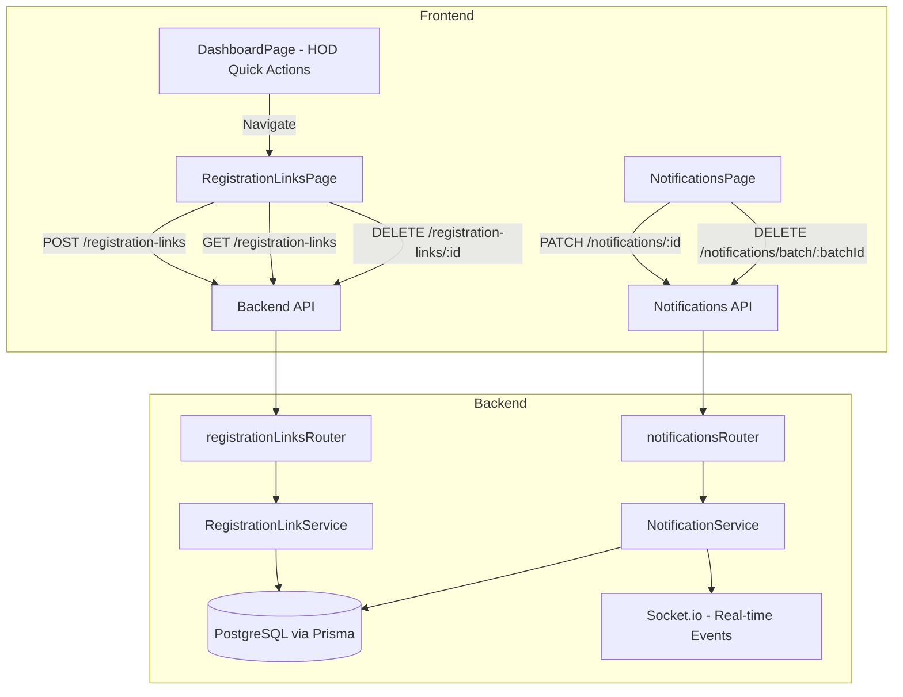

# Design Document: HOD Registration Links

## Overview

This feature extends the existing SAMS registration link system to give HODs full control over generating registration links for both Teachers and Students within their department. It also enhances the notification system with sender attribution and edit/delete capabilities.

The design builds on the existing `RegistrationLinkService`, `registrationLinksRouter`, and `RegistrationLinksPage` components. Changes are scoped to:

1. **Backend**: Extend the registration link service to validate HOD target role selection (TEACHER/STUDENT), enforce class ownership, and scope link visibility by `createdById`.
2. **Frontend**: Add a "Registration Links" quick action to the HOD dashboard, adapt the RegistrationLinksPage modal to show only TEACHER/STUDENT options for HODs, and add a class picker when STUDENT is selected.
3. **Notifications**: Add `senderId` and `batchId` fields to the Notification model, include sender name in responses, and add edit/delete endpoints with a 24-hour modification window.

## Architecture



### Key Design Decisions

1. **Role-based filtering at the query level**: HOD link visibility is enforced by adding a `createdById` filter in the GET endpoint rather than post-filtering, ensuring efficient queries and no data leakage.
2. **Class ownership validation**: When an HOD generates a STUDENT link, the backend validates that the selected `classId` belongs to a class within the HOD's assigned department, preventing cross-department link creation.
3. **Batch-based notification operations**: Notifications sent in a single operation share a `batchId`, enabling bulk edit/delete of all notifications from the same send action.
4. **24-hour modification window**: Edit/delete of notifications is time-bounded to prevent retroactive content manipulation while allowing reasonable correction of mistakes.

## Components and Interfaces

### Backend Components

#### 1. Registration Link Service (`registrationLinkService.ts`)

**Modified method: `generateLink`**

```typescript
interface GenerateLinkOptions {
  expiryDays?: number;
  maxUses?: number;
  targetRole?: 'TEACHER' | 'STUDENT'; // Extended for HOD use
}
```

Changes:
- When `creatorRole === HOD`, validate that `targetRole` is either `TEACHER` or `STUDENT` (reject other values with 400)
- If `targetRole` is not provided and creator is HOD, default to `TEACHER`
- When `targetRole === STUDENT`, require `classId` and validate it belongs to the HOD's department
- Embed `departmentId` from the HOD's user record on all HOD-created links

**New method: `getLinksForUser`**

```typescript
async getLinksForUser(userId: string, userRole: UserRole, schoolId: string): Promise<RegistrationLink[]>
```

- If `userRole === SCHOOL_ADMIN`: return all links for the school
- If `userRole === HOD`: return only links where `createdById === userId`
- Otherwise: throw 403

**Modified method: `deleteLink`**

```typescript
async deleteLink(linkId: string, requesterId: string, requesterRole: UserRole, schoolId: string): Promise<void>
```

- SCHOOL_ADMIN can delete any link in their school
- HOD can only delete links where `createdById === requesterId`
- Returns 403 if ownership check fails, 404 if link not found

#### 2. Registration Links Router (`users.ts` - registrationLinksRouter)

**Modified endpoints:**

| Method | Path | Change |
|--------|------|--------|
| GET | `/registration-links` | Add role-based filtering via `getLinksForUser` |
| POST | `/registration-links` | Accept `targetRole` in body, validate for HOD |
| DELETE | `/registration-links/:id` | Add ownership check for HOD |

**Updated validation schema:**

```typescript
const generateLinkSchema = z.object({
  classId: z.string().optional(),
  expiryDays: z.number().int().min(7).max(365).optional(),
  maxUses: z.number().int().min(1).optional(),
  targetRole: z.enum(['TEACHER', 'STUDENT']).optional(), // New field
});
```

#### 3. Notification Service (`notificationService.ts`)

**New methods:**

```typescript
async editNotification(notificationId: string, senderId: string, newMessage: string): Promise<void>
async deleteNotificationBatch(batchId: string, senderId: string): Promise<void>
```

#### 4. Notifications Router (`notifications.ts`)

**New endpoints:**

| Method | Path | Description |
|--------|------|-------------|
| PATCH | `/notifications/:id` | Edit a notification (sender only, within 24h) |
| DELETE | `/notifications/batch/:batchId` | Delete all notifications in a batch (sender only, within 24h) |

**Modified endpoints:**

| Method | Path | Change |
|--------|------|--------|
| GET | `/notifications` | Include sender full name via join |
| POST | `/notifications/send` | Store `senderId` and `batchId` on created notifications |

### Frontend Components

#### 1. DashboardPage (`DashboardPage.tsx`)

Add to `getQuickActions` for `UserRole.HOD`:

```typescript
{ to: '/admin/links', label: 'Registration Links', icon: ICONS.link, gradient: 'from-emerald-500 to-teal-500' }
```

#### 2. RegistrationLinksPage (`RegistrationLinksPage.tsx`)

**Changes for HOD role:**
- Detect user role from auth store
- If HOD: show only TEACHER and STUDENT in the target role dropdown (remove HOD option)
- If HOD + STUDENT selected: show class picker populated from `/departments` endpoint filtered to HOD's department
- If HOD + no classes available: show disabled state with message
- Display only HOD's own links (backend handles filtering)

**New UI elements:**
- Role-aware role selector (2 options for HOD, 3 for SCHOOL_ADMIN)
- Class picker component (reuses existing `classesForSelectedDept` logic)

#### 3. NotificationsPage

**Changes:**
- Display sender name next to each notification (truncated to 50 chars)
- Show edit/delete buttons on notifications where current user is the sender
- Edit modal with message textarea (1-1000 chars)
- 24-hour window indicator (disable edit/delete after 24h)

## Data Models

### Schema Changes

#### Notification Model (Modified)

```prisma
model Notification {
  id        String   @id @default(cuid())
  schoolId  String
  userId    String
  senderId  String?  // NEW: null for system-generated notifications
  batchId   String?  // NEW: groups notifications from same send operation
  title     String
  message   String
  type      String   @default("MESSAGE")
  read      Boolean  @default(false)
  createdAt DateTime @default(now())
  updatedAt DateTime? // NEW: set when notification is edited

  user   User   @relation(fields: [userId], references: [id])
  school School @relation(fields: [schoolId], references: [id])

  @@index([userId, read])
  @@index([schoolId])
  @@index([batchId])        // NEW: for batch operations
  @@index([senderId])       // NEW: for sender lookups
}
```

#### RegistrationLink Model (No schema changes needed)

The existing `RegistrationLink` model already has `createdById`, `classId`, and `targetRole` fields. No schema migration is required for registration link functionality.

### API Response Shapes

#### GET /registration-links (HOD response)

```typescript
interface RegistrationLinkResponse {
  id: string;
  token: string;
  targetRole: 'TEACHER' | 'STUDENT';
  classId: string | null;
  className?: string; // Resolved class name
  schoolId: string;
  useCount: number;
  maxUses: number;
  expiresAt: string;
  createdAt: string;
  createdById: string;
}
```

#### GET /notifications (Enhanced response)

```typescript
interface NotificationResponse {
  id: string;
  title: string;
  message: string;
  type: string;
  read: boolean;
  createdAt: string;
  updatedAt: string | null;
  senderId: string | null;
  senderName: string; // "System" if senderId is null, "Deleted User" if sender not found
  batchId: string | null;
}
```

## Correctness Properties

*A property is a characteristic or behavior that should hold true across all valid executions of a system — essentially, a formal statement about what the system should do. Properties serve as the bridge between human-readable specifications and machine-verifiable correctness guarantees.*

### Property 1: Link creation embeds correct metadata

*For any* HOD user generating a registration link with a valid targetRole (TEACHER or STUDENT), the created link SHALL have its `targetRole` field set to the specified value, `schoolId` set to the HOD's school, and when targetRole is STUDENT, the `classId` SHALL be set to the provided class identifier.

**Validates: Requirements 1.2, 1.3**

### Property 2: Invalid target role rejection

*For any* string value that is not "TEACHER" or "STUDENT" submitted as targetRole by an HOD, the Registration Link Service SHALL reject the request with an error and no link SHALL be created.

**Validates: Requirements 1.5**

### Property 3: Class ownership enforcement

*For any* HOD and any classId, the Registration Link Service SHALL create a STUDENT link if and only if the classId belongs to a class within the HOD's assigned department. If the classId belongs to a different department, the service SHALL return a 403 Forbidden response.

**Validates: Requirements 2.2, 2.7**

### Property 4: Student registration class assignment

*For any* valid registration link with a classId, when a student registers via that link, the created user record SHALL have its `classId` set to the link's classId and its `departmentId` set to the department that contains that class.

**Validates: Requirements 2.4**

### Property 5: Role-scoped link visibility

*For any* user querying registration links: if the user is a SCHOOL_ADMIN, all returned links SHALL belong to the admin's school; if the user is an HOD, all returned links SHALL have `createdById` equal to the HOD's user ID; if the user has any other role, the query SHALL be rejected with a 403 response.

**Validates: Requirements 4.1, 4.3, 4.4**

### Property 6: Ownership-based link deletion

*For any* HOD requesting deletion of a registration link, the deletion SHALL succeed if and only if the link's `createdById` matches the requesting HOD's user ID. If the HOD did not create the link, the service SHALL return a 403 Forbidden error and the link SHALL remain unchanged.

**Validates: Requirements 5.1, 5.2**

### Property 7: Link deletion preserves registered users

*For any* registration link that has been used to register one or more users, deleting that link SHALL not delete, modify, or affect any user accounts that were previously created via that link.

**Validates: Requirements 5.5**

### Property 8: Sender attribution round-trip

*For any* notification created by a user action, the `senderId` SHALL be stored on the notification record, and when that notification is subsequently retrieved, the response SHALL include the sender's current `fullName` resolved from the stored `senderId`.

**Validates: Requirements 6.1, 6.2**

### Property 9: Sender name truncation

*For any* sender name string, when displayed in the notifications list, if the string length exceeds 50 characters it SHALL be truncated to 50 characters followed by an ellipsis ("…"). If the string length is 50 characters or fewer, it SHALL be displayed unchanged.

**Validates: Requirements 6.5**

### Property 10: Notification edit correctness

*For any* valid edit request (message between 1 and 1000 characters) from the original sender within the 24-hour window, the notification's `message` field SHALL be updated to the new content, and `updatedAt` SHALL be set on all notification records sharing the same `batchId`.

**Validates: Requirements 7.1, 7.4**

### Property 11: Batch deletion completeness

*For any* batch of notifications (sharing the same `batchId` and `senderId`), when the sender requests deletion, ALL notification records in that batch SHALL be permanently removed regardless of the number of recipients.

**Validates: Requirements 7.2**

### Property 12: Non-sender modification rejection

*For any* user attempting to edit or delete a notification where the notification's `senderId` does not match the requesting user's ID, the service SHALL return a 403 Forbidden error and SHALL NOT modify any notification records.

**Validates: Requirements 7.3**

### Property 13: 24-hour modification window enforcement

*For any* notification whose `createdAt` timestamp is more than 24 hours before the current time, any edit or delete request SHALL be rejected with an error indicating the modification window has expired, regardless of whether the requester is the original sender.

**Validates: Requirements 7.5**

## Error Handling

### Registration Link Errors

| Scenario | HTTP Status | Error Code | Message |
|----------|-------------|------------|---------|
| HOD provides invalid targetRole | 400 | INVALID_TARGET_ROLE | "HOD can only generate links for TEACHER or STUDENT roles" |
| HOD provides classId from another department | 403 | FORBIDDEN | "Class does not belong to your department" |
| HOD generates STUDENT link without classId | 400 | CLASS_REQUIRED | "A class must be selected for student registration links" |
| No classes in HOD's department | 400 | NO_CLASSES | "No classes available in your department" |
| Class at capacity during registration | 409 | CLASS_FULL | "The target class has reached its maximum capacity" |
| Class deleted after link creation | 410 | LINK_INVALID | "This registration link is no longer valid (class removed)" |
| HOD tries to delete another's link | 403 | FORBIDDEN | "You can only delete links you created" |
| Link not found on delete | 404 | NOT_FOUND | "Registration link not found" |
| Unauthorized role accessing links | 403 | FORBIDDEN | "You do not have permission to access registration links" |

### Notification Errors

| Scenario | HTTP Status | Error Code | Message |
|----------|-------------|------------|---------|
| Edit message too short/long | 400 | VALIDATION_ERROR | "Message must be between 1 and 1000 characters" |
| Non-sender attempts edit/delete | 403 | FORBIDDEN | "You can only modify notifications you sent" |
| Edit/delete after 24 hours | 403 | WINDOW_EXPIRED | "Notifications can only be modified within 24 hours of sending" |
| Notification/batch not found | 404 | NOT_FOUND | "Notification not found" |

### Error Propagation Strategy

- All service-layer errors use the existing `AppError` class with structured error codes
- Frontend displays error messages from the API response in toast notifications or inline error banners
- Network errors (timeouts, 5xx) show a generic "Something went wrong" message with retry option
- Validation errors (400) highlight the specific field in the form

## Testing Strategy

### Unit Tests

- **RegistrationLinkService.generateLink**: Test HOD target role validation, class ownership checks, default behavior when targetRole is omitted
- **RegistrationLinkService.getLinksForUser**: Test role-based filtering (HOD sees own, admin sees all, others get 403)
- **RegistrationLinkService.deleteLink**: Test ownership verification, 404 for missing links
- **NotificationService.editNotification**: Test message update, updatedAt setting, 24-hour window, sender verification
- **NotificationService.deleteNotificationBatch**: Test batch removal, sender verification, time window
- **Sender name truncation utility**: Test strings at boundary (49, 50, 51 chars)

### Property-Based Tests

Property-based tests will use `fast-check` (already available in the Node.js ecosystem) with a minimum of 100 iterations per property.

Each property test will be tagged with:
```
// Feature: hod-registration-links, Property N: <property text>
```

Properties to implement:
1. Link creation metadata correctness
2. Invalid role rejection
3. Class ownership enforcement
4. Student registration class assignment
5. Role-scoped link visibility
6. Ownership-based link deletion
7. Link deletion preserves users
8. Sender attribution round-trip
9. Sender name truncation
10. Notification edit correctness
11. Batch deletion completeness
12. Non-sender modification rejection
13. 24-hour modification window enforcement

### Integration Tests

- End-to-end flow: HOD generates TEACHER link → teacher registers via link → verify user created with correct role/department
- End-to-end flow: HOD generates STUDENT link with class → student registers → verify user in correct class
- Notification send → edit → verify real-time Socket.io event emitted
- Notification send → delete batch → verify all recipient notifications removed

### Frontend Tests

- Component tests for RegistrationLinksPage role-aware dropdown (HOD vs SCHOOL_ADMIN)
- Component tests for class picker visibility and disabled state
- Component tests for NotificationsPage sender display and truncation
- Navigation test for HOD dashboard quick action

