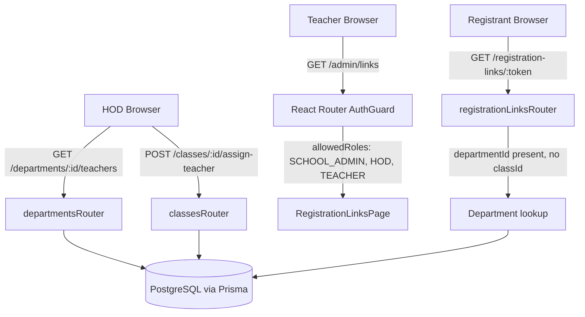

# Design Document

## Feature: role-registration-and-hod-class-teacher

---

## Overview

This document covers the technical design for a set of bug fixes and new features in the SAMS project. The changes span the full stack — Prisma schema, Express backend routes, and React frontend pages.

**Bug fixes:**
1. The `/admin/links` route guard in `main.tsx` excludes `TEACHER`, blocking teachers from accessing the Registration Links page.
2. The `GET /registration-links/:token` handler does not resolve `departmentName` when a link has a `departmentId` but no `classId` (teacher-targeted links).

**New features:**
3. A nullable `classTeacherId` field on the `Class` Prisma model, with a migration and enriched `GET /classes` response.
4. `GET /departments/:id/teachers` — a new endpoint for HODs and admins to list teachers in a department.
5. `POST /classes/:id/assign-teacher` — a new endpoint for HODs and admins to designate a class teacher.
6. A new HOD Department Management page (`/hod/department`) with teacher list and class teacher assignment UI.
7. HOD dashboard quick action linking to the new page.
8. Admin Departments page enriched to show `classTeacherName`.
9. Teacher registration link flow (unblocked by bug fix #1; existing UI already handles it).
10. Student QR scan flow verification (route already correct; dashboard quick action already present).

---

## Architecture

The project is a TypeScript monorepo with two packages:

- **`packages/backend`** — Node.js + Express + Prisma + PostgreSQL
- **`packages/frontend`** — React + TypeScript + Tailwind CSS + Zustand

```
packages/
  backend/
    prisma/
      schema.prisma          ← Class model gets classTeacherId
      migrations/            ← New migration SQL
    src/
      routes/
        departments.ts       ← New GET /:id/teachers, POST /classes/:id/assign-teacher
        users.ts             ← Bug fix: departmentName resolution in GET /:token
      middleware/
        rbac.ts              ← No changes needed (HOD scope logic already exists)
  frontend/
    src/
      main.tsx               ← Bug fix: add TEACHER to /admin/links allowedRoles
      pages/
        DashboardPage.tsx    ← Add "Department Management" to HOD quick actions
        admin/
          DepartmentsPage.tsx ← Show classTeacherName in class rows
        hod/
          DepartmentManagementPage.tsx  ← New page
```

### Data Flow



---

## Components and Interfaces

### Backend

#### 1. Prisma Schema — `Class` model

Add a nullable `classTeacherId` field and the corresponding relation:

```prisma
model Class {
  id              String     @id @default(cuid())
  schoolId        String
  school          School     @relation(fields: [schoolId], references: [id])
  departmentId    String
  department      Department @relation(fields: [departmentId], references: [id])
  name            String
  capacity        Int        @default(50)
  classTeacherId  String?
  classTeacher    User?      @relation("ClassTeacher", fields: [classTeacherId], references: [id])
  createdAt       DateTime   @default(now())

  users             User[]
  timetableEntries  TimetableEntry[]
  sessions          AttendanceSession[]
  registrationLinks RegistrationLink[]

  @@unique([schoolId, name])
}
```

The `User` model gains the inverse relation:

```prisma
model User {
  // ... existing fields ...
  classesAsTeacher  Class[]  @relation("ClassTeacher")
}
```

#### 2. Migration SQL

File: `packages/backend/prisma/migrations/20250606000000_add_class_teacher/migration.sql`

```sql
-- AlterTable
ALTER TABLE "classes" ADD COLUMN "classTeacherId" TEXT;

-- AddForeignKey
ALTER TABLE "classes" ADD CONSTRAINT "classes_classTeacherId_fkey"
  FOREIGN KEY ("classTeacherId") REFERENCES "users"("id")
  ON DELETE SET NULL ON UPDATE CASCADE;
```

The `ON DELETE SET NULL` ensures that if a teacher user is deleted, the class teacher assignment is cleared rather than cascading a delete.

#### 3. `GET /departments/:id/teachers` (new endpoint in `departmentsRouter`)

**Authorization logic:**
- `SCHOOL_ADMIN`: allowed for any department in their school.
- `HOD`: allowed only if `req.params.id === req.user.departmentId`; otherwise 403.
- `TEACHER` / `STUDENT`: always 403.
- Department not in the authenticated user's school: 404.

**Response shape:**
```typescript
interface TeacherSummary {
  id: string;
  fullName: string;
  email: string | null;
  phone: string | null;
}
```

**Handler sketch:**
```typescript
departmentsRouter.get('/:id/teachers', async (req, res) => {
  const user = req.user;
  if (user.role === 'TEACHER' || user.role === 'STUDENT') {
    return res.status(403).json({ error: 'Forbidden', code: 'FORBIDDEN' });
  }
  const deptId = req.params.id;
  const dept = await prisma.department.findUnique({ where: { id: deptId } });
  if (!dept || dept.schoolId !== req.schoolId) {
    return res.status(404).json({ error: 'Not found', code: 'NOT_FOUND' });
  }
  if (user.role === 'HOD' && user.departmentId !== deptId) {
    return res.status(403).json({ error: 'Forbidden', code: 'FORBIDDEN' });
  }
  const teachers = await prisma.user.findMany({
    where: { schoolId: req.schoolId, departmentId: deptId, role: 'TEACHER' },
    select: { id: true, fullName: true, email: true, phone: true },
  });
  res.json(teachers);
});
```

#### 4. `POST /classes/:id/assign-teacher` (new endpoint in `classesRouter`)

**Authorization logic:**
- `TEACHER` / `STUDENT`: always 403.
- `HOD`: class must be in their department; teacher must be in their department; otherwise 403.
- `SCHOOL_ADMIN`: unrestricted within the school; teacher must exist in the school.

**Request body:**
```typescript
interface AssignTeacherBody {
  teacherId: string;
}
```

**Response:** Updated class object including `classTeacherId` and `classTeacherName`.

**Handler sketch:**
```typescript
classesRouter.post('/:id/assign-teacher', async (req, res) => {
  const user = req.user;
  if (user.role === 'TEACHER' || user.role === 'STUDENT') {
    return res.status(403).json({ error: 'Forbidden', code: 'FORBIDDEN' });
  }
  const { teacherId } = req.body;
  if (!teacherId) {
    return res.status(400).json({ error: 'teacherId is required', code: 'VALIDATION_ERROR' });
  }
  const cls = await prisma.class.findUnique({ where: { id: req.params.id } });
  if (!cls || cls.schoolId !== req.schoolId) {
    return res.status(404).json({ error: 'Class not found', code: 'NOT_FOUND' });
  }
  const teacher = await prisma.user.findUnique({ where: { id: teacherId } });
  if (!teacher || teacher.schoolId !== req.schoolId || teacher.role !== 'TEACHER') {
    return res.status(404).json({ error: 'Teacher not found', code: 'NOT_FOUND' });
  }
  if (user.role === 'HOD') {
    if (cls.departmentId !== user.departmentId) {
      return res.status(403).json({ error: 'Forbidden', code: 'FORBIDDEN' });
    }
    if (teacher.departmentId !== user.departmentId) {
      return res.status(403).json({ error: 'Forbidden', code: 'FORBIDDEN' });
    }
  }
  const updated = await prisma.class.update({
    where: { id: cls.id },
    data: { classTeacherId: teacherId },
    include: { classTeacher: { select: { fullName: true } } },
  });
  res.json({
    ...updated,
    classTeacherName: updated.classTeacher?.fullName ?? null,
  });
});
```

#### 5. Enriched `GET /classes` response

The existing handler in `classesRouter` is updated to include the class teacher:

```typescript
classesRouter.get('/', async (req, res) => {
  const classes = await prisma.class.findMany({
    where: { schoolId: req.schoolId },
    include: {
      department: true,
      classTeacher: { select: { fullName: true } },
    },
  });
  const enriched = classes.map(c => ({
    ...c,
    classTeacherName: c.classTeacher?.fullName ?? null,
  }));
  res.json(enriched);
});
```

#### 6. Bug fix — `GET /registration-links/:token` department name resolution

The existing handler in `registrationLinksRouter` is updated to handle the case where `link.departmentId` is set but `link.classId` is not:

```typescript
registrationLinksRouter.get('/:token', async (req, res) => {
  const link = await registrationLinkService.resolveLink(req.params.token);
  const school = await prisma.school.findUnique({
    where: { id: link.schoolId },
    select: { name: true, schoolCode: true },
  });

  let className: string | undefined;
  let departmentName: string | undefined;

  if (link.classId) {
    // Existing path: resolve department name via the class
    const classRecord = await prisma.class.findUnique({
      where: { id: link.classId },
      select: { name: true, department: { select: { name: true } } },
    });
    className = classRecord?.name;
    departmentName = classRecord?.department?.name;
  } else if (link.departmentId) {
    // New path: resolve department name directly from departmentId
    const dept = await prisma.department.findUnique({
      where: { id: link.departmentId },
      select: { name: true },
    });
    departmentName = dept?.name ?? undefined;
  }

  res.status(200).json({
    ...link,
    schoolName: school?.name,
    schoolCode: school?.schoolCode,
    className,
    departmentName,
  });
});
```

### Frontend

#### 7. Bug fix — `main.tsx` route guard

Move `/admin/links` out of the `SCHOOL_ADMIN | HOD` block and into its own guard:

```tsx
{/* Registration Links — accessible to SCHOOL_ADMIN, HOD, and TEACHER */}
<Route element={<AuthGuard allowedRoles={[UserRole.SCHOOL_ADMIN, UserRole.HOD, UserRole.TEACHER]} />}>
  <Route path="/admin/links" element={<RegistrationLinksPage />} />
</Route>
```

The remaining admin routes (`/admin`, `/admin/users`, `/admin/timetable`, `/admin/departments`) stay restricted to `SCHOOL_ADMIN | HOD`.

#### 8. HOD Department Management Page — `DepartmentManagementPage.tsx`

New file: `packages/frontend/src/pages/hod/DepartmentManagementPage.tsx`

**State:**
```typescript
interface Teacher { id: string; fullName: string; email: string | null; phone: string | null; }
interface ClassWithTeacher { id: string; name: string; capacity: number; classTeacherId: string | null; classTeacherName: string | null; }

const [teachers, setTeachers] = useState<Teacher[]>([]);
const [classes, setClasses] = useState<ClassWithTeacher[]>([]);
const [selectedTeacherId, setSelectedTeacherId] = useState('');
const [selectedClassId, setSelectedClassId] = useState('');
const [assigning, setAssigning] = useState(false);
const [error, setError] = useState('');
const [success, setSuccess] = useState('');
```

**Data fetching:**
- On mount: `GET /departments/${user.departmentId}/teachers` → `setTeachers`
- On mount: `GET /departments/${user.departmentId}/classes` → `setClasses`

**Assignment flow:**
1. HOD selects a teacher from a dropdown.
2. HOD selects a class from a dropdown.
3. HOD clicks "Assign".
4. `POST /classes/${selectedClassId}/assign-teacher` with `{ teacherId: selectedTeacherId }`.
5. On success: update the matching class in `classes` state with the new `classTeacherId` and `classTeacherName`.
6. On failure: display the error message from the API response.

**Layout:**
- Two-column layout on desktop: Teachers list (left) | Classes list with assignment UI (right).
- Each class row shows: class name, current class teacher name (or "No class teacher assigned"), and an "Assign Teacher" button that opens an inline form.

#### 9. HOD Dashboard Quick Action

In `DashboardPage.tsx`, add to the `HOD` case of `getQuickActions`:

```typescript
{ to: '/hod/department', label: 'Department Management', icon: ICONS.building, gradient: 'from-indigo-500 to-blue-500' },
```

Insert it as the first action (most prominent) or after "View Reports" depending on priority. Per requirements, it should be clearly accessible — placing it second (after Reports) is appropriate.

#### 10. Admin Departments Page — `classTeacherName` display

In `DepartmentsPage.tsx`, update the `ClassItem` interface and the class row rendering:

```typescript
interface ClassItem {
  id: string;
  name: string;
  capacity: number;
  departmentId: string;
  classTeacherId: string | null;
  classTeacherName: string | null;
}
```

In the class row JSX, add below the capacity line:
```tsx
<p className="text-gray-500 text-xs">
  Class Teacher: {cls.classTeacherName ?? <span className="text-gray-600 italic">None assigned</span>}
</p>
```

The `fetchDepartments` function already calls `GET /departments/:id/classes` per department. The `GET /classes` endpoint (used in the fallback path) will now include `classTeacherName`. Both paths will work once the backend is updated.

#### 11. Route registration — `main.tsx`

Add the new HOD page import and route:

```tsx
import DepartmentManagementPage from './pages/hod/DepartmentManagementPage';

// In the HOD-only routes block:
<Route element={<AuthGuard allowedRoles={[UserRole.HOD]} />}>
  <Route path="/hod/department" element={<DepartmentManagementPage />} />
</Route>
```

---

## Data Models

### Updated `Class` model

| Field | Type | Nullable | Description |
|---|---|---|---|
| `id` | `String` (cuid) | No | Primary key |
| `schoolId` | `String` | No | FK → School |
| `departmentId` | `String` | No | FK → Department |
| `name` | `String` | No | Class name |
| `capacity` | `Int` | No | Default 50 |
| `classTeacherId` | `String?` | **Yes** | FK → User (new) |
| `createdAt` | `DateTime` | No | Creation timestamp |

### API Response Shapes

**`GET /departments/:id/teachers`**
```json
[
  { "id": "cuid", "fullName": "Jane Doe", "email": "jane@school.ke", "phone": "+254700000000" }
]
```

**`POST /classes/:id/assign-teacher` (success)**
```json
{
  "id": "cuid",
  "name": "Form 1A",
  "capacity": 50,
  "departmentId": "cuid",
  "schoolId": "cuid",
  "classTeacherId": "cuid",
  "classTeacherName": "Jane Doe",
  "createdAt": "2025-01-01T00:00:00.000Z"
}
```

**`GET /classes` (enriched)**
```json
[
  {
    "id": "cuid",
    "name": "Form 1A",
    "capacity": 50,
    "departmentId": "cuid",
    "schoolId": "cuid",
    "classTeacherId": "cuid",
    "classTeacherName": "Jane Doe",
    "department": { "id": "cuid", "name": "Science" },
    "createdAt": "2025-01-01T00:00:00.000Z"
  }
]
```

**`GET /registration-links/:token` (enriched for teacher links)**
```json
{
  "id": "cuid",
  "token": "...",
  "targetRole": "TEACHER",
  "departmentId": "cuid",
  "classId": null,
  "schoolId": "cuid",
  "schoolName": "Kenyatta High School",
  "schoolCode": "KHS2024",
  "departmentName": "Science Department",
  "className": null
}
```

---

## Correctness Properties

*A property is a characteristic or behavior that should hold true across all valid executions of a system — essentially, a formal statement about what the system should do. Properties serve as the bridge between human-readable specifications and machine-verifiable correctness guarantees.*

### Property 1: Department name resolution for teacher links

*For any* registration link that has a `departmentId` and no `classId`, resolving the link token should return a `departmentName` that exactly matches the `name` field of the department record identified by `departmentId`.

**Validates: Requirements 2.1, 2.2**

---

### Property 2: Class-path department name takes precedence

*For any* registration link that has both a `classId` and a `departmentId`, the resolved `departmentName` should equal the name of the department associated with the class (via `class.department.name`), not the name of the department directly referenced by `link.departmentId`.

**Validates: Requirements 2.3**

---

### Property 3: Class teacher assignment is reflected in GET /classes

*For any* class in the school, after a successful `POST /classes/:id/assign-teacher` with a valid `teacherId`, a subsequent `GET /classes` response should include that class with `classTeacherId` equal to the assigned teacher's id and `classTeacherName` equal to the teacher's `fullName`.

**Validates: Requirements 3.4, 5.9**

---

### Property 4: GET /classes always includes teacher fields

*For any* `GET /classes` response, every class object in the array should contain both `classTeacherId` and `classTeacherName` fields (either populated or explicitly `null`). No class object should be missing these fields.

**Validates: Requirements 3.4, 3.5**

---

### Property 5: GET /departments/:id/teachers returns only teachers from that department

*For any* department in the school, `GET /departments/:id/teachers` should return a list where every item has `role = TEACHER` and `departmentId` equal to the requested department's id. No teachers from other departments and no non-teacher users should appear in the list.

**Validates: Requirements 4.1, 4.6**

---

### Property 6: HOD cannot access other departments' teacher lists

*For any* HOD user and *any* department id that is not equal to the HOD's own `departmentId`, calling `GET /departments/:id/teachers` should return `403 Forbidden`.

**Validates: Requirements 4.3**

---

### Property 7: TEACHER and STUDENT roles are always forbidden from teacher list and assign-teacher endpoints

*For any* user with role `TEACHER` or `STUDENT`, calling either `GET /departments/:id/teachers` or `POST /classes/:id/assign-teacher` should always return `403 Forbidden`, regardless of which department or class is targeted.

**Validates: Requirements 4.5, 5.6**

---

### Property 8: HOD cannot assign a teacher from outside their department

*For any* HOD user, calling `POST /classes/:id/assign-teacher` with a `teacherId` belonging to a teacher whose `departmentId` does not match the HOD's `departmentId` should return `403 Forbidden`.

**Validates: Requirements 5.3**

---

### Property 9: HOD cannot assign a teacher to a class outside their department

*For any* HOD user, calling `POST /classes/:id/assign-teacher` for a class whose `departmentId` does not match the HOD's `departmentId` should return `403 Forbidden`.

**Validates: Requirements 5.4**

---

### Property 10: Teacher registration link payload always forces targetRole to STUDENT

*For any* class selection made by a `TEACHER` user in the Generate Link modal, the payload submitted to `POST /registration-links` should always contain `targetRole: "STUDENT"`, regardless of any other UI state.

**Validates: Requirements 7.3**

---

### Property 11: Non-STUDENT targetRole from TEACHER is rejected

*For any* `targetRole` value other than `"STUDENT"` submitted by a `TEACHER` user to `POST /registration-links`, the backend should return `400 Bad Request`.

**Validates: Requirements 7.4**

---

### Property 12: HOD Department Management page renders all teachers and classes

*For any* list of teachers returned by `GET /departments/:id/teachers` and *any* list of classes returned by `GET /departments/:id/classes`, the `DepartmentManagementPage` should render a row for every teacher and a row for every class — no items should be silently dropped.

**Validates: Requirements 6.2, 6.3**

---

### Property 13: Class teacher name display correctness

*For any* class in the `DepartmentManagementPage` or `DepartmentsPage`, if `classTeacherName` is non-null, the rendered output should contain that name; if `classTeacherName` is null, a placeholder (e.g. "No class teacher assigned") should be rendered instead.

**Validates: Requirements 6.4, 6.8**

---

## Error Handling

### Backend

| Scenario | HTTP Status | Error Code |
|---|---|---|
| `GET /departments/:id/teachers` — TEACHER or STUDENT caller | 403 | `FORBIDDEN` |
| `GET /departments/:id/teachers` — HOD calling another dept | 403 | `FORBIDDEN` |
| `GET /departments/:id/teachers` — dept not in school | 404 | `NOT_FOUND` |
| `POST /classes/:id/assign-teacher` — TEACHER or STUDENT caller | 403 | `FORBIDDEN` |
| `POST /classes/:id/assign-teacher` — HOD, class not in their dept | 403 | `FORBIDDEN` |
| `POST /classes/:id/assign-teacher` — HOD, teacher not in their dept | 403 | `FORBIDDEN` |
| `POST /classes/:id/assign-teacher` — class not found in school | 404 | `NOT_FOUND` |
| `POST /classes/:id/assign-teacher` — teacher not found in school | 404 | `NOT_FOUND` |
| `POST /classes/:id/assign-teacher` — missing `teacherId` in body | 400 | `VALIDATION_ERROR` |
| `POST /registration-links` — TEACHER with non-STUDENT targetRole | 400 | `BAD_REQUEST` |
| `GET /registration-links/:token` — departmentId not found in DB | 200 with `departmentName: null` | — |

All unhandled errors fall through to the global error handler in `globalMiddleware.ts`, which returns `500 INTERNAL_ERROR`.

### Frontend

- `DepartmentManagementPage`: assignment errors are displayed inline (red banner) without navigating away. The page does not crash if either the teachers or classes fetch fails — it shows an empty list with a retry option.
- `RegistrationLinksPage`: existing error handling (`setError`) already covers the teacher flow.
- `DepartmentsPage`: `classTeacherName` is rendered defensively — if the field is absent (e.g. old cached response), it falls back to `null` display.

---

## Testing Strategy

### Unit Tests

Focus on specific examples, edge cases, and authorization logic:

**Backend:**
- `GET /registration-links/:token` — link with `departmentId` only returns correct `departmentName`.
- `GET /registration-links/:token` — link with both `classId` and `departmentId` returns class's department name.
- `GET /registration-links/:token` — link with neither returns `departmentName: null`.
- `GET /registration-links/:token` — non-existent `departmentId` returns `departmentName: null` without error.
- `GET /departments/:id/teachers` — SCHOOL_ADMIN gets full list; HOD gets own dept; HOD gets 403 for other dept; TEACHER gets 403; STUDENT gets 403; cross-school dept gets 404.
- `POST /classes/:id/assign-teacher` — HOD success; HOD cross-dept class 403; HOD cross-dept teacher 403; TEACHER caller 403; STUDENT caller 403; non-existent class 404; non-existent teacher 404; SCHOOL_ADMIN cross-dept success.
- `GET /classes` — response includes `classTeacherId` and `classTeacherName` for all classes.

**Frontend:**
- `main.tsx` route guard — `allowedRoles` on `/admin/links` includes `TEACHER`, `SCHOOL_ADMIN`, `HOD`; excludes `STUDENT`.
- `DashboardPage.getQuickActions(HOD)` — includes entry with `to: '/hod/department'`.
- `RegistrationLinksPage` with TEACHER role — only STUDENT option visible; payload always has `targetRole: 'STUDENT'`.

### Property-Based Tests

Using a property-based testing library (e.g. **fast-check** for TypeScript):

**Tag format: `Feature: role-registration-and-hod-class-teacher, Property {N}: {property_text}`**

Each property test runs a minimum of **100 iterations**.

- **Property 1** — Generate random `(departmentId, departmentName)` pairs; create a link with that `departmentId` and no `classId`; resolve the token; assert `departmentName` matches.
  - *Tag: Feature: role-registration-and-hod-class-teacher, Property 1: department name resolution for teacher links*

- **Property 2** — Generate random `(class, department, linkDepartment)` where `class.departmentId !== linkDepartment.id`; resolve the token; assert `departmentName === class.department.name`.
  - *Tag: Feature: role-registration-and-hod-class-teacher, Property 2: class-path department name takes precedence*

- **Property 3** — Generate random `(class, teacher)` in the same school; call assign-teacher; call GET /classes; assert the class entry has the correct `classTeacherId` and `classTeacherName`.
  - *Tag: Feature: role-registration-and-hod-class-teacher, Property 3: class teacher assignment is reflected in GET /classes*

- **Property 4** — Generate random school with N classes (some with teachers, some without); call GET /classes; assert every item has `classTeacherId` and `classTeacherName` fields.
  - *Tag: Feature: role-registration-and-hod-class-teacher, Property 4: GET /classes always includes teacher fields*

- **Property 5** — Generate random department with M teachers and K non-teachers; call GET /departments/:id/teachers; assert all returned items are teachers in that department.
  - *Tag: Feature: role-registration-and-hod-class-teacher, Property 5: GET /departments/:id/teachers returns only teachers from that department*

- **Property 6** — Generate random HOD and random department id != HOD's departmentId; call GET /departments/:id/teachers; assert 403.
  - *Tag: Feature: role-registration-and-hod-class-teacher, Property 6: HOD cannot access other departments' teacher lists*

- **Property 7** — Generate random TEACHER or STUDENT user; call both endpoints; assert 403 for both.
  - *Tag: Feature: role-registration-and-hod-class-teacher, Property 7: TEACHER and STUDENT roles are always forbidden*

- **Property 8** — Generate random HOD and random teacher not in HOD's department; call assign-teacher; assert 403.
  - *Tag: Feature: role-registration-and-hod-class-teacher, Property 8: HOD cannot assign a teacher from outside their department*

- **Property 9** — Generate random HOD and random class not in HOD's department; call assign-teacher; assert 403.
  - *Tag: Feature: role-registration-and-hod-class-teacher, Property 9: HOD cannot assign a teacher to a class outside their department*

- **Property 10** — Generate random class selection by TEACHER user; simulate form submission; assert payload `targetRole === 'STUDENT'`.
  - *Tag: Feature: role-registration-and-hod-class-teacher, Property 10: teacher registration link payload always forces targetRole to STUDENT*

- **Property 11** — Generate random `targetRole` from `['TEACHER', 'HOD', 'SCHOOL_ADMIN']`; submit as TEACHER user; assert 400.
  - *Tag: Feature: role-registration-and-hod-class-teacher, Property 11: non-STUDENT targetRole from TEACHER is rejected*

- **Property 12** — Generate random teacher list and class list; render DepartmentManagementPage; assert all items appear.
  - *Tag: Feature: role-registration-and-hod-class-teacher, Property 12: HOD Department Management page renders all teachers and classes*

- **Property 13** — Generate random class with non-null `classTeacherName`; render; assert name appears. Generate class with null `classTeacherName`; render; assert placeholder appears.
  - *Tag: Feature: role-registration-and-hod-class-teacher, Property 13: class teacher name display correctness*

### Integration Tests

- End-to-end: HOD logs in → navigates to `/hod/department` → assigns a teacher → verifies the class row updates.
- End-to-end: Teacher logs in → navigates to `/admin/links` → generates a STUDENT link → verifies link appears in the list.
- End-to-end: Registrant opens teacher registration link → verifies department name is displayed on the registration page.
- Migration: Apply migration to a test database; verify `classTeacherId` column exists and accepts null.
