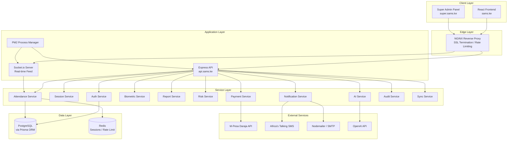
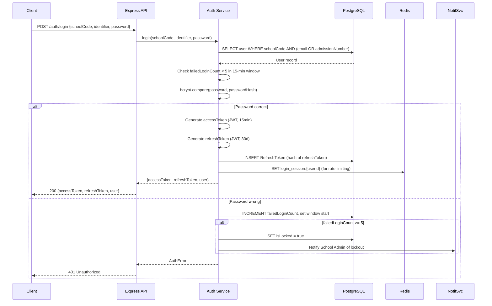
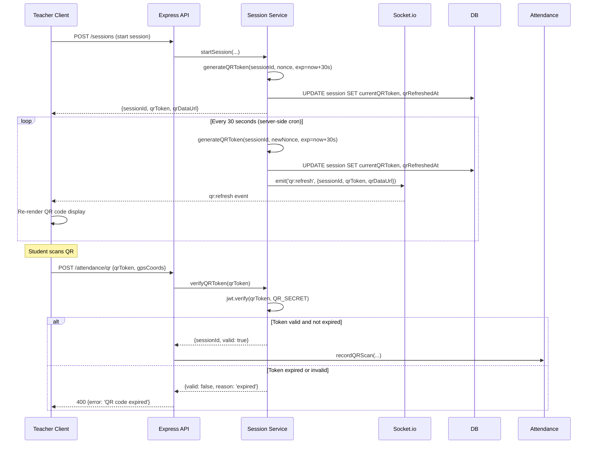
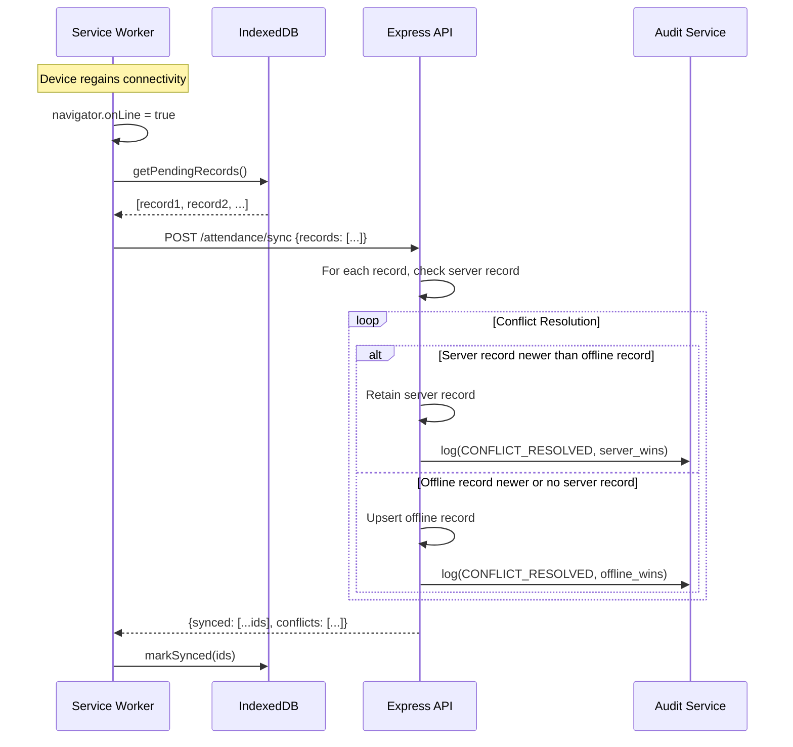
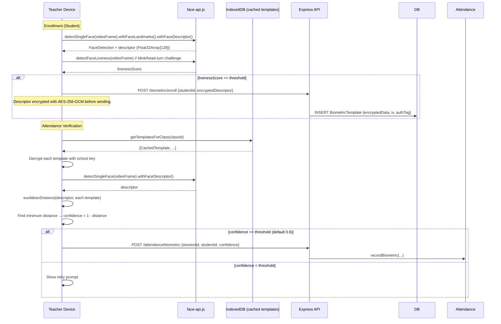
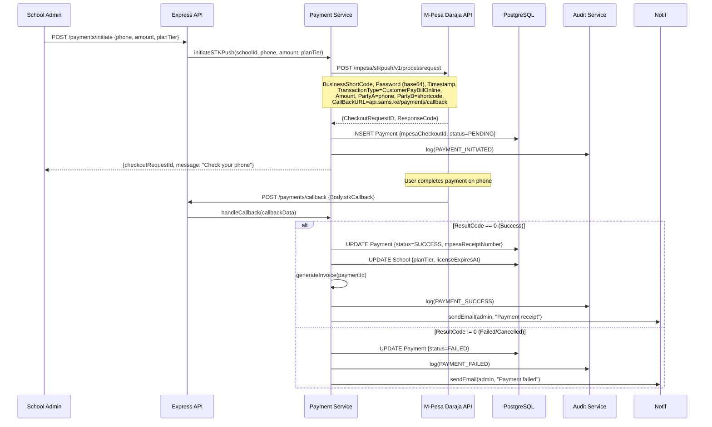
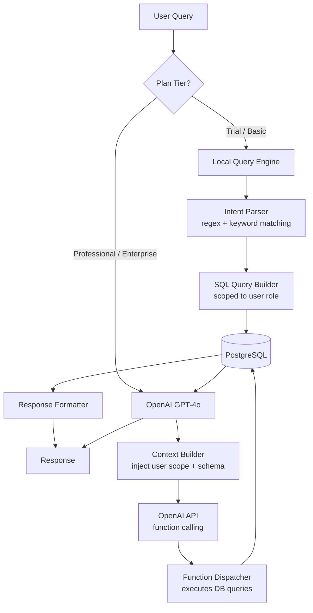

# Design Document: SAMS (Smart Attendance Management System)

## Overview

SAMS is a multi-school, enterprise-grade attendance platform for Kenyan educational institutions. It prevents fraudulent attendance through multi-layer validation (QR code, GPS, biometric), supports real-time monitoring, offline-first operation, AI-assisted insights, and M-Pesa subscription payments. The system is deployed across three subdomains on a single Ubuntu 22.04 VPS: `sams.ke` (React frontend), `api.sams.ke` (Express backend), and `super.sams.ke` (Super Admin panel).

The design follows a monorepo structure with three packages: `frontend`, `backend`, and `super-admin`. All packages share TypeScript types via a `shared` package. The backend exposes a REST API consumed by both the frontend and super-admin panel, with Socket.io for real-time attendance feeds.

---

## Architecture

### Monorepo Structure

```
sams/
├── packages/
│   ├── shared/               # Shared TypeScript types, constants, utilities
│   │   ├── src/
│   │   │   ├── types/        # Prisma-derived types, DTOs, enums
│   │   │   └── utils/        # License key codec, validation helpers
│   │   └── package.json
│   ├── backend/              # Node.js + Express + TypeScript API
│   │   ├── src/
│   │   │   ├── routes/       # Express routers per domain
│   │   │   ├── services/     # Business logic layer
│   │   │   ├── middleware/   # Auth, RBAC, rate-limit, validation
│   │   │   ├── prisma/       # Prisma schema and migrations
│   │   │   ├── sockets/      # Socket.io event handlers
│   │   │   ├── jobs/         # Cron jobs (risk scoring, notifications)
│   │   │   └── index.ts      # Entry point
│   │   └── package.json
│   ├── frontend/             # React + TypeScript + Vite + TailwindCSS
│   │   ├── src/
│   │   │   ├── pages/        # Route-level page components
│   │   │   ├── components/   # Reusable UI components
│   │   │   ├── hooks/        # Custom React hooks
│   │   │   ├── services/     # API client, IndexedDB, sync
│   │   │   ├── store/        # Zustand global state
│   │   │   ├── workers/      # Service Worker registration
│   │   │   └── main.tsx
│   │   ├── public/
│   │   │   └── sw.js         # Service Worker
│   │   └── package.json
│   └── super-admin/          # React + TypeScript + Vite (Super Admin panel)
│       ├── src/
│       │   ├── pages/
│       │   ├── components/
│       │   └── main.tsx
│       └── package.json
├── nginx/
│   └── sams.conf             # NGINX virtual host config
├── .github/
│   └── workflows/
│       └── deploy.yml        # GitHub Actions CI/CD
├── package.json              # Root workspace config
└── turbo.json                # Turborepo pipeline config
```

### High-Level Architecture Diagram



---

## Components and Interfaces

### Backend Service Interfaces

```typescript
// Auth Service
interface IAuthService {
  login(schoolCode: string, identifier: string, password: string): Promise<TokenPair>;
  refresh(refreshToken: string): Promise<TokenPair>;
  logout(userId: string, refreshToken: string): Promise<void>;
  lockAccount(userId: string): Promise<void>;
}

// Session Service
interface ISessionService {
  startSession(teacherId: string, timetableEntryId: string, location: GpsCoords): Promise<AttendanceSession>;
  endSession(sessionId: string, teacherId: string): Promise<void>;
  generateQRCode(sessionId: string): Promise<QRPayload>;
  refreshQRCode(sessionId: string): Promise<QRPayload>;
  getActiveQR(sessionId: string): Promise<QRPayload | null>;
}

// Attendance Service
interface IAttendanceService {
  recordQRScan(studentId: string, qrToken: string, gpsCoords: GpsCoords): Promise<AttendanceRecord>;
  recordManual(teacherId: string, studentId: string, sessionId: string, status: AttendanceStatus, note?: string): Promise<AttendanceRecord>;
  recordBiometric(teacherId: string, sessionId: string, matchResult: BiometricMatch): Promise<AttendanceRecord>;
  updateRecord(teacherId: string, recordId: string, status: AttendanceStatus, note?: string): Promise<AttendanceRecord>;
  syncOfflineRecords(records: OfflineAttendanceRecord[]): Promise<SyncResult>;
}

// Biometric Service
interface IBiometricService {
  enrollTemplate(studentId: string, descriptor: Float32Array): Promise<void>;
  matchDescriptor(descriptor: Float32Array, classId: string): Promise<BiometricMatch>;
  getEncryptedTemplates(classId: string): Promise<EncryptedTemplate[]>;
}

// Report Service
interface IReportService {
  getStudentReport(studentId: string, dateRange: DateRange): Promise<StudentReport>;
  getClassReport(classId: string, dateRange: DateRange): Promise<ClassReport>;
  getDepartmentReport(departmentId: string, dateRange: DateRange): Promise<DepartmentReport>;
  getSchoolReport(schoolId: string, dateRange: DateRange): Promise<SchoolReport>;
  exportReport(reportId: string, format: 'pdf' | 'excel'): Promise<Buffer>;
}

// Risk Service
interface IRiskService {
  computeRiskScore(studentId: string): Promise<RiskScore>;
  getRiskScores(scope: RiskScope): Promise<RiskScore[]>;
}

// Payment Service
interface IPaymentService {
  initiateSTKPush(schoolId: string, phone: string, amount: number, plan: PlanTier): Promise<STKPushResponse>;
  handleCallback(callbackData: MpesaCallback): Promise<void>;
  getInvoice(paymentId: string): Promise<Invoice>;
}

// AI Service
interface IAIService {
  query(userId: string, role: UserRole, question: string, schoolId: string): Promise<AIResponse>;
  voiceQuery(userId: string, role: UserRole, audioBlob: Blob, schoolId: string): Promise<AIResponse>;
}

// Notification Service
interface INotificationService {
  sendSMS(phone: string, message: string): Promise<void>;
  sendEmail(to: string, subject: string, body: string): Promise<void>;
  sendInApp(userId: string, notification: InAppNotification): Promise<void>;
}

// Audit Service
interface IAuditService {
  log(event: AuditEvent): Promise<void>;
  query(filters: AuditFilters): Promise<AuditLog[]>;
}
```

### Frontend Service Interfaces

```typescript
// API Client
interface IApiClient {
  get<T>(path: string): Promise<T>;
  post<T>(path: string, body: unknown): Promise<T>;
  put<T>(path: string, body: unknown): Promise<T>;
  delete<T>(path: string): Promise<T>;
}

// IndexedDB Store
interface IOfflineStore {
  saveAttendanceRecord(record: OfflineAttendanceRecord): Promise<void>;
  getPendingRecords(): Promise<OfflineAttendanceRecord[]>;
  markSynced(recordId: string): Promise<void>;
  saveBiometricTemplate(template: CachedTemplate): Promise<void>;
  getTemplatesForClass(classId: string): Promise<CachedTemplate[]>;
}

// Sync Service
interface ISyncService {
  syncPendingRecords(): Promise<SyncResult>;
  onConnectivityRestored(): void;
}
```

---

## Data Models

### Prisma Schema

```prisma
// prisma/schema.prisma

generator client {
  provider = "prisma-client-js"
}

datasource db {
  provider = "postgresql"
  url      = env("DATABASE_URL")
}

// ─── Enums ───────────────────────────────────────────────────────────────────

enum PlanTier {
  TRIAL
  BASIC
  PROFESSIONAL
  ENTERPRISE
}

enum UserRole {
  SUPER_ADMIN
  SCHOOL_ADMIN
  HOD
  TEACHER
  STUDENT
}

enum AttendanceStatus {
  PRESENT
  LATE
  EXCUSED
  ABSENT
}

enum RiskLevel {
  LOW
  MEDIUM
  HIGH
  CRITICAL
}

enum AuditEventType {
  USER_LOGIN
  USER_LOGOUT
  LICENSE_ACTIVATION
  ATTENDANCE_CREATED
  ATTENDANCE_UPDATED
  PAYMENT_INITIATED
  PAYMENT_SUCCESS
  PAYMENT_FAILED
  SCHOOL_SUSPENDED
  ROLE_CHANGED
  CONFLICT_RESOLVED
  SMS_RETRY
}

enum PaymentStatus {
  PENDING
  SUCCESS
  FAILED
  CANCELLED
}

// ─── Core Entities ────────────────────────────────────────────────────────────

model LicenseKey {
  id          String    @id @default(cuid())
  keyHash     String    @unique          // bcrypt hash of raw key — raw key never stored
  planTier    PlanTier
  schoolName  String
  expiresAt   DateTime
  usedAt      DateTime?
  usedBySchoolId String? @unique
  school      School?   @relation(fields: [usedBySchoolId], references: [id])
  createdAt   DateTime  @default(now())
}

model School {
  id              String      @id @default(cuid())
  name            String
  schoolCode      String      @unique   // short memorable code, e.g. "KHS2024"
  planTier        PlanTier    @default(TRIAL)
  licenseExpiresAt DateTime
  isSuspended     Boolean     @default(false)
  isReadOnly      Boolean     @default(false)
  logoUrl         String?                         // Enterprise: custom branding
  primaryColor    String?
  createdAt       DateTime    @default(now())
  updatedAt       DateTime    @updatedAt

  licenseKey      LicenseKey?
  users           User[]
  departments     Department[]
  classes         Class[]
  timetableEntries TimetableEntry[]
  sessions        AttendanceSession[]
  registrationLinks RegistrationLink[]
  auditLogs       AuditLog[]
  payments        Payment[]
  riskScores      RiskScore[]
}

model User {
  id            String    @id @default(cuid())
  schoolId      String
  school        School    @relation(fields: [schoolId], references: [id])
  role          UserRole
  fullName      String
  email         String?
  phone         String?
  admissionNumber String?                         // Students only
  passwordHash  String
  departmentId  String?
  department    Department? @relation(fields: [departmentId], references: [id])
  classId       String?
  class         Class?      @relation(fields: [classId], references: [id])
  isLocked      Boolean   @default(false)
  failedLoginCount Int     @default(0)
  failedLoginWindowStart DateTime?
  lastLoginAt   DateTime?
  createdAt     DateTime  @default(now())
  updatedAt     DateTime  @updatedAt

  refreshTokens RefreshToken[]
  biometricTemplate BiometricTemplate?
  attendanceRecords AttendanceRecord[]
  sessionsStarted AttendanceSession[] @relation("SessionTeacher")
  auditLogsActed  AuditLog[]          @relation("AuditActor")

  @@unique([schoolId, admissionNumber])
  @@index([schoolId, role])
}

model RefreshToken {
  id        String   @id @default(cuid())
  userId    String
  user      User     @relation(fields: [userId], references: [id], onDelete: Cascade)
  tokenHash String   @unique
  expiresAt DateTime
  createdAt DateTime @default(now())

  @@index([userId])
}

model Department {
  id        String   @id @default(cuid())
  schoolId  String
  school    School   @relation(fields: [schoolId], references: [id])
  name      String
  createdAt DateTime @default(now())

  users     User[]
  classes   Class[]

  @@unique([schoolId, name])
}

model Class {
  id           String   @id @default(cuid())
  schoolId     String
  school       School   @relation(fields: [schoolId], references: [id])
  departmentId String
  department   Department @relation(fields: [departmentId], references: [id])
  name         String
  capacity     Int      @default(50)
  createdAt    DateTime @default(now())

  users        User[]
  timetableEntries TimetableEntry[]
  sessions     AttendanceSession[]
  registrationLinks RegistrationLink[]

  @@unique([schoolId, name])
}

model TimetableEntry {
  id           String   @id @default(cuid())
  schoolId     String
  school       School   @relation(fields: [schoolId], references: [id])
  classId      String
  class        Class    @relation(fields: [classId], references: [id])
  teacherId    String
  teacher      User     @relation(fields: [teacherId], references: [id])
  subject      String
  dayOfWeek    Int      // 0=Monday … 6=Sunday
  startTime    String   // "HH:MM" 24-hour
  endTime      String
  room         String?
  createdAt    DateTime @default(now())
  updatedAt    DateTime @updatedAt

  sessions     AttendanceSession[]

  @@index([schoolId, teacherId, dayOfWeek])
  @@index([schoolId, classId, dayOfWeek])
}

model AttendanceSession {
  id               String   @id @default(cuid())
  schoolId         String
  school           School   @relation(fields: [schoolId], references: [id])
  classId          String
  class            Class    @relation(fields: [classId], references: [id])
  teacherId        String
  teacher          User     @relation("SessionTeacher", fields: [teacherId], references: [id])
  timetableEntryId String?
  timetableEntry   TimetableEntry? @relation(fields: [timetableEntryId], references: [id])
  subject          String
  lateThresholdMin Int      @default(15)
  locationLat      Float?
  locationLng      Float?
  locationRadiusM  Int      @default(100)
  currentQRToken   String?
  qrRefreshedAt    DateTime?
  startedAt        DateTime @default(now())
  endedAt          DateTime?
  isActive         Boolean  @default(true)

  records          AttendanceRecord[]

  @@index([schoolId, classId, isActive])
  @@index([schoolId, teacherId, isActive])
}

model AttendanceRecord {
  id          String           @id @default(cuid())
  schoolId    String
  sessionId   String
  session     AttendanceSession @relation(fields: [sessionId], references: [id])
  studentId   String
  student     User             @relation(fields: [studentId], references: [id])
  status      AttendanceStatus
  method      String           // "QR" | "MANUAL" | "BIOMETRIC" | "OFFLINE_QR" | "OFFLINE_MANUAL"
  note        String?          @db.VarChar(500)
  scannedAt   DateTime
  syncedAt    DateTime?
  createdAt   DateTime         @default(now())
  updatedAt   DateTime         @updatedAt

  @@unique([sessionId, studentId])
  @@index([schoolId, studentId])
  @@index([sessionId])
}

model RegistrationLink {
  id          String   @id @default(cuid())
  schoolId    String
  school      School   @relation(fields: [schoolId], references: [id])
  classId     String?
  class       Class?   @relation(fields: [classId], references: [id])
  targetRole  UserRole
  token       String   @unique @default(cuid())
  expiresAt   DateTime
  maxUses     Int
  useCount    Int      @default(0)
  createdById String
  createdAt   DateTime @default(now())

  @@index([schoolId])
}

model BiometricTemplate {
  id              String   @id @default(cuid())
  schoolId        String
  studentId       String   @unique
  student         User     @relation(fields: [studentId], references: [id], onDelete: Cascade)
  encryptedData   Bytes    // AES-256-GCM encrypted Float32Array descriptor
  iv              Bytes    // AES-256-GCM initialization vector
  authTag         Bytes    // AES-256-GCM authentication tag
  createdAt       DateTime @default(now())
  updatedAt       DateTime @updatedAt
}

model RiskScore {
  id               String    @id @default(cuid())
  schoolId         String
  school           School    @relation(fields: [schoolId], references: [id])
  studentId        String    @unique
  attendanceWeight Float     // 0–100 normalized
  gradeWeight      Float
  patternWeight    Float
  score            Float     // composite 0–100
  riskLevel        RiskLevel
  computedAt       DateTime  @default(now())

  @@index([schoolId, riskLevel])
}

model AuditLog {
  id           String         @id @default(cuid())
  sequenceNum  BigInt         @default(autoincrement())
  schoolId     String?
  school       School?        @relation(fields: [schoolId], references: [id])
  actorId      String?
  actor        User?          @relation("AuditActor", fields: [actorId], references: [id])
  actorRole    UserRole?
  eventType    AuditEventType
  resourceSnapshot Json       // JSON snapshot of affected resource
  createdAt    DateTime       @default(now())

  @@index([schoolId, eventType])
  @@index([schoolId, createdAt])
}

model Payment {
  id                String        @id @default(cuid())
  schoolId          String
  school            School        @relation(fields: [schoolId], references: [id])
  mpesaCheckoutId   String?       @unique
  mpesaReceiptNumber String?
  phone             String
  amount            Float
  planTier          PlanTier
  status            PaymentStatus @default(PENDING)
  invoiceUrl        String?
  initiatedAt       DateTime      @default(now())
  completedAt       DateTime?

  @@index([schoolId])
}
```

---

## API Design

All endpoints are prefixed with `/api/v1`. Every request (except public auth and activation endpoints) requires a valid `Authorization: Bearer <accessToken>` header. The API enforces `schoolId` scoping via JWT claims on every data-access endpoint.

### Authentication Endpoints

| Method | Path | Description | Auth |
|--------|------|-------------|------|
| POST | `/auth/login` | Login with schoolCode + identifier + password | Public |
| POST | `/auth/refresh` | Exchange refresh token for new access token | Public |
| POST | `/auth/logout` | Invalidate refresh token | Bearer |
| POST | `/activate` | Activate school with license key | Public |

### User & Registration Endpoints

| Method | Path | Description | Roles |
|--------|------|-------------|-------|
| GET | `/users` | List users in school (scoped by role) | Admin, HOD |
| POST | `/users` | Manually create a user | Admin, HOD, Teacher |
| GET | `/users/:id` | Get user profile | Self, Admin, HOD |
| PUT | `/users/:id` | Update user profile | Self, Admin |
| DELETE | `/users/:id` | Remove user | Admin |
| POST | `/registration-links` | Generate registration link | Admin, HOD, Teacher |
| GET | `/registration-links/:token` | Resolve link metadata | Public |
| POST | `/registration-links/:token/register` | Self-register via link | Public |

### Timetable Endpoints

| Method | Path | Description | Roles |
|--------|------|-------------|-------|
| GET | `/timetable` | List timetable entries for school | Admin, HOD, Teacher |
| POST | `/timetable` | Create timetable entry | Admin |
| PUT | `/timetable/:id` | Update timetable entry | Admin |
| DELETE | `/timetable/:id` | Delete timetable entry | Admin |

### Attendance Session Endpoints

| Method | Path | Description | Roles |
|--------|------|-------------|-------|
| POST | `/sessions` | Start attendance session | Teacher |
| GET | `/sessions/:id` | Get session details | Teacher, Admin |
| GET | `/sessions/:id/qr` | Get current QR payload | Teacher |
| POST | `/sessions/:id/end` | End session | Teacher |
| GET | `/sessions` | List sessions (scoped) | Teacher, Admin, HOD |

### Attendance Record Endpoints

| Method | Path | Description | Roles |
|--------|------|-------------|-------|
| POST | `/attendance/qr` | Record QR scan | Student |
| POST | `/attendance/manual` | Record manual mark | Teacher |
| POST | `/attendance/biometric` | Record biometric mark | Teacher |
| PUT | `/attendance/:id` | Update attendance record | Teacher |
| POST | `/attendance/sync` | Sync offline records | Teacher, Student |
| GET | `/attendance` | List records (scoped) | All roles |

### Report Endpoints

| Method | Path | Description | Roles |
|--------|------|-------------|-------|
| GET | `/reports/student/:id` | Student attendance report | Student (self), Teacher, HOD, Admin |
| GET | `/reports/class/:classId` | Class attendance report | Teacher, HOD, Admin |
| GET | `/reports/department/:deptId` | Department report | HOD, Admin |
| GET | `/reports/school` | School-wide report | Admin |
| GET | `/reports/:reportId/export` | Export PDF or Excel | Teacher, HOD, Admin |

### Risk Score Endpoints

| Method | Path | Description | Roles |
|--------|------|-------------|-------|
| GET | `/risk-scores` | List risk scores (scoped) | HOD, Admin |
| GET | `/risk-scores/:studentId` | Get student risk score | Teacher, HOD, Admin |

### Payment Endpoints

| Method | Path | Description | Roles |
|--------|------|-------------|-------|
| POST | `/payments/initiate` | Initiate M-Pesa STK Push | Admin |
| POST | `/payments/callback` | M-Pesa callback (Daraja webhook) | Public (IP-whitelisted) |
| GET | `/payments` | List payment history | Admin |
| GET | `/payments/:id/invoice` | Download invoice | Admin |

### AI Assistant Endpoints

| Method | Path | Description | Roles |
|--------|------|-------------|-------|
| POST | `/ai/query` | Text query | All roles |
| POST | `/ai/voice` | Voice query (audio blob) | All roles |

### Super Admin Endpoints (super.sams.ke only)

| Method | Path | Description | Roles |
|--------|------|-------------|-------|
| POST | `/super/licenses` | Generate license key | Super Admin |
| GET | `/super/schools` | List all schools | Super Admin |
| GET | `/super/schools/:id` | Get school details | Super Admin |
| POST | `/super/schools/:id/suspend` | Suspend school | Super Admin |
| POST | `/super/schools/:id/unsuspend` | Lift suspension | Super Admin |
| POST | `/super/schools/:id/extend` | Extend license | Super Admin |
| GET | `/super/revenue` | Aggregated revenue stats | Super Admin |
| GET | `/super/audit-logs` | Query audit logs | Super Admin |

---

## Authentication and Authorization Flow

### JWT Token Design

Access tokens are short-lived (15 minutes). Refresh tokens are long-lived (30 days) and stored hashed in the database.

```typescript
// Access Token Payload
interface AccessTokenPayload {
  sub: string;          // userId
  schoolId: string;
  role: UserRole;
  departmentId?: string;
  classId?: string;
  iat: number;
  exp: number;
}

// Refresh Token Payload
interface RefreshTokenPayload {
  sub: string;          // userId
  jti: string;          // unique token ID (stored hashed in DB)
  iat: number;
  exp: number;
}
```

### Login Flow



### RBAC Middleware

```typescript
// middleware/rbac.ts
type Permission = 'manage:users' | 'start:session' | 'mark:attendance' |
                  'view:reports' | 'manage:timetable' | 'view:risk' |
                  'manage:payments' | 'super:admin';

const ROLE_PERMISSIONS: Record<UserRole, Permission[]> = {
  SUPER_ADMIN:  ['super:admin', 'view:reports'],
  SCHOOL_ADMIN: ['manage:users', 'manage:timetable', 'view:reports', 'view:risk', 'manage:payments'],
  HOD:          ['manage:users', 'view:reports', 'view:risk'],
  TEACHER:      ['start:session', 'mark:attendance', 'view:reports'],
  STUDENT:      ['view:reports'],
};

// Middleware factory
export const requirePermission = (permission: Permission) =>
  (req: AuthRequest, res: Response, next: NextFunction) => {
    const { role, schoolId } = req.user;
    if (!ROLE_PERMISSIONS[role].includes(permission)) {
      return res.status(403).json({ error: 'Forbidden' });
    }
    next();
  };

// School isolation middleware — applied globally to all data routes
export const enforceSchoolScope = (req: AuthRequest, res: Response, next: NextFunction) => {
  req.schoolId = req.user.schoolId; // injected into all DB queries
  next();
};
```

---

## QR Code Generation and Refresh Mechanism

### QR Payload Design

Each QR code encodes a signed JWT with a 30-second expiry. The token contains the session ID, a nonce, and the issue timestamp. The server validates the token signature and expiry on every scan.

```typescript
interface QRTokenPayload {
  sessionId: string;
  nonce: string;       // random UUID, changes every refresh
  iat: number;
  exp: number;         // iat + 30 seconds
}
```

### QR Refresh Flow



The QR code is rendered client-side using the `qrcode` library from the JWT string. The Teacher's device polls `GET /sessions/:id/qr` as a fallback if the WebSocket connection drops.

---

## Offline-First Architecture

### IndexedDB Schema (idb library)

```typescript
// services/offlineStore.ts
interface SAMSDatabase extends DBSchema {
  pendingAttendance: {
    key: string;                    // auto-generated UUID
    value: OfflineAttendanceRecord;
    indexes: { 'by-session': string; 'by-synced': boolean };
  };
  biometricTemplates: {
    key: string;                    // studentId
    value: CachedTemplate;
    indexes: { 'by-class': string };
  };
  sessionCache: {
    key: string;                    // sessionId
    value: CachedSession;
  };
  studentCache: {
    key: string;                    // studentId
    value: CachedStudent;
    indexes: { 'by-class': string };
  };
}

interface OfflineAttendanceRecord {
  id: string;
  sessionId: string;
  studentId: string;
  status: AttendanceStatus;
  method: string;
  note?: string;
  scannedAt: string;   // ISO timestamp
  synced: boolean;
  conflictResolution?: 'server_wins' | 'offline_wins';
}
```

### Service Worker Strategy

```
public/sw.js — Cache-first for static assets, network-first for API calls
```

| Resource Type | Strategy | Cache Name |
|---------------|----------|------------|
| Static assets (JS, CSS, images) | Cache-first | `sams-static-v1` |
| API GET requests | Network-first, fallback to cache | `sams-api-v1` |
| API POST/PUT requests | Queue in IndexedDB, replay on reconnect | — |
| QR code display page | Cache-first | `sams-static-v1` |

### Sync Strategy



The sync endpoint accepts a batch of offline records and returns which were accepted, which were rejected due to conflicts, and the resolution applied. The client marks accepted records as synced in IndexedDB.

---

## Real-Time WebSocket Design

### Socket.io Architecture

The Socket.io server runs on the same Express process. Rooms are namespaced by session ID to isolate broadcasts.

```typescript
// sockets/attendanceSocket.ts
io.on('connection', (socket) => {
  // Authenticate via handshake token
  const token = socket.handshake.auth.token;
  const user = verifyAccessToken(token);

  // Teacher joins session room
  socket.on('session:join', ({ sessionId }) => {
    // Verify teacher owns session
    socket.join(`session:${sessionId}`);
    // Replay missed events since last seen timestamp
    replayMissedEvents(socket, sessionId, socket.handshake.auth.lastSeen);
  });

  // Student joins to receive QR refresh
  socket.on('qr:subscribe', ({ sessionId }) => {
    socket.join(`qr:${sessionId}`);
  });
});

// Emitted by Attendance Service on record create/update
export const broadcastAttendanceUpdate = (sessionId: string, record: AttendanceRecord) => {
  io.to(`session:${sessionId}`).emit('attendance:update', record);
};

// Emitted by Session Service on QR refresh
export const broadcastQRRefresh = (sessionId: string, qrPayload: QRPayload) => {
  io.to(`qr:${sessionId}`).emit('qr:refresh', qrPayload);
};

// Emitted by Session Service on session end
export const broadcastSessionEnd = (sessionId: string) => {
  io.to(`session:${sessionId}`).emit('session:ended');
  io.to(`qr:${sessionId}`).emit('session:ended');
};
```

### Event Replay on Reconnect

Attendance events are stored in Redis with a 2-hour TTL keyed by `events:{sessionId}`. On reconnect, the server replays all events with a timestamp newer than the client's `lastSeen` value.

```typescript
// On new attendance record
await redis.lpush(`events:${sessionId}`, JSON.stringify({ ...record, ts: Date.now() }));
await redis.expire(`events:${sessionId}`, 7200);

// On reconnect replay
const events = await redis.lrange(`events:${sessionId}`, 0, -1);
const missed = events
  .map(e => JSON.parse(e))
  .filter(e => e.ts > lastSeen);
missed.forEach(e => socket.emit('attendance:update', e));
```

---

## Biometric Service Design

### Client-Side Processing with face-api.js

All biometric processing happens on the client device. Raw facial images are never transmitted to the server. Only the encrypted 128-dimensional face descriptor (Float32Array) is stored.



### Biometric Encryption

Templates are encrypted using AES-256-GCM before storage. The encryption key is derived from the school's secret key stored in environment variables.

```typescript
// services/biometricEncryption.ts
import { createCipheriv, createDecipheriv, randomBytes } from 'crypto';

const ALGORITHM = 'aes-256-gcm';

export function encryptDescriptor(descriptor: Float32Array, schoolKey: Buffer): EncryptedTemplate {
  const iv = randomBytes(12);
  const cipher = createCipheriv(ALGORITHM, schoolKey, iv);
  const data = Buffer.from(descriptor.buffer);
  const encrypted = Buffer.concat([cipher.update(data), cipher.final()]);
  const authTag = cipher.getAuthTag();
  return { encryptedData: encrypted, iv, authTag };
}

export function decryptDescriptor(template: EncryptedTemplate, schoolKey: Buffer): Float32Array {
  const decipher = createDecipheriv(ALGORITHM, schoolKey, template.iv);
  decipher.setAuthTag(template.authTag);
  const decrypted = Buffer.concat([decipher.update(template.encryptedData), decipher.final()]);
  return new Float32Array(decrypted.buffer);
}
```

---

## M-Pesa Payment Integration Flow

### Daraja API Integration



### M-Pesa Password Generation

```typescript
// services/mpesa.ts
const generatePassword = (shortCode: string, passKey: string, timestamp: string): string => {
  return Buffer.from(`${shortCode}${passKey}${timestamp}`).toString('base64');
};

const getTimestamp = (): string => {
  return new Date().toISOString().replace(/[-:T.Z]/g, '').slice(0, 14);
};
```

The callback endpoint is IP-whitelisted to Safaricom's published IP ranges and does not require a Bearer token.

---

## AI Assistant Architecture

### Tiered Query Engine



### Local Query Engine (Trial/Basic)

The local engine handles structured queries without an LLM. It uses regex-based intent detection and a query builder that enforces role-based scoping.

```typescript
// services/ai/localEngine.ts
const INTENTS = [
  { pattern: /attendance.*percentage|how.*often.*attend/i, handler: 'getAttendancePercentage' },
  { pattern: /absent.*today|who.*missing/i, handler: 'getAbsentStudents' },
  { pattern: /risk.*score|dropout.*risk/i, handler: 'getRiskScores' },
  { pattern: /top.*student|best.*attendance/i, handler: 'getTopStudents' },
  { pattern: /compare.*class|class.*vs/i, handler: 'compareClasses' },
];

export async function localQuery(question: string, userContext: UserContext): Promise<AIResponse> {
  const intent = INTENTS.find(i => i.pattern.test(question));
  if (!intent) return { answer: "I couldn't understand that query. Try asking about attendance percentages, absent students, or risk scores." };
  return handlers[intent.handler](userContext);
}
```

### OpenAI Integration (Professional/Enterprise)

Uses OpenAI function calling to translate natural language into scoped database queries.

```typescript
// services/ai/openaiEngine.ts
const TOOLS: OpenAI.Chat.ChatCompletionTool[] = [
  {
    type: 'function',
    function: {
      name: 'query_attendance',
      description: 'Query attendance records for the user\'s permitted scope',
      parameters: {
        type: 'object',
        properties: {
          studentId: { type: 'string' },
          classId: { type: 'string' },
          dateFrom: { type: 'string', format: 'date' },
          dateTo: { type: 'string', format: 'date' },
          status: { type: 'string', enum: ['PRESENT', 'LATE', 'EXCUSED', 'ABSENT'] },
        },
      },
    },
  },
  // ... more tools: query_risk_scores, query_reports, etc.
];

// System prompt enforces scope
const systemPrompt = (ctx: UserContext) =>
  `You are SAMS AI Assistant. The user is a ${ctx.role} at school ${ctx.schoolId}.
   You may ONLY query data within their permitted scope.
   ${ctx.role === 'TEACHER' ? `Restrict all queries to classId: ${ctx.classId}` : ''}
   ${ctx.role === 'STUDENT' ? `Restrict all queries to studentId: ${ctx.userId}` : ''}`;
```

### Voice Input

Voice queries use the Web Speech API on the client. The transcript is sent as a text query to the AI endpoint.

```typescript
// frontend/hooks/useVoiceQuery.ts
const recognition = new window.SpeechRecognition();
recognition.lang = 'en-KE';
recognition.onresult = (event) => {
  const transcript = event.results[0][0].transcript;
  submitQuery(transcript);
};
```

---

## Notification Service

### Architecture

```typescript
// services/notification.ts
export class NotificationService {
  private atClient: AfricasTalking;
  private transporter: nodemailer.Transporter;

  async sendSMS(phone: string, message: string, retryCount = 0): Promise<void> {
    try {
      await this.atClient.SMS.send({ to: [phone], message, from: 'SAMS' });
    } catch (err) {
      if (retryCount < 3) {
        await this.auditService.log({ eventType: 'SMS_RETRY', ... });
        await sleep(60_000);
        return this.sendSMS(phone, message, retryCount + 1);
      }
      await this.auditService.log({ eventType: 'SMS_RETRY', note: 'Max retries exceeded' });
    }
  }

  async sendEmail(to: string, subject: string, html: string): Promise<void> {
    await this.transporter.sendMail({
      from: '"SAMS" <noreply@sams.ke>',
      to, subject, html,
    });
  }
}
```

### Notification Triggers

| Trigger | Channel | Recipients |
|---------|---------|------------|
| Student attendance below threshold | SMS + In-app | Student, Teacher, HOD |
| License expiry within 7 days | Email (daily) | School Admin |
| Payment success | Email | School Admin |
| Payment failure | Email | School Admin |
| Risk level change | In-app | Teacher, HOD |
| Account locked (5 failed logins) | In-app | School Admin |

---

## License Key Design

### Encoding Scheme

License keys are self-contained encoded tokens in the format `XXXX-YYYY-XXXX-XXXX`. The raw key encodes school name, plan tier, and expiry date using base32 encoding with a HMAC-SHA256 checksum. The server stores only a bcrypt hash of the raw key.

```typescript
// shared/utils/licenseKey.ts
import { createHmac } from 'crypto';

interface LicensePayload {
  schoolName: string;
  planTier: PlanTier;
  expiresAt: Date;
}

export function encodeLicenseKey(payload: LicensePayload, secret: string): string {
  const data = JSON.stringify({
    n: payload.schoolName.slice(0, 20),
    p: payload.planTier,
    e: Math.floor(payload.expiresAt.getTime() / 1000),
  });
  const encoded = Buffer.from(data).toString('base64url');
  const hmac = createHmac('sha256', secret).update(encoded).digest('hex').slice(0, 8);
  // Format as XXXX-YYYY-XXXX-XXXX (16 chars + 3 dashes)
  const raw = (encoded + hmac).slice(0, 19).toUpperCase();
  return `${raw.slice(0,4)}-${raw.slice(4,8)}-${raw.slice(8,12)}-${raw.slice(12,16)}`;
}

export function decodeLicenseKey(key: string, secret: string): LicensePayload | null {
  const raw = key.replace(/-/g, '');
  const encoded = raw.slice(0, 11);
  const hmac = raw.slice(11).toLowerCase();
  const expectedHmac = createHmac('sha256', secret).update(encoded).digest('hex').slice(0, 8);
  if (hmac !== expectedHmac) return null;
  try {
    const data = JSON.parse(Buffer.from(encoded, 'base64url').toString());
    return {
      schoolName: data.n,
      planTier: data.p as PlanTier,
      expiresAt: new Date(data.e * 1000),
    };
  } catch {
    return null;
  }
}
```

---

## Dropout Risk Scoring

### Computation

```typescript
// services/riskService.ts
export async function computeRiskScore(studentId: string): Promise<RiskScore> {
  const [attendance, grades, patterns] = await Promise.all([
    getAttendanceWeight(studentId),   // 0–100: % present sessions
    getGradeWeight(studentId),        // 0–100: normalized grade average
    getPatternWeight(studentId),      // 0–100: consecutive absences, late streaks
  ]);

  const score = (attendance * 0.4) + (grades * 0.4) + (patterns * 0.2);

  const riskLevel: RiskLevel =
    score <= 20 ? 'LOW' :
    score <= 50 ? 'MEDIUM' :
    score <= 80 ? 'HIGH' : 'CRITICAL';

  return { studentId, attendanceWeight: attendance, gradeWeight: grades,
           patternWeight: patterns, score, riskLevel };
}
```

Risk scores are recomputed after every attendance record creation or update via a post-save hook in the Attendance Service. If the risk level changes, the Notification Service is triggered.

---

## Security Design

### Password Hashing

All passwords are hashed with bcrypt using a cost factor of 12 (per-user salt is implicit in bcrypt).

```typescript
import bcrypt from 'bcrypt';
const SALT_ROUNDS = 12;
const hash = await bcrypt.hash(plainPassword, SALT_ROUNDS);
const valid = await bcrypt.compare(plainPassword, hash);
```

### Rate Limiting

Two layers of rate limiting are applied:

1. **NGINX level** — limits connections per IP before requests reach Node.js.
2. **Express level** — uses `express-rate-limit` with Redis store for distributed rate limiting.

```typescript
// middleware/rateLimiter.ts
import rateLimit from 'express-rate-limit';
import RedisStore from 'rate-limit-redis';

export const globalRateLimiter = rateLimit({
  windowMs: 60 * 1000,       // 1 minute
  max: 100,                   // 100 requests per IP per minute
  standardHeaders: true,
  legacyHeaders: false,
  store: new RedisStore({ client: redisClient }),
  handler: (req, res) => res.status(429).json({ error: 'Too many requests' }),
});

export const loginRateLimiter = rateLimit({
  windowMs: 15 * 60 * 1000,  // 15 minutes
  max: 5,                     // 5 failed attempts
  skipSuccessfulRequests: true,
  store: new RedisStore({ client: redisClient }),
});
```

### Input Validation

All request bodies are validated using `zod` schemas before reaching service layer.

```typescript
// middleware/validate.ts
import { z } from 'zod';

export const loginSchema = z.object({
  schoolCode: z.string().min(3).max(20).regex(/^[A-Z0-9]+$/),
  identifier: z.string().min(1).max(100),
  password: z.string().min(8).max(128),
});

export const validate = (schema: z.ZodSchema) =>
  (req: Request, res: Response, next: NextFunction) => {
    const result = schema.safeParse(req.body);
    if (!result.success) {
      return res.status(400).json({ error: 'Validation failed', details: result.error.flatten() });
    }
    req.body = result.data;
    next();
  };
```

### HTTPS Enforcement

NGINX redirects all HTTP traffic to HTTPS. The Express app also sets security headers via `helmet`.

```typescript
import helmet from 'helmet';
app.use(helmet());
app.use((req, res, next) => {
  if (req.headers['x-forwarded-proto'] !== 'https') {
    return res.redirect(301, `https://${req.headers.host}${req.url}`);
  }
  next();
});
```

---

## Deployment Architecture

### NGINX Configuration

```nginx
# nginx/sams.conf

# Frontend — sams.ke
server {
    listen 443 ssl http2;
    server_name sams.ke www.sams.ke;
    ssl_certificate /etc/letsencrypt/live/sams.ke/fullchain.pem;
    ssl_certificate_key /etc/letsencrypt/live/sams.ke/privkey.pem;

    root /var/www/sams/frontend/dist;
    index index.html;

    location / {
        try_files $uri $uri/ /index.html;  # SPA fallback
    }

    location ~* \.(js|css|png|jpg|svg|woff2)$ {
        expires 1y;
        add_header Cache-Control "public, immutable";
    }
}

# Backend API — api.sams.ke
server {
    listen 443 ssl http2;
    server_name api.sams.ke;
    ssl_certificate /etc/letsencrypt/live/api.sams.ke/fullchain.pem;
    ssl_certificate_key /etc/letsencrypt/live/api.sams.ke/privkey.pem;

    location / {
        proxy_pass http://127.0.0.1:3001;
        proxy_http_version 1.1;
        proxy_set_header Upgrade $http_upgrade;
        proxy_set_header Connection 'upgrade';  # WebSocket support
        proxy_set_header Host $host;
        proxy_set_header X-Real-IP $remote_addr;
        proxy_set_header X-Forwarded-Proto $scheme;
        proxy_cache_bypass $http_upgrade;
    }

    # Rate limiting at NGINX level
    limit_req_zone $binary_remote_addr zone=api:10m rate=100r/m;
    limit_req zone=api burst=20 nodelay;
}

# Super Admin Panel — super.sams.ke
server {
    listen 443 ssl http2;
    server_name super.sams.ke;
    ssl_certificate /etc/letsencrypt/live/super.sams.ke/fullchain.pem;
    ssl_certificate_key /etc/letsencrypt/live/super.sams.ke/privkey.pem;

    # IP allowlist — only developer IPs
    allow 197.x.x.x;
    deny all;

    root /var/www/sams/super-admin/dist;
    index index.html;
    location / {
        try_files $uri $uri/ /index.html;
    }
}

# HTTP → HTTPS redirect
server {
    listen 80;
    server_name sams.ke www.sams.ke api.sams.ke super.sams.ke;
    return 301 https://$host$request_uri;
}
```

### PM2 Ecosystem

```javascript
// ecosystem.config.js
module.exports = {
  apps: [
    {
      name: 'sams-api',
      script: 'packages/backend/dist/index.js',
      instances: 2,
      exec_mode: 'cluster',
      env: { NODE_ENV: 'production', PORT: 3001 },
      error_file: '/var/log/pm2/sams-api-error.log',
      out_file: '/var/log/pm2/sams-api-out.log',
      restart_delay: 3000,
      max_restarts: 10,
    },
  ],
};
```

### GitHub Actions CI/CD Pipeline

```yaml
# .github/workflows/deploy.yml
name: Deploy SAMS

on:
  push:
    branches: [main]

jobs:
  test:
    runs-on: ubuntu-latest
    steps:
      - uses: actions/checkout@v4
      - uses: actions/setup-node@v4
        with: { node-version: '20' }
      - run: npm ci
      - run: npm run test --workspaces
      - run: npm run build --workspaces

  deploy:
    needs: test
    runs-on: ubuntu-latest
    steps:
      - uses: actions/checkout@v4
      - name: Deploy to VPS
        uses: appleboy/ssh-action@v1
        with:
          host: ${{ secrets.VPS_HOST }}
          username: ${{ secrets.VPS_USER }}
          key: ${{ secrets.VPS_SSH_KEY }}
          script: |
            cd /var/www/sams
            git pull origin main
            npm ci
            npm run build --workspaces
            npx prisma migrate deploy --schema=packages/backend/prisma/schema.prisma
            pm2 reload ecosystem.config.js --update-env
            sudo nginx -t && sudo systemctl reload nginx
```

### Infrastructure Requirements

| Resource | Minimum | Recommended |
|----------|---------|-------------|
| CPU | 2 vCPU | 4 vCPU |
| RAM | 4 GB | 8 GB |
| SSD | 20 GB | 50 GB |
| OS | Ubuntu 22.04 LTS | Ubuntu 22.04 LTS |
| Node.js | 20 LTS | 20 LTS |
| PostgreSQL | 15 | 15 |
| Redis | 7 | 7 |

---

## Correctness Properties

*A property is a characteristic or behavior that should hold true across all valid executions of a system — essentially, a formal statement about what the system should do. Properties serve as the bridge between human-readable specifications and machine-verifiable correctness guarantees.*

### Property 1: License Key Round-Trip Encoding

*For any* combination of (schoolName, planTier, expiryDate), encoding the values into a license key and then decoding the key must produce the original schoolName, planTier, and expiryDate without a database lookup.

**Validates: Requirements 1.8**

---

### Property 2: License Key Non-Exposure

*For any* activation request (successful or failed), the raw license key value must not appear in the API response body, error messages, or audit log entries.

**Validates: Requirements 1.5, 19.7**

---

### Property 3: License Key Idempotence Rejection

*For any* license key that has already been used to activate a school, a second activation attempt using the same key must be rejected with an error response, and no new school record must be created.

**Validates: Requirements 1.2**

---

### Property 4: Malformed Key Rejection

*For any* string that does not match the pattern `XXXX-YYYY-XXXX-XXXX` or fails HMAC verification, the Activation Service must reject the request with a descriptive error and must not create any school or user records.

**Validates: Requirements 1.4**

---

### Property 5: School Code Uniqueness

*For any* two schools registered on the platform, their school codes must be distinct. Any activation attempt using a school code already in use must be rejected.

**Validates: Requirements 1.6, 1.7**

---

### Property 6: School ID Scoping Invariant

*For any* authenticated user making a data request, every record returned by the API must have a `schoolId` field equal to the `schoolId` embedded in the user's JWT token. No record from a different school may appear in the response.

**Validates: Requirements 2.1, 2.2**

---

### Property 7: Cross-School Access Rejection

*For any* request that attempts to access a resource whose `schoolId` differs from the requesting user's `schoolId`, the API must return a 403 Forbidden response and must not return or modify the resource.

**Validates: Requirements 2.3**

---

### Property 8: Single Role Assignment

*For any* user created in the system, the user must have exactly one role assigned. No user may have zero roles or multiple roles simultaneously.

**Validates: Requirements 3.1**

---

### Property 9: JWT Claims Completeness

*For any* user who successfully authenticates, the issued access token must contain the fields: `sub` (userId), `schoolId`, `role`, and — where applicable — `departmentId` and `classId`, all matching the user's stored record.

**Validates: Requirements 3.6**

---

### Property 10: Refresh Token Round-Trip

*For any* valid, unexpired refresh token, submitting it to the refresh endpoint must produce a new access token with the same `schoolId`, `role`, `departmentId`, and `classId` claims as the original token.

**Validates: Requirements 3.8**

---

### Property 11: HOD Scope Enforcement

*For any* HOD user and any user record whose `departmentId` differs from the HOD's `departmentId`, any management operation (create, update, delete) attempted by the HOD on that out-of-scope user must return a 403 Forbidden response.

**Validates: Requirements 3.3**

---

### Property 12: Student Privacy Enforcement

*For any* two distinct students A and B within the same school, student A must not be able to retrieve, modify, or delete student B's attendance records. Any such attempt must return a 403 Forbidden response.

**Validates: Requirements 3.5**

---

### Property 13: Registration Link Context Embedding

*For any* user of role School Admin, HOD, or Teacher who generates a registration link, the link must embed exactly the IDs corresponding to the generator's scope: School Admin embeds schoolId only; HOD embeds schoolId and departmentId; Teacher embeds schoolId, departmentId, and classId.

**Validates: Requirements 4.1, 4.2, 4.3**

---

### Property 14: Registration Link Max-Use Enforcement

*For any* registration link with a configured maximum-use count N, the link must accept exactly N successful registrations and must reject the (N+1)th and all subsequent registration attempts with a descriptive error.

**Validates: Requirements 4.5, 4.6**

---

### Property 15: Duplicate Admission Number Rejection

*For any* school and any admission number that has already been used to register a student, a second registration attempt using the same admission number within the same school must be rejected.

**Validates: Requirements 4.8**

---

### Property 16: QR Code Uniqueness Across Sessions

*For any* set of N concurrently active attendance sessions, all N current QR tokens must be distinct. No two sessions may share the same active QR token at any point in time.

**Validates: Requirements 5.1**

---

### Property 17: Attendance Status Assignment by Timing

*For any* QR scan with a known scan timestamp and session start timestamp, the assigned attendance status must satisfy: PRESENT if `scanTime - sessionStart <= lateThreshold`; LATE if `lateThreshold < scanTime - sessionStart <= 2 * lateThreshold`; ABSENT if `scanTime - sessionStart > 2 * lateThreshold`.

**Validates: Requirements 5.5, 5.6, 5.7**

---

### Property 18: GPS Radius Enforcement

*For any* QR scan where the student's GPS coordinates fall outside the configured radius from the session location, the scan must be rejected and no attendance record must be created.

**Validates: Requirements 5.8**

---

### Property 19: Duplicate Scan Rejection

*For any* student and any attendance session, submitting a second scan (QR, manual, or biometric) for the same student in the same session must be rejected. The original attendance record must remain unchanged.

**Validates: Requirements 5.10**

---

### Property 20: Manual Attendance Status Validation

*For any* manual attendance marking request, the system must accept exactly the four valid status values (PRESENT, LATE, EXCUSED, ABSENT) and must reject any other value with a 400 error.

**Validates: Requirements 6.2**

---

### Property 21: Reason Note Length Enforcement

*For any* attendance record marked as EXCUSED or ABSENT, a reason note of length 0 to 500 characters must be accepted; a note exceeding 500 characters must be rejected with a validation error.

**Validates: Requirements 6.3**

---

### Property 22: Attendance Update Audit Trail

*For any* update to an existing attendance record, the Audit Service must create an AuditLog entry containing the previous status, the new status, the actor's userId, and the timestamp of the change.

**Validates: Requirements 6.5**

---

### Property 23: Biometric Confidence Threshold

*For any* biometric match result, if the confidence score is greater than or equal to the configured minimum threshold, the student must be marked PRESENT; if the confidence score is below the threshold, the match must be rejected and no attendance record must be created.

**Validates: Requirements 7.5, 7.6**

---

### Property 24: Biometric Template Encryption

*For any* biometric template stored in the database, the stored value must be AES-256-GCM encrypted such that decrypting with the correct school key produces the original descriptor, and the raw descriptor bytes must not appear in the stored record.

**Validates: Requirements 7.8, 19.3**

---

### Property 25: Offline Conflict Resolution

*For any* pair of (offline record, server record) for the same student and session, the Sync Service must retain the record with the newer timestamp. If the server record is newer, the server record is retained; if the offline record is newer, the offline record overwrites the server record.

**Validates: Requirements 8.3**

---

### Property 26: Conflict Resolution Audit Logging

*For any* conflict resolved during sync, the Audit Service must create an AuditLog entry containing both the offline record value and the server record value, and the resolution decision.

**Validates: Requirements 8.4**

---

### Property 27: Attendance Percentage Formula

*For any* student with a known count of present sessions and expected sessions, the computed attendance percentage must equal `(totalPresent / totalExpected) × 100`, rounded to two decimal places.

**Validates: Requirements 10.5**

---

### Property 28: Risk Score Formula

*For any* student with known attendance weight A, grade weight G, and pattern weight P (each in [0, 100]), the computed risk score must equal `(A × 0.4) + (G × 0.4) + (P × 0.2)`.

**Validates: Requirements 11.1**

---

### Property 29: Risk Level Classification

*For any* risk score S in [0, 100], the assigned risk level must satisfy: LOW if S ∈ [0, 20]; MEDIUM if S ∈ (20, 50]; HIGH if S ∈ (50, 80]; CRITICAL if S ∈ (80, 100].

**Validates: Requirements 11.2**

---

### Property 30: Plan Tier Student Count Enforcement

*For any* school at its plan tier's student count limit (Trial: 50, Basic: 500, Professional: 2000), any attempt to register an additional student must be rejected and the student count must remain at the limit.

**Validates: Requirements 12.1, 12.6**

---

### Property 31: Password Hashing Non-Reversibility

*For any* plaintext password P, the stored hash H must satisfy: `H ≠ P` (hash is not the raw password), and `bcrypt.compare(P, H) === true` (hash verifies correctly against the original password).

**Validates: Requirements 19.2**

---

### Property 32: Login Rate Limiting

*For any* user account, after 5 consecutive failed login attempts within a 15-minute window, the 6th and all subsequent login attempts within that window must be rejected with a 401 response and the account must be marked as locked.

**Validates: Requirements 19.5**

---

### Property 33: API Rate Limiting

*For any* IP address that sends more than 100 requests within a 60-second window, all requests beyond the 100th must receive a 429 Too Many Requests response.

**Validates: Requirements 19.6**

---

### Property 34: AuditLog Immutability

*For any* existing AuditLog entry, any attempt to delete or modify it via any API endpoint must be rejected with an error response, and the entry must remain unchanged in the database.

**Validates: Requirements 16.3**

---

### Property 35: AuditLog Required Fields

*For any* triggering event (login, logout, license activation, attendance creation/update, payment event, school suspension, role change), the created AuditLog entry must contain all required fields: eventType, actorId, actorRole, schoolId, timestamp, and resourceSnapshot.

**Validates: Requirements 16.1, 16.2**

---

## Error Handling

### Error Response Format

All API errors follow a consistent JSON structure:

```typescript
interface ErrorResponse {
  error: string;          // Human-readable message
  code: string;           // Machine-readable error code
  details?: unknown;      // Validation details (zod errors, etc.)
  requestId: string;      // Correlation ID for log tracing
}
```

### Error Categories

| HTTP Status | Code | Scenario |
|-------------|------|----------|
| 400 | `VALIDATION_ERROR` | Invalid request body (zod failure) |
| 400 | `QR_EXPIRED` | QR token older than 30 seconds |
| 400 | `DUPLICATE_SCAN` | Student already scanned in session |
| 400 | `GPS_OUT_OF_RANGE` | Student GPS outside session radius |
| 401 | `UNAUTHORIZED` | Missing or expired JWT |
| 401 | `INVALID_CREDENTIALS` | Wrong password |
| 401 | `ACCOUNT_LOCKED` | Too many failed login attempts |
| 403 | `FORBIDDEN` | Role or school scope violation |
| 403 | `SCHOOL_SUSPENDED` | School is suspended |
| 403 | `LICENSE_EXPIRED` | School license expired (read-only) |
| 404 | `NOT_FOUND` | Resource does not exist |
| 409 | `SCHOOL_CODE_TAKEN` | School code already in use |
| 409 | `DUPLICATE_ADMISSION` | Admission number already registered |
| 409 | `TIMETABLE_CONFLICT` | Overlapping timetable entry |
| 409 | `LICENSE_USED` | License key already activated |
| 422 | `PLAN_LIMIT_REACHED` | Student count at plan tier limit |
| 429 | `RATE_LIMITED` | Too many requests |
| 500 | `INTERNAL_ERROR` | Unexpected server error |

### Global Error Handler

```typescript
// middleware/errorHandler.ts
export const errorHandler = (err: Error, req: Request, res: Response, next: NextFunction) => {
  const requestId = req.headers['x-request-id'] as string || cuid();

  if (err instanceof AppError) {
    return res.status(err.statusCode).json({
      error: err.message,
      code: err.code,
      details: err.details,
      requestId,
    });
  }

  // Prisma unique constraint violation
  if (err instanceof Prisma.PrismaClientKnownRequestError && err.code === 'P2002') {
    return res.status(409).json({ error: 'Resource already exists', code: 'CONFLICT', requestId });
  }

  console.error('[UNHANDLED]', err);
  return res.status(500).json({ error: 'Internal server error', code: 'INTERNAL_ERROR', requestId });
};
```

---

## Testing Strategy

### Dual Testing Approach

SAMS uses both unit/property-based tests and integration tests for comprehensive coverage.

- **Property-based tests** validate universal correctness properties (Properties 1–35 above) using the `fast-check` library for TypeScript. Each property test runs a minimum of 100 iterations with randomized inputs.
- **Unit tests** validate specific examples, edge cases, and error conditions using `vitest`.
- **Integration tests** validate external service interactions (M-Pesa callbacks, Africa's Talking SMS, WebSocket behavior) using representative examples with mocked external services.

### Property-Based Testing Configuration

```typescript
// vitest.config.ts
import { defineConfig } from 'vitest/config';
export default defineConfig({
  test: {
    globals: true,
    environment: 'node',
  },
});
```

```typescript
// Example property test using fast-check
import * as fc from 'fast-check';
import { encodeLicenseKey, decodeLicenseKey } from '../src/utils/licenseKey';

// Feature: sams-attendance-system, Property 1: License Key Round-Trip Encoding
test('license key round-trip preserves all fields', () => {
  fc.assert(
    fc.property(
      fc.string({ minLength: 1, maxLength: 20 }),
      fc.constantFrom('TRIAL', 'BASIC', 'PROFESSIONAL', 'ENTERPRISE'),
      fc.date({ min: new Date(), max: new Date(Date.now() + 365 * 24 * 60 * 60 * 1000) }),
      (schoolName, planTier, expiresAt) => {
        const key = encodeLicenseKey({ schoolName, planTier, expiresAt }, TEST_SECRET);
        const decoded = decodeLicenseKey(key, TEST_SECRET);
        expect(decoded).not.toBeNull();
        expect(decoded!.planTier).toBe(planTier);
        expect(decoded!.expiresAt.getTime()).toBeCloseTo(expiresAt.getTime(), -3);
      }
    ),
    { numRuns: 100 }
  );
});
```

### Test Organization

```
packages/backend/src/
├── __tests__/
│   ├── unit/
│   │   ├── licenseKey.test.ts          # Properties 1–5
│   │   ├── auth.test.ts                # Properties 8–12, 31–32
│   │   ├── attendance.test.ts          # Properties 17–22
│   │   ├── biometric.test.ts           # Properties 23–24
│   │   ├── sync.test.ts                # Properties 25–26
│   │   ├── reports.test.ts             # Property 27
│   │   ├── riskScore.test.ts           # Properties 28–29
│   │   ├── planLimits.test.ts          # Property 30
│   │   ├── rateLimiting.test.ts        # Properties 32–33
│   │   └── auditLog.test.ts            # Properties 34–35
│   └── integration/
│       ├── mpesa.test.ts               # M-Pesa callback flow
│       ├── websocket.test.ts           # Real-time feed
│       ├── offline-sync.test.ts        # Offline sync timing
│       └── notifications.test.ts      # SMS/email delivery
```

### Integration Test Strategy

Integration tests use `supertest` for HTTP and `socket.io-client` for WebSocket testing. External services (M-Pesa, Africa's Talking, OpenAI) are mocked using `msw` (Mock Service Worker) at the network level.

| Test Area | Approach | Tool |
|-----------|----------|------|
| REST API endpoints | HTTP integration tests | supertest |
| WebSocket events | Socket.io client tests | socket.io-client |
| M-Pesa callback | Mock Daraja webhook | msw |
| SMS delivery | Mock Africa's Talking | msw |
| Email delivery | Mock SMTP | nodemailer-mock |
| OpenAI queries | Mock API responses | msw |
| Database | Test database with migrations | Prisma + PostgreSQL |

### Unit Test Focus Areas

Unit tests cover specific examples and edge cases not covered by property tests:
- Timetable conflict detection (overlapping time slots)
- Session validation against timetable entries
- QR token expiry boundary (exactly 30 seconds)
- License expiry boundary (exactly at expiry date)
- Super Admin panel access control
- Plan tier feature gating (biometric disabled on Trial)
- AI query scope enforcement per role
