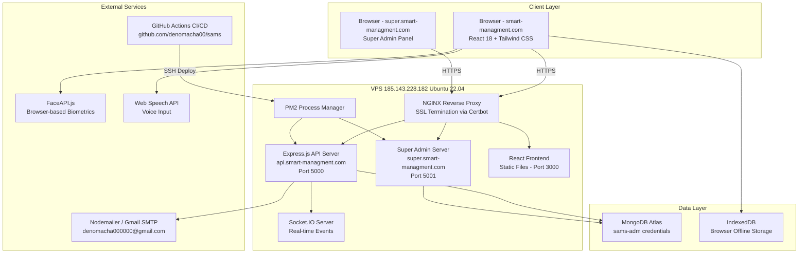

# Design Document: SAMS (Smart Attendance Management System)

## Overview

SAMS is a multi-school, enterprise-grade attendance management platform for educational institutions. It prevents fraudulent attendance through multi-layer validation (QR code, GPS, and biometric), tracks real-time attendance per session, and supports multiple schools under a single SaaS platform with complete data isolation.

The system is deployed on a VPS (Ubuntu 22.04, IP `185.143.228.182`) and operates across three subdomains:

- `smart-managment.com` — React 18 frontend (main app + public website)
- `api.smart-managment.com` — Express.js REST + WebSocket backend
- `super.smart-managment.com` — Private Super Admin control panel

Key design goals:
- **Multi-tenancy with strict data isolation** — every record is scoped to a `schoolId`
- **Offline-first** — IndexedDB caching with automatic sync on reconnect
- **Security by default** — HTTPS everywhere, bcrypt passwords, AES-256 biometric encryption, JWT auth
- **Plan-tier feature gating** — Trial / Basic / Professional / Enterprise capabilities
- **Zero-touch deployment** — GitHub Actions CI/CD, PM2 process management, NGINX reverse proxy, Certbot SSL

---

## Architecture

### High-Level System Diagram



### Subdomain Routing

| Subdomain | Target | Port | Description |
|-----------|--------|------|-------------|
| `smart-managment.com` | React static build | 3000 | Main app + public landing page |
| `api.smart-managment.com` | Express.js | 5000 | REST API + Socket.IO |
| `super.smart-managment.com` | Super Admin React build | 5001 | Private admin panel |

### Technology Stack

| Layer | Technology | Version |
|-------|-----------|---------|
| Frontend | React | 18.x |
| Routing | React Router | 6.x |
| State | Context API + React Query | — |
| Styling | Tailwind CSS | 3.x |
| HTTP Client | Axios | 1.x |
| Charts | Recharts | 2.x |
| PDF | React PDF / pdfmake | — |
| Excel | xlsx (SheetJS) | — |
| Offline Storage | IndexedDB (idb wrapper) | — |
| Biometrics | FaceAPI.js | 0.22.x |
| Voice | Web Speech API | Browser native |
| Backend | Express.js | 4.x |
| Database | MongoDB Atlas + Mongoose | 7.x |
| Real-time | Socket.IO | 4.x |
| Auth | JWT (jsonwebtoken) | 9.x |
| Password | bcrypt | 5.x |
| Email | Nodemailer | 6.x |
| Process Mgr | PM2 | 5.x |
| Reverse Proxy | NGINX | 1.24.x |
| SSL | Certbot (Let's Encrypt) | — |
| CI/CD | GitHub Actions | — |
| OS | Ubuntu | 22.04 LTS |

---

## Components and Interfaces

### Backend Service Architecture

The Express.js backend is organized as a modular monolith with clearly separated service layers. Each service is responsible for a single domain and communicates through well-defined interfaces.

```
src/
├── config/
│   ├── db.js              # Mongoose connection to MongoDB Atlas
│   ├── jwt.js             # JWT signing/verification helpers
│   └── mailer.js          # Nodemailer transporter config
├── middleware/
│   ├── auth.js            # JWT verification + role extraction
│   ├── schoolScope.js     # schoolId scoping enforcement
│   ├── rateLimiter.js     # express-rate-limit (100 req/min/IP)
│   ├── inputSanitizer.js  # express-validator + mongo-sanitize
│   └── errorHandler.js    # Global error handler
├── services/
│   ├── LicenseService.js
│   ├── ActivationService.js
│   ├── AuthService.js
│   ├── RegistrationService.js
│   ├── SessionService.js
│   ├── AttendanceService.js
│   ├── BiometricService.js
│   ├── SyncService.js
│   ├── ReportService.js
│   ├── RiskService.js
│   ├── TimetableService.js
│   ├── NotificationService.js
│   ├── PaymentService.js
│   ├── AuditService.js
│   ├── AIService.js
│   └── RealtimeService.js
├── routes/
│   ├── auth.routes.js
│   ├── license.routes.js
│   ├── registration.routes.js
│   ├── session.routes.js
│   ├── attendance.routes.js
│   ├── biometric.routes.js
│   ├── report.routes.js
│   ├── risk.routes.js
│   ├── timetable.routes.js
│   ├── notification.routes.js
│   ├── payment.routes.js
│   ├── audit.routes.js
│   └── ai.routes.js
├── models/
│   └── (Mongoose models — see Data Models section)
├── sockets/
│   └── attendanceSocket.js  # Socket.IO event handlers
└── app.js                   # Express app entry point
```

### Key Service Interfaces

#### LicenseService

```javascript
// Generates a license key encoding schoolName, planTier, expiryDate
generateKey(schoolName: string, planTier: PlanTier, expiryDate: Date): Promise<string>

// Validates format, checks expiry, checks used status
validateKey(rawKey: string): Promise<ValidationResult>

// Marks key as used after successful activation
consumeKey(hashedKey: string, schoolId: ObjectId): Promise<void>

// Checks if a school has access to a specific feature
checkFeatureAccess(schoolId: ObjectId, feature: Feature): Promise<boolean>
```

#### AuthService

```javascript
// Authenticates user, returns JWT + refresh token
login(schoolCode: string, identifier: string, password: string): Promise<AuthTokens>

// Verifies JWT, returns decoded payload
verifyToken(token: string): Promise<JWTPayload>

// Issues new access token from valid refresh token
refreshToken(refreshToken: string): Promise<string>

// Increments failed login counter; locks account at 5 failures
recordFailedLogin(userId: ObjectId): Promise<void>
```

#### SessionService

```javascript
// Creates session, generates initial QR code
startSession(teacherId: ObjectId, classId: ObjectId, subjectId: ObjectId, location: GeoPoint): Promise<Session>

// Rotates QR code every 30 seconds
rotateQRCode(sessionId: ObjectId): Promise<QRCode>

// Validates QR code freshness (< 30 seconds old)
validateQRCode(qrToken: string, sessionId: ObjectId): Promise<boolean>

// Ends session, closes Socket.IO subscription
endSession(sessionId: ObjectId): Promise<void>
```

#### AttendanceService

```javascript
// Records attendance from QR scan with GPS validation
recordQRScan(studentId: ObjectId, sessionId: ObjectId, qrToken: string, gpsCoords: GeoPoint): Promise<AttendanceRecord>

// Records manual attendance mark
recordManual(teacherId: ObjectId, studentId: ObjectId, sessionId: ObjectId, status: AttendanceStatus, reason?: string): Promise<AttendanceRecord>

// Syncs offline records, resolves conflicts by newer timestamp
syncOfflineRecords(records: OfflineRecord[]): Promise<SyncResult>

// Calculates attendance status based on timing
calculateStatus(scanTime: Date, sessionStart: Date, lateThreshold: number): AttendanceStatus
```

#### ReportService

```javascript
// Returns attendance records scoped to requesting user's role
generateReport(requesterId: ObjectId, scope: ReportScope, filters: ReportFilters): Promise<ReportData>

// Exports report as PDF buffer
exportPDF(reportData: ReportData): Promise<Buffer>

// Exports report as Excel buffer
exportExcel(reportData: ReportData): Promise<Buffer>

// Calculates attendance percentage
calculatePercentage(present: number, expected: number): number
```

#### RiskService

```javascript
// Computes dropout risk score using weighted formula
computeRiskScore(attendanceWeight: number, gradeWeight: number, patternWeight: number): number

// Classifies score into risk level
classifyRisk(score: number): RiskLevel

// Recalculates and persists risk score for a student
updateStudentRisk(studentId: ObjectId): Promise<RiskScore>
```

#### AuditService

```javascript
// Creates immutable audit log entry with monotonic sequence number
log(event: AuditEvent): Promise<AuditLog>

// Queries audit logs with filters (schoolId, dateRange, eventType)
query(filters: AuditFilters): Promise<AuditLog[]>
```

### Frontend Application Structure

```
src/
├── components/
│   ├── common/           # Shared UI components
│   ├── attendance/       # QR scanner, manual marking, biometric
│   ├── reports/          # Charts, tables, export buttons
│   ├── timetable/        # Timetable grid and editor
│   ├── ai/               # AI assistant chat interface
│   └── notifications/    # In-app notification panel
├── pages/
│   ├── auth/             # Login, activation
│   ├── dashboard/        # Role-specific dashboards
│   ├── students/         # Student management
│   ├── teachers/         # Teacher management
│   ├── sessions/         # Attendance sessions
│   ├── reports/          # Report generation
│   └── settings/         # School settings
├── context/
│   ├── AuthContext.jsx   # JWT storage, role, schoolId
│   ├── OfflineContext.jsx # Online/offline state
│   └── SocketContext.jsx  # Socket.IO connection
├── hooks/
│   ├── useAuth.js
│   ├── useOfflineSync.js
│   ├── useSocket.js
│   └── useIndexedDB.js
├── services/
│   ├── api.js            # Axios instance with interceptors
│   ├── indexedDB.js      # IndexedDB wrapper (idb)
│   ├── syncService.js    # Offline sync logic
│   └── faceapi.js        # FaceAPI.js wrapper
└── utils/
    ├── roleGuard.jsx     # Route protection by role
    └── serializer.js     # JSON serialization helpers
```

### Socket.IO Event Protocol

| Event | Direction | Payload | Description |
|-------|-----------|---------|-------------|
| `session:join` | Client → Server | `{ sessionId }` | Teacher subscribes to session feed |
| `session:leave` | Client → Server | `{ sessionId }` | Teacher unsubscribes |
| `attendance:update` | Server → Client | `AttendanceRecord` | New/updated attendance record |
| `session:ended` | Server → Client | `{ sessionId }` | Session closed by teacher |
| `session:replay` | Server → Client | `AttendanceRecord[]` | Missed events on reconnect |

---

## Data Models

All collections include a `schoolId` field (except `LicenseKey` and `SuperAdmin`) to enforce multi-tenant data isolation.

### School

```javascript
{
  _id: ObjectId,
  name: String,                    // Full school name
  schoolCode: String,              // Unique short code (e.g., "mukiria")
  planTier: Enum['Trial','Basic','Professional','Enterprise'],
  licenseExpiry: Date,
  studentCount: Number,
  isActive: Boolean,
  isSuspended: Boolean,
  customBranding: {                // Enterprise only
    logoUrl: String,
    primaryColor: String
  },
  adminEmail: String,
  createdAt: Date,
  updatedAt: Date
}
// Indexes: schoolCode (unique), planTier
```

### LicenseKey

```javascript
{
  _id: ObjectId,
  hashedKey: String,               // bcrypt hash of raw key — raw key never stored
  schoolName: String,              // Encoded metadata
  planTier: Enum['Trial','Basic','Professional','Enterprise'],
  expiryDate: Date,
  isUsed: Boolean,
  usedBySchoolId: ObjectId,        // null until activated
  createdAt: Date
}
// Indexes: hashedKey (unique)
```

### User

```javascript
{
  _id: ObjectId,
  schoolId: ObjectId,              // null for SuperAdmin
  role: Enum['SuperAdmin','SchoolAdmin','HOD','Teacher','Student'],
  fullName: String,
  email: String,
  passwordHash: String,            // bcrypt hash
  admissionNumber: String,         // Students only
  departmentId: ObjectId,          // HOD, Teacher, Student
  classId: ObjectId,               // Teacher, Student
  isActive: Boolean,
  failedLoginAttempts: Number,
  lockedUntil: Date,
  refreshTokenHash: String,
  createdAt: Date,
  updatedAt: Date
}
// Indexes: schoolId, role, email (unique per school), admissionNumber (unique per school)
```

### Department

```javascript
{
  _id: ObjectId,
  schoolId: ObjectId,
  name: String,
  hodId: ObjectId,
  createdAt: Date
}
```

### Class

```javascript
{
  _id: ObjectId,
  schoolId: ObjectId,
  departmentId: ObjectId,
  name: String,
  teacherId: ObjectId,
  studentIds: [ObjectId],
  createdAt: Date
}
```

### TimetableEntry

```javascript
{
  _id: ObjectId,
  schoolId: ObjectId,
  classId: ObjectId,
  subjectName: String,
  teacherId: ObjectId,
  dayOfWeek: Enum['Monday','Tuesday','Wednesday','Thursday','Friday','Saturday'],
  startTime: String,               // "HH:MM" 24-hour format
  endTime: String,
  createdAt: Date
}
// Indexes: schoolId + teacherId + dayOfWeek + startTime (compound, for conflict detection)
// Indexes: schoolId + classId + dayOfWeek + startTime (compound, for conflict detection)
```

### AttendanceSession

```javascript
{
  _id: ObjectId,
  schoolId: ObjectId,
  teacherId: ObjectId,
  classId: ObjectId,
  subjectName: String,
  timetableEntryId: ObjectId,
  status: Enum['active','ended'],
  currentQRToken: String,          // Current valid QR token (rotated every 30s)
  qrTokenExpiry: Date,
  sessionLocation: {
    type: 'Point',
    coordinates: [Number, Number]  // [longitude, latitude]
  },
  gpsRadiusMeters: Number,
  lateThresholdMinutes: Number,
  startedAt: Date,
  endedAt: Date
}
// Indexes: schoolId, teacherId, status, sessionLocation (2dsphere)
```

### AttendanceRecord

```javascript
{
  _id: ObjectId,
  schoolId: ObjectId,
  sessionId: ObjectId,
  studentId: ObjectId,
  status: Enum['PRESENT','LATE','EXCUSED','ABSENT'],
  method: Enum['QR','Manual','Biometric','Offline'],
  reason: String,                  // Optional, max 500 chars
  scanTimestamp: Date,
  syncedAt: Date,
  isOfflineRecord: Boolean,
  conflictResolved: Boolean,
  createdAt: Date,
  updatedAt: Date
}
// Indexes: schoolId + sessionId + studentId (unique compound — prevents duplicates)
// Indexes: schoolId + studentId, sessionId
```

### BiometricTemplate

```javascript
{
  _id: ObjectId,
  schoolId: ObjectId,
  studentId: ObjectId,
  encryptedDescriptor: Buffer,     // AES-256 encrypted FaceAPI descriptor
  iv: Buffer,                      // AES-256 initialization vector
  createdAt: Date,
  updatedAt: Date
}
// Indexes: schoolId + studentId (unique)
```

### RegistrationLink

```javascript
{
  _id: ObjectId,
  schoolId: ObjectId,
  createdByUserId: ObjectId,
  targetRole: Enum['HOD','Teacher','Student'],
  departmentId: ObjectId,          // null for HOD links
  classId: ObjectId,               // null for HOD/Teacher links
  token: String,                   // URL-safe random token
  expiryDate: Date,
  maxUses: Number,
  useCount: Number,
  isActive: Boolean,
  createdAt: Date
}
// Indexes: token (unique), schoolId
```

### Payment

```javascript
{
  _id: ObjectId,
  schoolId: ObjectId,
  planTier: Enum['Basic','Professional','Enterprise'],
  amount: Number,
  currency: String,                // 'KES'
  status: Enum['pending','confirmed','rejected'],
  submittedAt: Date,
  reviewedAt: Date,
  reviewedByAdminId: ObjectId,
  invoiceUrl: String,
  notes: String
}
// Indexes: schoolId, status
```

### RiskScore

```javascript
{
  _id: ObjectId,
  schoolId: ObjectId,
  studentId: ObjectId,
  score: Number,                   // 0–100
  riskLevel: Enum['Low','Medium','High','Critical'],
  attendanceWeight: Number,
  gradeWeight: Number,
  patternWeight: Number,
  calculatedAt: Date
}
// Indexes: schoolId + studentId (unique), riskLevel
```

### AuditLog

```javascript
{
  _id: ObjectId,
  sequenceNumber: Number,          // Monotonically increasing
  schoolId: ObjectId,              // null for super-admin events
  eventType: Enum[
    'USER_LOGIN','USER_LOGOUT','LICENSE_ACTIVATION',
    'ATTENDANCE_CREATED','ATTENDANCE_UPDATED',
    'PAYMENT_SUBMITTED','PAYMENT_CONFIRMED','PAYMENT_REJECTED',
    'SCHOOL_SUSPENDED','ROLE_CHANGED','CONFLICT_RESOLVED',
    'ACCOUNT_LOCKED','SESSION_STARTED','SESSION_ENDED'
  ],
  actorUserId: ObjectId,
  actorRole: String,
  resourceSnapshot: Object,        // JSON snapshot of affected resource
  timestamp: Date
}
// Indexes: schoolId + timestamp, eventType, sequenceNumber (unique)
// NOTE: No update or delete endpoints exist for this collection
```

### Notification

```javascript
{
  _id: ObjectId,
  schoolId: ObjectId,
  recipientUserId: ObjectId,
  type: Enum['IN_APP','EMAIL'],
  subject: String,
  body: String,
  isRead: Boolean,
  deliveryStatus: Enum['pending','delivered','failed'],
  retryCount: Number,
  createdAt: Date,
  deliveredAt: Date
}
```

---

## Correctness Properties

*A property is a characteristic or behavior that should hold true across all valid executions of a system — essentially, a formal statement about what the system should do. Properties serve as the bridge between human-readable specifications and machine-verifiable correctness guarantees.*

### Property 1: License Key Format Invariant

*For any* combination of school name, plan tier, and expiry date, the license key generator SHALL produce a key that matches the format `XXXX-YYYY-XXXX-XXXX` (four groups of alphanumeric characters separated by hyphens), and a hashed reference SHALL be stored in the database.

**Validates: Requirements 1.1**

---

### Property 2: Invalid Format Keys Are Always Rejected

*For any* string that does not match the format `XXXX-YYYY-XXXX-XXXX`, the Activation_Service SHALL reject the activation request with a descriptive error.

**Validates: Requirements 1.5**

---

### Property 3: License Key Confidentiality

*For any* activation response, API log entry, or UI-rendered payload, the raw license key value SHALL NOT appear in the output after activation.

**Validates: Requirements 1.6**

---

### Property 4: School Code Uniqueness

*For any* two schools registered on the platform, their `schoolCode` values SHALL be distinct. Any attempt to register a second school with an already-used `schoolCode` SHALL be rejected.

**Validates: Requirements 1.7, 1.8**

---

### Property 5: Multi-Tenant Data Isolation

*For any* authenticated user making a data request, all returned records SHALL have a `schoolId` field equal to the `schoolId` embedded in the user's JWT token. No record from a different school SHALL appear in the response.

**Validates: Requirements 2.1, 2.2, 2.3, 2.5**

---

### Property 6: Cross-School Access Returns 403

*For any* request that attempts to access a resource whose `schoolId` does not match the requesting user's `schoolId`, the API SHALL return HTTP 403 Forbidden.

**Validates: Requirements 2.3**

---

### Property 7: JWT Payload Completeness

*For any* JWT token issued by the Auth_Service, the decoded payload SHALL contain all four fields: `role`, `schoolId`, `departmentId`, and `classId`.

**Validates: Requirements 3.6**

---

### Property 8: Token Refresh Round Trip

*For any* valid refresh token, exchanging it for a new access token SHALL produce a valid JWT that grants the same role and scope as the original token.

**Validates: Requirements 3.8**

---

### Property 9: Role-Based Access Enforcement

*For any* user of a given role attempting an operation outside their permitted scope (e.g., HOD accessing another department, Teacher starting a session for an unassigned class, Student accessing another student's records), the API SHALL return HTTP 403 Forbidden.

**Validates: Requirements 3.2, 3.3, 3.4, 3.5**

---

### Property 10: Registration Link Scope Embedding

*For any* registration link generated by a role holder, the link SHALL embed exactly the IDs appropriate to that role: School_Admin links embed `schoolId` only; HOD links embed `schoolId` and `departmentId`; Teacher links embed `schoolId`, `departmentId`, and `classId`.

**Validates: Requirements 4.1, 4.2, 4.3**

---

### Property 11: Registration Link Max-Use Enforcement

*For any* registration link with a configured maximum-use count N, the (N+1)th registration attempt using that link SHALL be rejected with a descriptive error.

**Validates: Requirements 4.5, 4.6**

---

### Property 12: Admission Number Uniqueness Per School

*For any* school, no two students SHALL share the same `admissionNumber`. A second registration attempt using an already-registered admission number within the same school SHALL be rejected.

**Validates: Requirements 4.8**

---

### Property 13: QR Code Uniqueness Across Sessions

*For any* two concurrently active attendance sessions, their current QR tokens SHALL be distinct. No QR token SHALL be valid for more than one session at a time.

**Validates: Requirements 5.1**

---

### Property 14: Attendance Status Formula Correctness

*For any* combination of scan time, session start time, and late threshold value, the attendance status SHALL be assigned as follows:
- `scanTime ≤ sessionStart + lateThreshold` → PRESENT
- `sessionStart + lateThreshold < scanTime ≤ sessionStart + 2 × lateThreshold` → LATE
- `scanTime > sessionStart + 2 × lateThreshold` → ABSENT

**Validates: Requirements 5.5, 5.6, 5.7**

---

### Property 15: GPS Radius Enforcement

*For any* QR scan attempt, if the student's GPS coordinates fall outside the configured radius from the session location, the scan SHALL be rejected. If the coordinates fall within the radius, the scan SHALL be accepted (subject to other validations).

**Validates: Requirements 5.8**

---

### Property 16: Duplicate Scan Rejection

*For any* student and attendance session, a second scan attempt within the same session SHALL be rejected with a descriptive error.

**Validates: Requirements 5.10**

---

### Property 17: Manual Attendance Status Validity

*For any* manual attendance mark submitted by a Teacher, the status value SHALL be one of exactly four values: PRESENT, LATE, EXCUSED, or ABSENT. Any other value SHALL be rejected.

**Validates: Requirements 6.2**

---

### Property 18: Reason Note Length Enforcement

*For any* attendance record with status EXCUSED or ABSENT, a reason note of up to 500 characters SHALL be accepted. A reason note exceeding 500 characters SHALL be rejected.

**Validates: Requirements 6.3**

---

### Property 19: Biometric Feature Gating

*For any* school, the Biometric_Service SHALL be available if and only if the school's `planTier` is Professional or Enterprise. Attempts to use biometric attendance on Trial or Basic tier schools SHALL be rejected.

**Validates: Requirements 7.1, 12.2, 12.4**

---

### Property 20: Biometric Confidence Threshold Enforcement

*For any* biometric match attempt, if the confidence score meets or exceeds the configured minimum threshold, the student SHALL be marked PRESENT. If the confidence score falls below the threshold, the match SHALL be rejected.

**Validates: Requirements 7.5, 7.6**

---

### Property 21: Biometric Template Encryption

*For any* stored biometric template, the data SHALL be encrypted with AES-256 before storage. No raw biometric descriptor SHALL appear in any API response or database record.

**Validates: Requirements 7.8, 19.3**

---

### Property 22: Report Scope Enforcement

*For any* report request, the returned data SHALL be scoped exclusively to the requesting user's permitted scope: Student → own records only; Teacher → assigned class only; HOD → assigned department only; School_Admin → entire school only. No records from outside the permitted scope SHALL appear.

**Validates: Requirements 10.1, 10.2, 10.3, 10.4, 10.7**

---

### Property 23: Attendance Percentage Formula

*For any* student with `totalPresent` present records and `totalExpected` expected sessions, the calculated attendance percentage SHALL equal `(totalPresent / totalExpected) × 100`, rounded to two decimal places.

**Validates: Requirements 10.5**

---

### Property 24: Dropout Risk Score Formula

*For any* combination of `attendanceWeight`, `gradeWeight`, and `patternWeight` (each normalized to 0–100), the computed `Dropout_Risk_Score` SHALL equal `(attendanceWeight × 0.4) + (gradeWeight × 0.4) + (patternWeight × 0.2)`.

**Validates: Requirements 11.1**

---

### Property 25: Risk Level Classification

*For any* dropout risk score in the range [0, 100], the risk level SHALL be classified as: Low (0–20), Medium (21–50), High (51–80), or Critical (81–100). No score SHALL be assigned to more than one risk level.

**Validates: Requirements 11.2**

---

### Property 26: Plan Tier Feature Gating

*For any* school and any feature request, the feature SHALL be available if and only if the school's `planTier` meets the minimum required tier for that feature. Specifically:
- Biometric + AI_Assistant: Professional or Enterprise only
- Custom Branding: Enterprise only
- API Access: Basic or higher
- QR + GPS: all tiers

**Validates: Requirements 12.2, 12.3, 12.4, 12.5**

---

### Property 27: Student Count Limit Enforcement

*For any* school that has reached its plan's student count limit, any new student registration attempt SHALL be rejected and the School_Admin SHALL be notified with an upgrade prompt.

**Validates: Requirements 12.6**

---

### Property 28: Audit Log Completeness

*For any* significant system event (login, logout, license activation, attendance creation/update, payment event, school suspension, role change, conflict resolution), an AuditLog entry SHALL be created containing all required fields: `eventType`, `actorUserId`, `actorRole`, `schoolId`, `timestamp`, and `resourceSnapshot`.

**Validates: Requirements 16.1, 16.2**

---

### Property 29: Audit Log Immutability

*For any* existing AuditLog entry, no API endpoint SHALL permit modification or deletion of that entry. All write operations to the AuditLog collection SHALL be insert-only.

**Validates: Requirements 16.3**

---

### Property 30: Timetable Conflict Detection

*For any* new timetable entry, if it overlaps in time with an existing entry for the same teacher or the same class on the same day, the creation request SHALL be rejected with a descriptive conflict error.

**Validates: Requirements 17.2**

---

### Property 31: Notification Retry Logic

*For any* failed email delivery attempt, the Notification_Service SHALL retry delivery up to 3 times with a 60-second interval between attempts. Each retry attempt SHALL be logged in the AuditLog. After 3 failed attempts, no further retries SHALL occur.

**Validates: Requirements 18.4**

---

### Property 32: Rate Limiting Enforcement

*For any* IP address that exceeds 100 requests per minute to any public API endpoint, all subsequent requests within that minute SHALL receive HTTP 429 Too Many Requests.

**Validates: Requirements 19.6**

---

### Property 33: Account Lockout After Failed Logins

*For any* user account, after 5 consecutive failed login attempts within a 15-minute window, the account SHALL be locked and the School_Admin SHALL be notified. Subsequent login attempts during the lock period SHALL be rejected.

**Validates: Requirements 19.5**

---

### Property 34: Serialization Round Trip

*For any* valid attendance record object, serializing it to JSON and then deserializing the resulting JSON string SHALL produce an object with identical field values. No data SHALL be lost or mutated during the round trip.

**Validates: Requirements 22.1, 22.2, 22.6**

---

### Property 35: ISO 8601 Date Serialization

*For any* API response containing date or time values, all such values SHALL be formatted as ISO 8601 strings (e.g., `2025-01-15T10:30:00.000Z`). No other date format SHALL appear in API responses.

**Validates: Requirements 22.3**

---

### Property 36: AI Assistant Scope Enforcement

*For any* query submitted to the AI_Assistant, the response SHALL contain only data within the requesting user's permitted scope. No data from outside the user's `schoolId` or role-based scope SHALL appear in the response.

**Validates: Requirements 14.1, 14.2, 14.3**

---

## Error Handling

### API Error Response Format

All API errors follow a consistent JSON structure:

```json
{
  "success": false,
  "error": {
    "code": "SCHOOL_CODE_TAKEN",
    "message": "The school code 'mukiria' is already in use. Please choose a different code.",
    "statusCode": 409
  }
}
```

### Error Code Catalogue

| Code | HTTP Status | Description |
|------|-------------|-------------|
| `LICENSE_INVALID_FORMAT` | 400 | Key does not match `XXXX-YYYY-XXXX-XXXX` |
| `LICENSE_EXPIRED` | 400 | Key expiry date is in the past |
| `LICENSE_ALREADY_USED` | 409 | Key has already been activated |
| `SCHOOL_CODE_TAKEN` | 409 | School code already registered |
| `UNAUTHORIZED` | 401 | Missing or invalid JWT |
| `TOKEN_EXPIRED` | 401 | JWT has expired |
| `FORBIDDEN` | 403 | User lacks permission for this resource |
| `CROSS_SCHOOL_ACCESS` | 403 | schoolId mismatch detected |
| `QR_EXPIRED` | 400 | QR token is older than 30 seconds |
| `QR_DUPLICATE_SCAN` | 409 | Student already scanned for this session |
| `GPS_OUT_OF_RANGE` | 400 | Student GPS coordinates outside session radius |
| `BIOMETRIC_LOW_CONFIDENCE` | 400 | Face match confidence below threshold |
| `BIOMETRIC_PLAN_REQUIRED` | 403 | Feature requires Professional or Enterprise plan |
| `PLAN_STUDENT_LIMIT` | 403 | School has reached student count limit |
| `PLAN_EXPIRED` | 403 | School license has expired (read-only mode) |
| `SCHOOL_SUSPENDED` | 403 | School has been suspended by Super Admin |
| `TIMETABLE_CONFLICT` | 409 | Overlapping timetable entry detected |
| `REGISTRATION_LINK_EXPIRED` | 400 | Registration link has passed its expiry date |
| `REGISTRATION_LINK_MAX_USES` | 400 | Registration link has reached maximum use count |
| `ADMISSION_NUMBER_TAKEN` | 409 | Admission number already registered in this school |
| `ACCOUNT_LOCKED` | 423 | Account locked after 5 failed login attempts |
| `RATE_LIMIT_EXCEEDED` | 429 | More than 100 requests per minute from this IP |
| `VALIDATION_ERROR` | 422 | Input validation failed (details in `errors` array) |
| `INTERNAL_ERROR` | 500 | Unexpected server error |

### Global Error Handler

The Express global error handler (`middleware/errorHandler.js`) catches all unhandled errors, maps them to the standard response format, logs them to the AuditLog (for security-relevant errors), and never exposes stack traces in production responses.

### Offline Conflict Resolution

When the Sync_Service encounters a conflict between an offline record and a server record for the same `studentId` + `sessionId`:

1. Compare `scanTimestamp` of both records
2. Retain the record with the **newer** timestamp
3. Discard the older record
4. Create an AuditLog entry with `eventType: 'CONFLICT_RESOLVED'` containing both record snapshots

### Notification Retry

The Notification_Service uses an exponential-backoff-style retry for email delivery:

```
Attempt 1: immediate
Attempt 2: +60 seconds
Attempt 3: +60 seconds
After 3 failures: mark as failed, log final failure to AuditLog
```

---

## Testing Strategy

### Dual Testing Approach

SAMS uses a combination of property-based tests and example-based unit/integration tests for comprehensive coverage.

**Property-based tests** verify universal correctness properties across many generated inputs. They are implemented using **fast-check** (JavaScript/TypeScript PBT library) with a minimum of **100 iterations per property**.

**Unit tests** verify specific examples, edge cases, and error conditions using **Jest**.

**Integration tests** verify infrastructure wiring, external service behavior, and end-to-end workflows using **Supertest** (for HTTP) and **socket.io-client** (for WebSocket).

### Property-Based Testing Configuration

```javascript
// jest.config.js
module.exports = {
  testEnvironment: 'node',
  testMatch: ['**/*.test.js', '**/*.spec.js'],
  collectCoverageFrom: ['src/**/*.js']
}

// Property test example pattern
import fc from 'fast-check'
import { test, expect } from '@jest/globals'

test('Property 34: Serialization round trip', () => {
  // Feature: sams-complete-system, Property 34: Serialization round trip
  fc.assert(
    fc.property(attendanceRecordArbitrary, (record) => {
      const serialized = JSON.stringify(record)
      const deserialized = JSON.parse(serialized)
      expect(deserialized).toEqual(record)
    }),
    { numRuns: 100 }
  )
})
```

Each property test MUST be tagged with a comment in the format:
`// Feature: sams-complete-system, Property {N}: {property_text}`

### Test Coverage by Layer

#### Backend Unit + Property Tests (Jest + fast-check)

| Service | Test Type | Properties Covered |
|---------|-----------|-------------------|
| LicenseService | Property | P1, P2, P3, P4 |
| AuthService | Property + Unit | P7, P8, P9, P33 |
| RegistrationService | Property | P10, P11, P12 |
| SessionService | Property + Unit | P13, P14, P15, P16 |
| AttendanceService | Property | P14, P17, P18, P22, P23 |
| BiometricService | Property | P19, P20, P21 |
| ReportService | Property | P22, P23 |
| RiskService | Property | P24, P25 |
| AuditService | Property | P28, P29 |
| TimetableService | Property | P30 |
| NotificationService | Property | P31 |
| RateLimiter | Property | P32 |
| Serializer | Property | P34, P35 |
| AIService | Property | P36 |

#### Integration Tests (Supertest + socket.io-client)

- License activation end-to-end flow
- Multi-school data isolation (cross-school request returns 403)
- QR scan flow with GPS validation
- Offline sync: simulate IndexedDB records, restore connectivity, verify server state
- Socket.IO: attendance broadcast within 2 seconds, replay on reconnect
- Payment submission → Super Admin confirmation → plan upgrade
- Email delivery via Nodemailer (with SMTP mock)
- PM2 crash recovery (smoke test)

#### Frontend Tests (React Testing Library + Jest)

- Role-based routing: each role sees correct navigation
- Session-expired redirect to login page
- Offline indicator display when navigator.onLine is false
- QR scanner component renders and handles scan events
- Report export buttons trigger correct API calls

#### Smoke Tests

- NGINX routing: each subdomain resolves to correct backend
- SSL certificate validity for all three subdomains
- MongoDB Atlas connection health check
- PM2 process list shows all services running
- Environment variables are present and non-empty

### Property Test Arbitraries (fast-check generators)

```javascript
// Attendance record arbitrary
const attendanceRecordArbitrary = fc.record({
  _id: fc.hexaString({ minLength: 24, maxLength: 24 }),
  schoolId: fc.hexaString({ minLength: 24, maxLength: 24 }),
  sessionId: fc.hexaString({ minLength: 24, maxLength: 24 }),
  studentId: fc.hexaString({ minLength: 24, maxLength: 24 }),
  status: fc.constantFrom('PRESENT', 'LATE', 'EXCUSED', 'ABSENT'),
  method: fc.constantFrom('QR', 'Manual', 'Biometric', 'Offline'),
  reason: fc.option(fc.string({ maxLength: 500 })),
  scanTimestamp: fc.date(),
  createdAt: fc.date()
})

// License key format arbitrary (valid)
const validLicenseKeyArbitrary = fc.tuple(
  fc.stringOf(fc.constantFrom(...'ABCDEFGHIJKLMNOPQRSTUVWXYZ0123456789'), { minLength: 4, maxLength: 4 }),
  fc.stringOf(fc.constantFrom(...'ABCDEFGHIJKLMNOPQRSTUVWXYZ0123456789'), { minLength: 4, maxLength: 4 }),
  fc.stringOf(fc.constantFrom(...'ABCDEFGHIJKLMNOPQRSTUVWXYZ0123456789'), { minLength: 4, maxLength: 4 }),
  fc.stringOf(fc.constantFrom(...'ABCDEFGHIJKLMNOPQRSTUVWXYZ0123456789'), { minLength: 4, maxLength: 4 })
).map(([a, b, c, d]) => `${a}-${b}-${c}-${d}`)

// Attendance timing arbitrary
const attendanceTimingArbitrary = fc.record({
  sessionStart: fc.date(),
  lateThresholdMinutes: fc.integer({ min: 1, max: 60 }),
  scanOffsetMinutes: fc.integer({ min: 0, max: 180 })
}).map(({ sessionStart, lateThresholdMinutes, scanOffsetMinutes }) => ({
  sessionStart,
  lateThresholdMinutes,
  scanTime: new Date(sessionStart.getTime() + scanOffsetMinutes * 60000)
}))
```

---

## Deployment Architecture

### NGINX Configuration

NGINX acts as the SSL-terminating reverse proxy for all three subdomains. Certbot manages Let's Encrypt certificates with auto-renewal.

```nginx
# /etc/nginx/sites-available/sams

# Main frontend
server {
    listen 443 ssl;
    server_name smart-managment.com www.smart-managment.com;
    ssl_certificate /etc/letsencrypt/live/smart-managment.com/fullchain.pem;
    ssl_certificate_key /etc/letsencrypt/live/smart-managment.com/privkey.pem;

    root /var/www/sams/frontend/build;
    index index.html;
    try_files $uri /index.html;  # SPA fallback
}

# API backend
server {
    listen 443 ssl;
    server_name api.smart-managment.com;
    ssl_certificate /etc/letsencrypt/live/api.smart-managment.com/fullchain.pem;
    ssl_certificate_key /etc/letsencrypt/live/api.smart-managment.com/privkey.pem;

    location / {
        proxy_pass http://localhost:5000;
        proxy_http_version 1.1;
        proxy_set_header Upgrade $http_upgrade;
        proxy_set_header Connection "upgrade";  # WebSocket support
        proxy_set_header Host $host;
        proxy_set_header X-Real-IP $remote_addr;
    }
}

# Super Admin panel
server {
    listen 443 ssl;
    server_name super.smart-managment.com;
    ssl_certificate /etc/letsencrypt/live/super.smart-managment.com/fullchain.pem;
    ssl_certificate_key /etc/letsencrypt/live/super.smart-managment.com/privkey.pem;

    root /var/www/sams/super-admin/build;
    index index.html;
    try_files $uri /index.html;
}

# HTTP → HTTPS redirect for all domains
server {
    listen 80;
    server_name smart-managment.com www.smart-managment.com api.smart-managment.com super.smart-managment.com;
    return 301 https://$host$request_uri;
}
```

### PM2 Ecosystem Configuration

```javascript
// ecosystem.config.js
module.exports = {
  apps: [
    {
      name: 'sams-api',
      script: './backend/src/app.js',
      instances: 2,
      exec_mode: 'cluster',
      watch: false,
      env_production: {
        NODE_ENV: 'production',
        PORT: 5000
      },
      error_file: '/var/log/pm2/sams-api-error.log',
      out_file: '/var/log/pm2/sams-api-out.log',
      log_date_format: 'YYYY-MM-DD HH:mm:ss Z'
    }
  ]
}
```

PM2 is configured with `--watch false` in production and `pm2 startup` to survive reboots. Crash events are automatically logged and the process is restarted.

### GitHub Actions CI/CD Pipeline

```yaml
# .github/workflows/deploy.yml
name: Deploy SAMS

on:
  push:
    branches: [main]

jobs:
  test:
    runs-on: ubuntu-latest
    steps:
      - uses: actions/checkout@v4
      - uses: actions/setup-node@v4
        with:
          node-version: '20'
      - run: npm ci
        working-directory: backend
      - run: npm test
        working-directory: backend
      - run: npm ci
        working-directory: frontend
      - run: npm run build
        working-directory: frontend

  deploy:
    needs: test
    runs-on: ubuntu-latest
    steps:
      - uses: actions/checkout@v4
      - name: Deploy to VPS
        uses: appleboy/ssh-action@v1
        with:
          host: 185.143.228.182
          username: ${{ secrets.VPS_USER }}
          key: ${{ secrets.VPS_SSH_KEY }}
          script: |
            cd /var/www/sams
            git pull origin main
            cd backend && npm ci --production
            cd ../frontend && npm ci && npm run build
            cd ../super-admin && npm ci && npm run build
            pm2 reload ecosystem.config.js --env production
```

All secrets (MongoDB URI, JWT secret, SMTP credentials, Super Admin credentials, VPS SSH key) are stored as GitHub Actions secrets and injected at deploy time. No `.env` files are committed to the repository.

### Environment Variables

| Variable | Used By | Description |
|----------|---------|-------------|
| `MONGODB_URI` | Backend | MongoDB Atlas connection string with `sams-adm` credentials |
| `JWT_SECRET` | Backend | Secret for signing access tokens |
| `JWT_REFRESH_SECRET` | Backend | Secret for signing refresh tokens |
| `JWT_EXPIRES_IN` | Backend | Access token TTL (e.g., `15m`) |
| `JWT_REFRESH_EXPIRES_IN` | Backend | Refresh token TTL (e.g., `7d`) |
| `SMTP_HOST` | Backend | Gmail SMTP host |
| `SMTP_PORT` | Backend | Gmail SMTP port (587) |
| `SMTP_USER` | Backend | `denomacha000000@gmail.com` |
| `SMTP_PASS` | Backend | Gmail app password |
| `SUPER_ADMIN_EMAIL` | Backend | Super Admin login email |
| `SUPER_ADMIN_PASSWORD_HASH` | Backend | bcrypt hash of Super Admin password |
| `BIOMETRIC_ENCRYPTION_KEY` | Backend | AES-256 key for biometric template encryption |
| `NODE_ENV` | Backend | `production` |
| `PORT` | Backend | `5000` |
| `REACT_APP_API_URL` | Frontend | `https://api.smart-managment.com` |
| `REACT_APP_SOCKET_URL` | Frontend | `https://api.smart-managment.com` |

---

## Key Design Decisions

### 1. Modular Monolith over Microservices

Given the single-VPS deployment target and team size, a modular monolith is chosen over microservices. Services are cleanly separated by domain within a single Express process, making deployment, debugging, and local development simpler. The architecture can be split into microservices later if scale demands it.

### 2. schoolId Scoping at Middleware Level

Rather than relying on individual service implementations to filter by `schoolId`, a dedicated `schoolScope` middleware extracts the `schoolId` from the JWT and attaches it to `req.schoolId`. All Mongoose queries use this value. This provides a single enforcement point and reduces the risk of accidental data leakage.

### 3. Browser-Based Biometrics with FaceAPI.js

FaceAPI.js runs entirely in the browser on the Teacher's device. This means:
- No raw biometric data is ever transmitted over the network (only the attendance result)
- Processing happens on-device, reducing server load
- The encrypted descriptor is stored server-side only for template matching during offline sync

### 4. IndexedDB for Offline Persistence

Browser cookies and sessionStorage are not suitable for offline persistence (cookies require network for server-side validation; sessionStorage is cleared on tab close). IndexedDB provides a persistent, structured, queryable store that survives browser restarts and network outages.

### 5. Monotonic Sequence Numbers for Audit Log

MongoDB's `_id` ObjectId provides ordering by insertion time but is not strictly monotonic under concurrent inserts. A separate atomic counter (using MongoDB's `$inc` on a counters collection) ensures strict ordering of audit log entries for compliance and forensic purposes.

### 6. QR Code Rotation Strategy

The QR token is a signed JWT with a 30-second expiry, containing `sessionId` and `issuedAt`. The Teacher's device polls `/api/sessions/:id/qr` every 25 seconds to get the next token before the current one expires. This provides a 5-second overlap window to handle clock skew between devices.

### 7. AI Assistant Without Paid Provider

The AI_Assistant uses a rule-based query engine that translates natural language patterns into MongoDB aggregation pipelines. Common query patterns (attendance percentage, at-risk students, comparison queries) are handled by a pattern-matching layer. This avoids API costs while supporting the required query types. For Professional/Enterprise tiers, dropout risk trend visualization is added using pre-computed `RiskScore` history.

---
