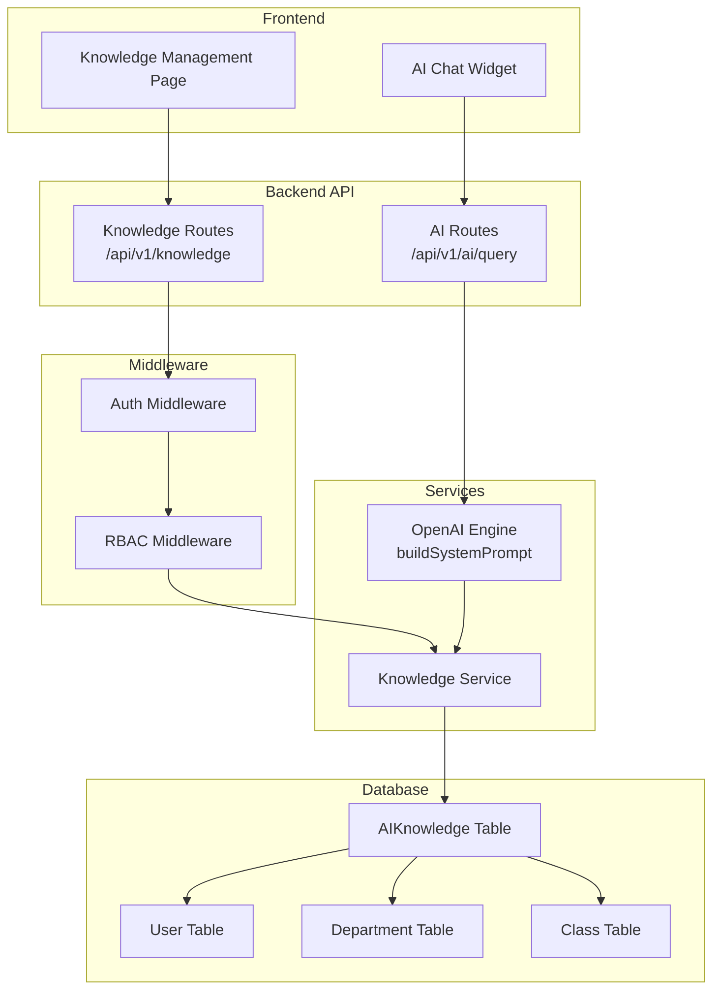

# Design Document: Scoped AI Knowledge Base

## Overview

This design extends the existing global `AIKnowledge` model to support hierarchically scoped knowledge entries. The current system has a flat knowledge base where all entries are globally visible and only manageable by Super Admins. The new design introduces scope fields (`schoolId`, `departmentId`, `classId`, `createdById`) that enable role-based knowledge management and contextual AI retrieval.

The architecture follows the existing patterns in SAMS: Prisma models with school-scoped queries, Express routes with RBAC middleware, and React frontend pages with role-based access guards.

**Key Design Decisions:**
- Scope is determined implicitly from field presence (no explicit `scopeLevel` enum column) to avoid data inconsistency
- SCHOOL_ADMIN has override authority for all entries within their school (consistent with existing admin patterns)
- AI retrieval uses an OR-based query to fetch all applicable scope levels in a single database call
- Pagination is server-side with cursor-based approach for consistent performance

## Architecture



**Request Flow for Knowledge CRUD:**
1. Frontend sends request to `/api/v1/knowledge`
2. Auth middleware validates JWT and attaches `req.user`
3. RBAC middleware checks role permissions (`manage:knowledge`)
4. Knowledge routes delegate to Knowledge Service
5. Knowledge Service enforces scope rules and performs DB operations

**Request Flow for AI Chat with Scoped Knowledge:**
1. User sends query to `/api/v1/ai/query`
2. `openaiEngine.buildSystemPrompt()` calls Knowledge Service to fetch scoped entries
3. Knowledge Service builds a scope-aware Prisma query based on user's role/IDs
4. Entries are formatted and injected into the system prompt

## Components and Interfaces

### Knowledge Service (`knowledgeService.ts`)

```typescript
// packages/backend/src/services/knowledgeService.ts

import { type AccessTokenPayload, UserRole } from '@sams/shared';

export interface CreateKnowledgeInput {
  title: string;
  content: string;
  category?: string;
}

export interface KnowledgeEntryResponse {
  id: string;
  title: string;
  content: string;
  category: string;
  schoolId: string;
  departmentId: string | null;
  classId: string | null;
  createdById: string;
  creatorName: string;
  creatorRole: UserRole;
  scopeLevel: 'school' | 'department' | 'class';
  createdAt: Date;
  updatedAt: Date;
}

export interface PaginatedKnowledgeResponse {
  entries: KnowledgeEntryResponse[];
  total: number;
  page: number;
  pageSize: number;
  totalPages: number;
}

export class KnowledgeService {
  /** Determine scope level from field presence */
  getScopeLevel(entry: { departmentId: string | null; classId: string | null }): 'school' | 'department' | 'class';

  /** Create a knowledge entry with role-based scope assignment */
  create(user: AccessTokenPayload, input: CreateKnowledgeInput): Promise<KnowledgeEntryResponse>;

  /** Update a knowledge entry (ownership or SCHOOL_ADMIN override) */
  update(user: AccessTokenPayload, entryId: string, input: Partial<CreateKnowledgeInput>): Promise<KnowledgeEntryResponse>;

  /** Delete a knowledge entry (ownership or SCHOOL_ADMIN override) */
  delete(user: AccessTokenPayload, entryId: string): Promise<void>;

  /** List entries scoped to user's role */
  list(user: AccessTokenPayload, page: number, pageSize: number): Promise<PaginatedKnowledgeResponse>;

  /** Get a single entry by ID (school-scoped) */
  getById(user: AccessTokenPayload, entryId: string): Promise<KnowledgeEntryResponse>;

  /** Retrieve all applicable knowledge entries for AI context injection */
  getForAIContext(user: AccessTokenPayload): Promise<Array<{ title: string; content: string; category: string }>>;
}
```

### Knowledge Routes (`routes/knowledge.ts`)

```typescript
// packages/backend/src/routes/knowledge.ts

// GET    /api/v1/knowledge          - List entries (paginated, role-scoped)
// POST   /api/v1/knowledge          - Create entry
// GET    /api/v1/knowledge/:id      - Get single entry
// PUT    /api/v1/knowledge/:id      - Update entry
// DELETE /api/v1/knowledge/:id      - Delete entry
```

**Middleware chain:** `authenticate → enforceSchoolScope → requirePermission('manage:knowledge')`

For the list/get endpoints, STUDENT role is blocked at the route level (they consume knowledge only through AI chat).

### Modified OpenAI Engine (`openaiEngine.ts`)

The `buildSystemPrompt` function will be modified to call `knowledgeService.getForAIContext(user)` instead of the current global `prisma.aIKnowledge.findMany()`.

```typescript
// Current (global):
const knowledgeEntries = await prisma.aIKnowledge.findMany({ orderBy: { createdAt: 'desc' } });

// New (scoped):
const knowledgeEntries = await knowledgeService.getForAIContext(user);
```

### Frontend Knowledge Management Page

```typescript
// packages/frontend/src/pages/admin/KnowledgeManagementPage.tsx

// Route: /admin/knowledge
// Access: SCHOOL_ADMIN, HOD, TEACHER (via AuthGuard)
// Components:
//   - KnowledgeList: Table/card list with scope badges, pagination
//   - KnowledgeForm: Modal/drawer form for create/edit
//   - DeleteConfirmDialog: Confirmation modal for deletion
//   - ScopeBadge: Visual indicator (school=blue, department=purple, class=green)
```

### RBAC Extension

Add `'manage:knowledge'` permission to the RBAC system:

```typescript
export const ROLE_PERMISSIONS: Record<UserRole, Permission[]> = {
  [UserRole.SUPER_ADMIN]:  ['super:admin', 'view:reports', 'manage:knowledge'],
  [UserRole.SCHOOL_ADMIN]: ['manage:users', 'manage:timetable', 'view:reports', 'view:risk', 'manage:payments', 'manage:knowledge'],
  [UserRole.HOD]:          ['manage:users', 'view:reports', 'view:risk', 'manage:knowledge'],
  [UserRole.TEACHER]:      ['start:session', 'mark:attendance', 'view:reports', 'manage:knowledge'],
  [UserRole.STUDENT]:      ['view:reports'],
};
```

## Data Models

### Updated AIKnowledge Prisma Model

```prisma
model AIKnowledge {
  id           String      @id @default(cuid())
  title        String      @db.VarChar(200)
  content      String      @db.Text
  category     String      @default("general") @db.VarChar(50)
  schoolId     String
  school       School      @relation(fields: [schoolId], references: [id])
  departmentId String?
  department   Department? @relation(fields: [departmentId], references: [id])
  classId      String?
  class        Class?      @relation(fields: [classId], references: [id])
  createdById  String
  createdBy    User        @relation(fields: [createdById], references: [id])
  createdAt    DateTime    @default(now())
  updatedAt    DateTime    @updatedAt

  @@index([schoolId])
  @@index([schoolId, departmentId])
  @@index([schoolId, classId])
  @@index([createdById])
}
```

**Relation additions to existing models:**

```prisma
// School model - add:
knowledgeEntries AIKnowledge[]

// Department model - add:
knowledgeEntries AIKnowledge[]

// Class model - add:
knowledgeEntries AIKnowledge[]

// User model - add:
knowledgeEntries AIKnowledge[]
```

### Migration SQL

```sql
-- AlterTable: Add scope fields to AIKnowledge
ALTER TABLE "AIKnowledge" ADD COLUMN "schoolId" TEXT NOT NULL;
ALTER TABLE "AIKnowledge" ADD COLUMN "departmentId" TEXT;
ALTER TABLE "AIKnowledge" ADD COLUMN "classId" TEXT;
ALTER TABLE "AIKnowledge" ADD COLUMN "createdById" TEXT NOT NULL;

-- Update column constraints
ALTER TABLE "AIKnowledge" ALTER COLUMN "title" TYPE VARCHAR(200);
ALTER TABLE "AIKnowledge" ALTER COLUMN "category" TYPE VARCHAR(50);

-- AddForeignKey
ALTER TABLE "AIKnowledge" ADD CONSTRAINT "AIKnowledge_schoolId_fkey" FOREIGN KEY ("schoolId") REFERENCES "School"("id") ON DELETE RESTRICT ON UPDATE CASCADE;
ALTER TABLE "AIKnowledge" ADD CONSTRAINT "AIKnowledge_departmentId_fkey" FOREIGN KEY ("departmentId") REFERENCES "Department"("id") ON DELETE SET NULL ON UPDATE CASCADE;
ALTER TABLE "AIKnowledge" ADD CONSTRAINT "AIKnowledge_classId_fkey" FOREIGN KEY ("classId") REFERENCES "Class"("id") ON DELETE SET NULL ON UPDATE CASCADE;
ALTER TABLE "AIKnowledge" ADD CONSTRAINT "AIKnowledge_createdById_fkey" FOREIGN KEY ("createdById") REFERENCES "User"("id") ON DELETE RESTRICT ON UPDATE CASCADE;

-- CreateIndex
CREATE INDEX "AIKnowledge_schoolId_idx" ON "AIKnowledge"("schoolId");
CREATE INDEX "AIKnowledge_schoolId_departmentId_idx" ON "AIKnowledge"("schoolId", "departmentId");
CREATE INDEX "AIKnowledge_schoolId_classId_idx" ON "AIKnowledge"("schoolId", "classId");
CREATE INDEX "AIKnowledge_createdById_idx" ON "AIKnowledge"("createdById");
```

### Scope Determination Logic

```typescript
function getScopeLevel(entry: { departmentId: string | null; classId: string | null }): 'school' | 'department' | 'class' {
  if (entry.classId) return 'class';
  if (entry.departmentId) return 'department';
  return 'school';
}
```

### Scoped Retrieval Query (AI Context)

```typescript
async function getForAIContext(user: AccessTokenPayload): Promise<AIKnowledgeEntry[]> {
  const where: Prisma.AIKnowledgeWhereInput = { schoolId: user.schoolId };

  switch (user.role) {
    case UserRole.SCHOOL_ADMIN:
      // All entries in the school
      break;
    case UserRole.HOD:
      // School-wide + department entries
      where.OR = [
        { departmentId: null, classId: null },           // school-wide
        { departmentId: user.departmentId },             // department-level
      ];
      break;
    case UserRole.TEACHER:
      // School-wide + department + class entries
      where.OR = [
        { departmentId: null, classId: null },           // school-wide
        { departmentId: user.departmentId, classId: null }, // department-level
        { classId: user.classId },                       // class-level
      ];
      break;
    case UserRole.STUDENT:
      // School-wide + department + class entries
      where.OR = [
        { departmentId: null, classId: null },           // school-wide
        { departmentId: user.departmentId, classId: null }, // department-level
        { classId: user.classId },                       // class-level
      ];
      break;
    default:
      break;
  }

  return prisma.aIKnowledge.findMany({
    where,
    select: { title: true, content: true, category: true },
    orderBy: { createdAt: 'desc' },
  });
}
```

### Authorization Logic for Mutations

```typescript
function canMutate(user: AccessTokenPayload, entry: AIKnowledge): boolean {
  // Cross-school: always denied
  if (entry.schoolId !== user.schoolId) return false;

  // SCHOOL_ADMIN: can mutate any entry in their school
  if (user.role === UserRole.SCHOOL_ADMIN) return true;

  // Owner: can always mutate their own entries
  if (entry.createdById === user.sub) return true;

  // HOD: cannot mutate entries from other departments
  if (user.role === UserRole.HOD && entry.departmentId && entry.departmentId !== user.departmentId) {
    return false;
  }

  // Non-owner, non-admin: denied
  return false;
}
```

## Correctness Properties

*A property is a characteristic or behavior that should hold true across all valid executions of a system — essentially, a formal statement about what the system should do. Properties serve as the bridge between human-readable specifications and machine-verifiable correctness guarantees.*

### Property 1: Scope Level Determination

*For any* knowledge entry, the scope level SHALL be 'class' if classId is non-null, 'department' if departmentId is non-null and classId is null, and 'school' if both departmentId and classId are null.

**Validates: Requirements 1.5, 1.6, 1.7**

### Property 2: Role-Based Creation Scope Assignment

*For any* staff user creating a knowledge entry with valid input, the resulting entry's scope fields SHALL match the user's role: SCHOOL_ADMIN → (schoolId=user.schoolId, departmentId=null, classId=null), HOD → (schoolId=user.schoolId, departmentId=user.departmentId, classId=null), TEACHER → (schoolId=user.schoolId, departmentId=user.departmentId, classId=user.classId).

**Validates: Requirements 2.1, 2.2, 2.3**

### Property 3: Student Creation Rejection

*For any* user with role STUDENT and any valid knowledge input, attempting to create a knowledge entry SHALL be rejected with a 403 status.

**Validates: Requirements 2.4**

### Property 4: Ownership-Based Mutation Authorization

*For any* staff user (HOD or TEACHER) and any knowledge entry within their school, the mutation (update or delete) SHALL succeed if and only if the user is the creator of the entry OR the user is a SCHOOL_ADMIN.

**Validates: Requirements 3.1, 3.2, 3.3, 3.4**

### Property 5: Cross-School Isolation

*For any* user and any knowledge entry belonging to a different school, all operations (read, update, delete) SHALL be denied, and listing/retrieval SHALL never include entries from other schools.

**Validates: Requirements 3.5, 8.1, 8.2, 8.3**

### Property 6: Scoped AI Knowledge Retrieval

*For any* authenticated user querying the AI chat, the knowledge entries injected into the system prompt SHALL be exactly those entries from the user's school that match their applicable scope levels (SCHOOL_ADMIN: all school entries; HOD: school-wide + their department; TEACHER/STUDENT: school-wide + their department + their class), and SHALL never include entries from other schools.

**Validates: Requirements 4.1, 4.2, 4.3, 4.4, 4.5, 4.6, 4.7**

### Property 7: Role-Based Knowledge Listing

*For any* staff user requesting the knowledge list, the returned entries SHALL be exactly those entries from their school that match their role-based scope (SCHOOL_ADMIN: all; HOD: school-wide + department; TEACHER: school-wide + department + class), and SHALL include creator name and role for each entry.

**Validates: Requirements 5.1, 5.2, 5.3, 5.4**

### Property 8: Pagination Correctness

*For any* knowledge list request with page number P and page size S, the response SHALL contain at most S entries, the total count SHALL equal the full set of applicable entries, and totalPages SHALL equal ceil(total / pageSize).

**Validates: Requirements 5.5**

### Property 9: Input Validation Rejection

*For any* knowledge entry creation attempt where title length is 0 or > 200, OR content is empty, OR category length is > 50, the request SHALL be rejected with a 400 status and the entry SHALL not be persisted.

**Validates: Requirements 7.1, 7.2, 7.3**

### Property 10: Cross-Reference Validation

*For any* knowledge entry creation attempt where the departmentId does not belong to the user's school OR the classId does not belong to the user's department, the request SHALL be rejected with a 400 status.

**Validates: Requirements 7.4, 7.5**

## Error Handling

| Scenario | HTTP Status | Error Code | Message |
|----------|-------------|------------|---------|
| Unauthenticated request | 401 | UNAUTHORIZED | Authentication required |
| Student attempts CRUD | 403 | FORBIDDEN | Access denied |
| Non-owner attempts mutation | 403 | FORBIDDEN | Only the creator or school admin can modify this entry |
| Cross-school access | 404 | NOT_FOUND | Knowledge entry not found |
| HOD cross-department mutation | 403 | FORBIDDEN | Access denied |
| Invalid title length | 400 | VALIDATION_ERROR | Title must be 1-200 characters |
| Empty content | 400 | VALIDATION_ERROR | Content is required |
| Category too long | 400 | VALIDATION_ERROR | Category must be at most 50 characters |
| Invalid departmentId reference | 400 | VALIDATION_ERROR | Department does not belong to your school |
| Invalid classId reference | 400 | VALIDATION_ERROR | Class does not belong to your department |
| Entry not found | 404 | NOT_FOUND | Knowledge entry not found |
| Database error | 500 | INTERNAL_ERROR | Failed to process request |

**Error handling patterns:**
- Cross-school access returns 404 (not 403) to avoid leaking existence information
- Validation errors return all failing fields in a single response
- Database errors are logged server-side with full context but return generic messages to clients
- The AI engine gracefully degrades: if knowledge fetch fails, it continues without knowledge context (existing pattern)

## Testing Strategy

### Property-Based Testing

This feature is well-suited for property-based testing because:
- The scope determination, authorization, and retrieval logic are pure functions with clear input/output behavior
- The input space is large (many combinations of roles, scope fields, ownership)
- Universal properties hold across all valid inputs

**Library:** [fast-check](https://github.com/dubzzz/fast-check) (already available in the Node.js ecosystem, works with the existing test setup)

**Configuration:**
- Minimum 100 iterations per property test
- Each test tagged with: `Feature: scoped-knowledge-base, Property {N}: {title}`

**Property tests to implement:**
1. Scope level determination (Property 1)
2. Role-based creation scope assignment (Property 2)
3. Student creation rejection (Property 3)
4. Ownership-based mutation authorization (Property 4)
5. Cross-school isolation (Property 5)
6. Scoped AI knowledge retrieval (Property 6)
7. Role-based knowledge listing (Property 7)
8. Pagination correctness (Property 8)
9. Input validation rejection (Property 9)
10. Cross-reference validation (Property 10)

### Unit Tests (Example-Based)

- Unauthenticated access returns 401
- Frontend route guards block STUDENT role
- Knowledge form renders with correct fields
- Scope badge displays correct colors/labels
- Delete confirmation dialog flow

### Integration Tests

- Full CRUD flow: create → list → update → delete
- AI chat query includes scoped knowledge in response
- Migration applies cleanly on existing data
- Pagination with real database queries

### Test Organization

```
packages/backend/src/services/__tests__/
  knowledgeService.test.ts        # Unit + property tests for service logic
  knowledgeService.property.test.ts  # Property-based tests (fast-check)

packages/backend/src/routes/__tests__/
  knowledge.test.ts               # Integration tests for API endpoints

packages/frontend/src/pages/admin/__tests__/
  KnowledgeManagementPage.test.tsx  # Component tests
```
